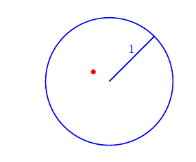

# Probability {#prob}


## Overview {#prob:overview}

In this Chapter we introduce **probability** as a **measure** associated with a **random experiment**. After providing a short motivation for probability ([Section 4.2](#prob:motivation)), we begin in [Section 4.3](#prob:sample_space) with the notion of a **Sample space** ([Section 4.3](#prob:sample_space)), the set of possible outcomes of a random experiment and  **Events** ([Section 4.4](#prob:events)), the outcome(s) which occur. This enables us in [Section 4.5](#prob:defn) to define [**probability**](#prob:def:prob) as a finite measure which uses the scale 0 (impossible) to 1 (certain) to define the likelihood of an event. We conclude the chapter by introducing the concept of [**conditional probability**](#prob:def:cond) ([Section 4.6](#prob:Conditional_Probability)), the probability of one event **given** (conditional upon) another event (or events) having occurred. We present the key results of the [Theorem of total probability](#prob:thm:totalprob) and [Bayes' formula](#prob:thm:bayes).
The discussion of conditional probability leads us naturally to consider the dependence between two (or more) events and the notion of [**independence**](#prob:def:independence), where the probability of an event occurring is not affected by whether or not another event has occurred and we explore this further in [Section 4.7](#prob:mutual).

## Motivation {#prob:motivation}

There are many situations where we have uncertainty and want to quantify that uncertainty.  

(a) Manchester United will win the Premier League this season.  
(b) The Labour Party will win the next general election.  
(c) The £ will rise against the $ today.  
(d) Coin tossed repeatedly - a head will turn up eventually.  
(e) In 5 throws of a dart, I will hit the Bull's eye once.  
(f) If I play the lottery every week I will win a prize next year.  

(a)-(c) are subjective probabilities, whereas (d)-(f) are objective/statistical/physical probabilities. 


The general idea is:  

(a) A conceptual random experiment $\mathcal{E}$.  
(b) List all possible outcomes $\Omega$ for the experiment $\mathcal{E}$ but **don’t know** which occurs, has occurred or will occur.  
(c) Assign to each possible outcome $\omega$ a real number which is the probability of that outcome.  

## Sample Space {#prob:sample_space}

We begin by defining a *set*.

:::{.def #prob:def:set} 
```{asis, include=knitr::is_latex_output()} 
\textcolor{red}{Definition 4.3.1.}
```
<span style="color: rgba(207, 0, 15, 1);">**Set.**</span>  
A *set* is a collection of objects. The notation for a set is to simply list every object separated by commas, and to surround this list by curly braces $\{$ and $\}$. The objects in a set are referred to as the *elements* of the set.
:::

There is no restrictions on what constitutes as an object in set. A set can have a finite or infinite number of elements. The ordering of the elements in a list is irrelevant. Two sets are equal if and only if they have the same collection of elements.


::: {.def #prob:def:samplespace}  
```{asis, include=knitr::is_latex_output()} 
\textcolor{red}{Definition 4.3.2.}
```
<span style="color: rgba(207, 0, 15, 1);">**Sample space.**</span>  
The *sample space* $\Omega$ for a random experiment $\mathcal{E}$ is the set of all possible outcomes of the random experiment.
:::

:::{.ex #prob:ex:dice}
```{asis, include=knitr::is_latex_output()} 
\textcolor{red}{Example 4.3.3.}
```
<span style="color: rgba(207, 0, 15, 1);">**Rolling a die.**</span>  

The sample space for the roll of a die is

<center>
$$\Omega = \{ 1,2,3,4,5,6 \},$$
</center>

that is, the set of the six possible outcomes.
:::
\

:::{.ex #prob:ex:dart}
```{asis, include=knitr::is_latex_output()} 
\textcolor{red}{Example 4.3.4.}
```
<span style="color: rgba(207, 0, 15, 1);">**Dart in a target.**</span> 

Dart into a circular target, radius 1:

<center>
$$\Omega = \{ (x,y): x^2 + y^2 \leq 1\},$$  
```{r dart1, echo = FALSE, message=FALSE, fig.keep='all', out.width= "80%", fig.cap = " Example: $(x,y) =(-0.25,0.15)$."}

```
</center>  


that is, the set of pairs of real numbers that are less than a distance 1 from the origin $(0,0)$.
:::

Note that the examples illustrate how $\Omega$ may be discrete or continuous.


## Events {#prob:events}

::: {.def #prob:def:event}  
```{asis, include=knitr::is_latex_output()} 
\textcolor{red}{Definition 4.4.1.}
```
<span style="color: rgba(207, 0, 15, 1);">**Event.**</span>  
An *event* relating to an experiment is a subset of $\Omega$.
:::

::: {.ex #prob:ex:twocoins}
```{asis, include=knitr::is_latex_output()} 
\textcolor{red}{Example 4.4.2.}
```
<span style="color: rgba(207, 0, 15, 1);">**Toss two coins.**</span>  

The sample space for the toss of two fair coins is 

<center>
$$\Omega = \{ HH, HT, TH, TT \}.$$
</center>

Let $A$ be the event that at least one head occurs, then

<center>
$$A = \{ HH, HT, TH \}.$$
</center>

Note that the events $HT$ (Head on coin 1 and Tail on coin 2) and $TH$ (Tail on coin 1 and Head on coin 2) are distinct events.  
:::
\

::: {.ex #prob:ex:volcano}
```{asis, include=knitr::is_latex_output()} 
\textcolor{red}{Example 4.4.3.}
```
<span style="color: rgba(207, 0, 15, 1);">**Volcano eruption.**</span>  

 The sample space of time in years until a volcano next erupts is
$$ \Omega = \{t: t >0 \} =(0,\infty),$$
that is, all positive real numbers. Let event $L$ be the volcano erupting in the next $10$ years, then
$$L = \{t: 0 < t \leq 10\} =(0,10].$$
:::

We summarise key set notation, involving sets $E$ and $F$, below:

1. We use $\omega \in E$ to denote that $\omega$ is an element of the set $E$. Likewise, $\omega \notin E$ denotes that $\omega$ is not an element of $E$;  
2. The notation $E \subseteq F$ means that if $\omega \in E$, then $\omega \in F$. In this case, we say $E$ is a *subset* of $F$;  
3. $E^{c}$ - complement of $E$, sometimes written $\bar{E}$. \
$E^{c}$ consists of all points in $\Omega$ that are not in $E$.  Thus, $E^{c}$ occurs
if and only if $E$ does not occur, see Figure \@ref(fig:Set1).  

```{r Set1, echo = FALSE, message=FALSE, fig.keep='all', out.width= "80%", fig.cap = " Complement example."}
knitr::include_graphics("Images/Set1.png")
```

4. The *intersection* of two sets $E$ and $F$, denoted $E \cap F$, is the set of all elements that belong to both $E$ and $F$, see Figure \@ref(fig:Set2).    

```{r Set2, echo = FALSE, message=FALSE, fig.keep='all', out.width= "80%", fig.cap = " Intersection example."}

```

5. If $E \cap F = \emptyset$ then $E$ and $F$ cannot both occur, *i.e.* $E$ and $F$
are *disjoint* (or *exclusive*) sets, see Figure \@ref(fig:Set3).  

```{r Set3, echo = FALSE, message=FALSE, fig.keep='all', out.width= "80%", fig.cap = " Disjoint (exclusive) example."}
knitr::include_graphics("Images/Set3.png")
```

6. The *union* of two sets $E$ and $F$, denoted $E \cup F$, is the set of all elements that belong to either $E$ or to $F$, see Figure \@ref(fig:Set4). 

```{r Set4, echo = FALSE, message=FALSE, fig.keep='all', out.width= "80%", fig.cap = " Union example."}

```

7. The set $\{\}$ with no elements in it is called the *empty set* and is denoted $\emptyset$.  
**Note**: $\Omega^c = \emptyset$ and $\emptyset^c = \Omega$.  

A summary of sets notation using the outcomes from a six sided die are presented in the [Video 6](#video6).

```{asis, include=knitr::is_html_output()}
:::{.des #video6}
<span style="color: rgba(207, 0, 15, 1);">**Video 6: Set notation**</span>  

<iframe id="kaltura_player" src="https://cdnapisec.kaltura.com/p/1355621/sp/135562100/embedIframeJs/uiconf_id/13188771/partner_id/1355621?iframeembed=true&playerId=kaltura_player&entry_id=1_cigsltq1&flashvars[streamerType]=auto&amp;flashvars[localizationCode]=en&amp;flashvars[sideBarContainer.plugin]=true&amp;flashvars[sideBarContainer.position]=left&amp;flashvars[sideBarContainer.clickToClose]=true&amp;flashvars[chapters.plugin]=true&amp;flashvars[chapters.layout]=vertical&amp;flashvars[chapters.thumbnailRotator]=false&amp;flashvars[streamSelector.plugin]=true&amp;flashvars[EmbedPlayer.SpinnerTarget]=videoHolder&amp;flashvars[dualScreen.plugin]=true&amp;flashvars[hotspots.plugin]=1&amp;flashvars[Kaltura.addCrossoriginToIframe]=true&amp;&wid=1_kbos8alt" width="640" height="420" allowfullscreen webkitallowfullscreen mozAllowFullScreen allow="autoplay *; fullscreen *; encrypted-media *" sandbox="allow-downloads allow-forms allow-same-origin allow-scripts allow-top-navigation allow-pointer-lock allow-popups allow-modals allow-orientation-lock allow-popups-to-escape-sandbox allow-presentation allow-top-navigation-by-user-activation" frameborder="0" title="Sets FINAL VERSION"></iframe>
:::
```

```{asis, include=knitr::is_latex_output()}
Watch [\textcolor{blue}{Video 6: Set notation}](https://mediaspace.nottingham.ac.uk/media/Sets+FINAL+VERSION/1_cigsltq1)
```

## Probability {#prob:defn}

There are different possible interpretations of the meaning of a probability:

- **Classical interpretation.**
Assuming that all outcomes of an experiment are equally likely, then the probability of an event $A = \frac{n(A)}{n(\Omega)}$, where $n(A)$ is the number of outcomes satisfying $A$ and $n(\Omega)$ is the number of outcomes in $\Omega$ (total number of possible outcomes).

- **Frequency interpretation.**
The probability of an event is the relative frequency of observing a particular outcome when an experiment is repeated a large number of times under similar circumstances.

- **Subjective interpretation.** 
The probability of an event is an individual's perception as to the likelihood of an event's occurrence.

:::{.def #prob:def:prob}  
```{asis, include=knitr::is_latex_output()} 
\textcolor{red}{Definition 4.5.1.}
```
<span style="color: rgba(207, 0, 15, 1);">**Probability.**</span>  

A *probability* (*measure*) is a real-valued set function $P$ defined on the events (subsets) of a sample space $\Omega$ satisfying the following three axioms (see Kolmogorov, 1933):

1. $P(E)\geq0$ for any event $E$;
2. $P(\Omega)=1$;
3. If $E_1,E_2,\dots, E_n$ are disjoint events (i.e. $E_i \cap E_j = \emptyset$ for all $i \neq j$), then
$$P \left( \bigcup_{i=1}^n E_i \right) = \sum_{i=1}^n P(E_i).$$  

If $\Omega$ is *infinite* then 3. can be extended to:  
3'. If $E_1,E_2,\dots$ is any infinite sequence of disjoint events (i.e. $E_i \cap E_j = \emptyset$ for all $i\not=j$), then
$$P \left( \bigcup_{i=1}^\infty E_i \right) = \sum_{i=1}^\infty P(E_i).$$  
:::

Note that all of the other standard properties of probability (measures) that we use are derived from these three axioms.

:::{.ex #prob:exer:1}
```{asis, include=knitr::is_latex_output()} 
\textcolor{red}{Example 4.5.2.}
```
\
Using only the axioms above, prove:

- $0 \leq P(E) \leq 1$ for any event $E$;  

- $P(E^C) = 1 - P(E)$ where $E^C$ is the complement of $E$;  

- $P(\emptyset) = 0$;  

- $P(A \cup B) = P(A) + P(B) - P(A \cap B)$.  
:::


A summary of probability along with proofs of the results in [Example 4.5.2](#prob:exer:1) are provided in [Video 7](#video7).

```{asis, include=knitr::is_html_output()}
:::{.des #video7}
<span style="color: rgba(207, 0, 15, 1);">**Video 7: Probability**</span>  

<iframe id="kaltura_player" src="https://cdnapisec.kaltura.com/p/1355621/sp/135562100/embedIframeJs/uiconf_id/13188771/partner_id/1355621?iframeembed=true&playerId=kaltura_player&entry_id=1_43tb6qxp&flashvars[streamerType]=auto&amp;flashvars[localizationCode]=en&amp;flashvars[sideBarContainer.plugin]=true&amp;flashvars[sideBarContainer.position]=left&amp;flashvars[sideBarContainer.clickToClose]=true&amp;flashvars[chapters.plugin]=true&amp;flashvars[chapters.layout]=vertical&amp;flashvars[chapters.thumbnailRotator]=false&amp;flashvars[streamSelector.plugin]=true&amp;flashvars[EmbedPlayer.SpinnerTarget]=videoHolder&amp;flashvars[dualScreen.plugin]=true&amp;flashvars[hotspots.plugin]=1&amp;flashvars[Kaltura.addCrossoriginToIframe]=true&amp;&wid=1_j0pgiupv" width="640" height="420" allowfullscreen webkitallowfullscreen mozAllowFullScreen allow="autoplay *; fullscreen *; encrypted-media *" sandbox="allow-downloads allow-forms allow-same-origin allow-scripts allow-top-navigation allow-pointer-lock allow-popups allow-modals allow-orientation-lock allow-popups-to-escape-sandbox allow-presentation allow-top-navigation-by-user-activation" frameborder="0" title="Probability FINAL VERSION"></iframe>
:::
```

```{asis, include=knitr::is_latex_output()}
Watch [\textcolor{blue}{Video 7: Probability}](https://mediaspace.nottingham.ac.uk/media/Probability+FINAL+VERSION/1_43tb6qxp)
```


<details><summary>Solution to Example 4.5.2.</summary>
:::{.prf}
Since for any event $E$, $\Omega = E \cup E^c$, we have by axiom 2 that
<center> 
\[ 1 = P (\Omega) = P (E \cup E^c).  \]
</center>
By axiom 3, since $E$ and $E^c$ are disjoint events, we have that 
<center> 
\[ 1 = P (E \cup E^c)= P (E) + P (E^c).  \]
</center>
which rearranges to give $P(E^c) = 1-P(E)$.

**Special cases**  
If $E = \emptyset$, then $E^c = \Omega$ giving $1 = P(\emptyset) +1$ and it follows that $P(\emptyset)=0$.  
Since $P(E^c) \geq 0$, we have that $P(E) \leq 1$ and hence $0\leq P(E) \leq 1$.

To study $P(A \cup B)$, we note that $A \cup B$ is formed by the union of the disjoint events: $A \cap B^c$, $A \cap B$ and $A^c \cap B$. Therefore using axiom 3,
<center> 
\[ P(A \cup B) = P(A \cap B^c) + P(A \cap B)+P(A^c \cap B).   \]
</center>
Similarly, we have that 
<center> 
\[ P(A) = P(A \cap B^c) + P(A \cap B)\] 
</center>
and 
<center> 
\[ P(B) =P(A \cap B)+P(A^c \cap B).\] 
</center>  
Since $P(A^c \cap B) = P(B)-P(A \cap B)$, we have that
<center> 
\begin{eqnarray*} P(A \cup B) &=& P(A \cap B^c) + P(A \cap B) + P(A^c \cap B)  \\
&=& P(A) + P(B)-P(A \cap B)   \\
&=& P(A) + P(B)-P(A \cap B).
\end{eqnarray*}
</center>  

:::
</details>
\


In many cases, $\Omega$ consists of $N (=n(\Omega))$ equally likely elements, *i.e.*
\[
\Omega = \left\{ \omega_{1}, \omega_{2}, \ldots, \omega_{N} \right\}, 
\]
with $P(\omega_i) = \frac{1}{N}$.

Then, for any event $E$ (*i.e.* subset of $\Omega$),
\[
P(E) = \frac{n(E)}{n(\Omega)} = \frac{n(E)}{N}
\]
coinciding with the Classical interpretation of probability.

:::{.ex #prob:ex:class}
```{asis, include=knitr::is_latex_output()} 
\textcolor{red}{Example 4.5.3.}
```
\
1. <span style="color: rgba(207, 0, 15, 1);">**Throw a die.**</span>  $\Omega = \left\{ 1,2,3,4,5,6 \right\}$.
\[ P(\{1\})=P(\{2\})= \ldots = P(\{6\})= \frac{1}{6}. \]
The probability of throwing an odd number is
\[P(\mbox{Odd}) = P( \left\{ 1,3,5 \right\}) = \frac{3}{6} = \frac{1}{2}. \]  
2. <span style="color: rgba(207, 0, 15, 1);">**Draw a card at random from a standard pack of 52.**</span>
\[\Omega = \left\{ A\clubsuit, 2\clubsuit, 3\clubsuit, \ldots, K\diamondsuit \right\}. \]
$P(\omega) = 1/52$ for all $\omega \in \Omega$.  
If $E = \left\{ \mbox{Black} \right\}$ and $F = \left\{ \mbox{King} \right\}$,
then there are 26 black cards, $n(E) =26$, 4 kings, $n(F)=4$ and 2 black kings ($K\clubsuit$ and $K\spadesuit$), $n(E\cap F)=2$,
\begin{eqnarray*}
P(E \cup F) & = & P(E) + P(F) - P(E \cap F) \\
& = & \frac{26}{52} + \frac{4}{52} - \frac{2}{52} \\
& = & \frac{7}{13}.
\end{eqnarray*}
:::

## Conditional probability {#prob:Conditional_Probability}

:::{.def #prob:def:cond} 
```{asis, include=knitr::is_latex_output()} 
\textcolor{red}{Definition 4.6.1.}
```
<span style="color: rgba(207, 0, 15, 1);">**Conditional Probability.**</span>  

The *conditional probability* of an event $E$ *given* an event $F$ is

<center>
$$P(E\mid F)=\frac{P(E\cap F)}{P(F)},\quad \mbox{ provided } P(F)>0.$$
</center>
:::

Note if $P(F)>0$, then $P(E \cap F) = P(E|F) P(F)$.

Moreover, since $E \cap F = F \cap E$, we have that
\[ P(E|F) P(F) = P(E \cap F) = P (F \cap E) = P(F|E) P(E).   \]
In other words, to compute the probability of both events $E$ and $F$ occurring, we can either:  

- Consider first whether $E$ occurs, $P(E)$, and then whether $F$ occurs *given* that $E$ has occurred, $P(F|E)$,  
- Or consider first whether $F$ occurs, $P(F)$, and then whether $E$ occurs *given* that $F$ has occurred, $P(E|F)$.  


:::{.ex #prob:ex:dice2}
```{asis, include=knitr::is_latex_output()} 
\textcolor{red}{Example 4.6.2.}
```
<span style="color: rgba(207, 0, 15, 1);">**Rolling a die.**</span>   

Consider the experiment of tossing a fair 6-sided die.  What is the probability of observing a 2 if the outcome was even?

Let event $T$ be observing a 2 and let event $E$ be the outcome is even.  Find $P(T|E)$:

<center>
$$P(T|E)=\frac{P(T \cap E)}{P(E)} = \frac{1/6}{1/2} = \frac{1}{3}.$$
</center>
:::

:::{.def #prob:def:independence}  
```{asis, include=knitr::is_latex_output()} 
\textcolor{red}{Definition 4.6.3.}
```
<span style="color: rgba(207, 0, 15, 1);">**Independence.**</span>  

Two events $E$ and $F$ are independent if
<center>
$$P(E\cap F)=P(E)P(F).$$
</center>
:::


:::{.thm #prob:thm:independence} 
```{asis, include=knitr::is_latex_output()} 
\textcolor{red}{Theorem 4.6.4.}
```
\
If $P(F)>0$, two events, $E$ and $F$, are independent if and only if $P(E|F)=P(E)$.
:::

:::{.prf}
<center>
\begin{align*}
& P(E|F) = P(E) \\
\iff \quad & \frac{P(E \cap F)}{P(F)} = P(E) \\
\iff \quad & P(E \cap F) = P(E)P(F) \\
\iff \quad & E \text{ and } F \text{ are independent.}
\end{align*}
</center>

:::
\

**Observations on Independence**

- If $E$ and $F$ are **NOT** independent then
\[
P( E \cap F) \neq P(E)P (F).
\]  
- $E$ and $F$ being independent is **NOT** the same as $E$ and $F$ being disjoint.  

**Independence:** $P( E \cap F) = P(E)P(F)$. \
**Disjoint (exclusive):** $P( E \cap F) = P (\emptyset) = 0$.  


:::{.ex #prob:ex:dice3}
```{asis, include=knitr::is_latex_output()} 
\textcolor{red}{Example 4.6.5.}
```
<span style="color: rgba(207, 0, 15, 1);">**Rolling a die.**</span>  

Consider the experiment of tossing a fair 6-sided die. 
\
Let $E= \{2,4,6\}$, an even number is rolled on the die and $F= \{3,6\}$, a multiple of 3 is rolled on the die. 

Are $E$ and $F$ independent?  

$E \cap F = \{6 \}$, so $P(E \cap F) = \frac{1}{6}$.  
<center>
\[P(E) \times P(F) = \frac{3}{6} \times \frac{2}{6} = \frac{1}{6} = P(E \cap F) \]
</center>  
Therefore $E$ and $F$ are independent.
:::


:::{.def #prob:partition}  
```{asis, include=knitr::is_latex_output()} 
\textcolor{red}{Definition 4.6.6.}
```
<span style="color: rgba(207, 0, 15, 1);">**Partition.**</span>  

A *partition* of a sample space $\Omega$ is a collection of events $E_{1}, E_{2}, \ldots,E_n$ in $\Omega$ such that:  

i. $E_{i} \cap E_{j} = \emptyset$  for all $i \neq j$ (disjoint sets)  
ii. $E_{1} \cup E_{2} \cup \ldots \cup E_n \; = \bigcup_{i=1}^n E_i = \Omega$.  
:::

We can set $n=\infty$ in [Definition 4.6.6](#prob:partition) and have infinitely many events constructed the partition.

Figure \@ref(fig:partition1) presents an example of a partition of $\Omega$ using six events 
$E_1,E_2, \ldots, E_6$.


```{r partition1, echo = FALSE, message=FALSE, fig.keep='all', out.width= "80%", fig.cap = "Example of a partition of a sample space using six events."}
knitr::include_graphics("Images/partition1.png")
```

For an event $F \subseteq \Omega$, 
<center>
\[ F = (F \cap E_1) \cup (F \cap E_2 ) \cup \ldots \cup (F \cap E_n ). \]  
</center>  
This is illustrated in Figure \@ref(fig:partition2)  using the partition given in Figure \@ref(fig:partition1).

```{r partition2, echo = FALSE, message=FALSE, fig.keep='all', out.width= "80%", fig.cap = "The event *F* expressed in terms of the union of events."}
knitr::include_graphics("Images/partition2.png")
```


:::{.thm #prob:thm:totalprob}
```{asis, include=knitr::is_latex_output()} 
\textcolor{red}{Theorem 4.6.7.}
```
<span style="color: rgba(207, 0, 15, 1);">**Theorem of Total Probability.**</span> 

Let $E_1,E_2,\dots, E_n$ be a partition of $\Omega$ (i.e. $E_i\cap E_j=\emptyset$ for all $i\not=j$ and $\bigcup\limits_{i=1}^n E_i=\Omega$) and let $F\subseteq
\Omega$ be any event. Then, 
<center>
$$P(F)=\sum_{i=1}^n P(F\mid E_i)\,P(E_i).$$
</center>
:::

:::{.prf #prob:prf:totalprob}
Since the $E_i$'s form a partition:

1. $F = F \cap \Omega = \bigcup_{i=1}^n [ F \cap E_i ]$.  
2. For each $i \neq j$, $[F \cap E_i] \cap [F \cap E_j] = \emptyset$.   

Therefore 
<center>
\begin{eqnarray} 
P(F) = \sum_{i=1}^n P \left(F \cap E_i \right).  
(\#eq:pp1)  
\end{eqnarray}   
</center>

By the definition of conditional probability, for each $i$,  
<center>
\begin{equation} 
P\left(F \cap E_i \right) = P(F|E_i) P(E_i).  
(\#eq:pp2)  
\end{equation}   
</center>

Substituting \@ref(eq:pp2) into \@ref(eq:pp1) completes the proof.
:::


:::{.ex #prob:ex:factory} 
```{asis, include=knitr::is_latex_output()} 
\textcolor{red}{Example 4.6.8.}
```
<span style="color: rgba(207, 0, 15, 1);">**Tin can factory.**</span> 

Suppose that a factory uses three different machines to produce tin cans.  Machine I produces 50\% of all cans, machine II produces 30\% of all cans and machine III produces the rest of the cans.  It is known that 4\% of cans produced on machine I are defective, 2\% of the cans produced on machine II are defective and 5\% of the cans produced on machine III are defective.  If a can is selected at random, what is the probability that it is defective?
:::

:::{.ans}
Let event $M_i$ be the can is produced by machine $i$, $i=1,2,3$.  Let $D$ be the event that the can is defective. From the question, we know 
<center>
\begin{eqnarray*}
P(M_1) &=& 0.5, \qquad P(D|M_1) = 0.04,\\
P(M_2) &=& 0.3, \qquad P(D|M_2) = 0.02,\\
P(M_3) &=& 0.2, \qquad P(D|M_3) = 0.05.\\
\end{eqnarray*}
</center>  
Therefore  
<center>  
\begin{eqnarray*}
P(D) &=& \sum_{i=1}^3 P(D|M_i)P(M_i)\\
&=& (0.04 \times 0.5) + (0.02 \times 0.3) + (0.05 \times 0.2) \\
&=& 0.036.
\end{eqnarray*}  
</center>  
:::
\

:::{.ex #prob:job_interview} 
```{asis, include=knitr::is_latex_output()} 
\textcolor{red}{Example 4.6.9.}
```
<span style="color: rgba(207, 0, 15, 1);">**Job interview problem.**</span>  

A manager interviews 4 candidates for a job.  The manager **MUST** make a decision offer/reject
after each interview.  Suppose that candidates are ranked $1,2,3,4$ (1 best) and are
interviewed in random order.  

The manager interviews and rejects the first candidate.  They then offer the job to
the first candidate that is better than the rejected candidate.  If all are worse
then they offer the job to the last candidate.  

What is the probability that the job is offered to the best candidate?  
:::

Attempt [Example 4.6.9 (Job interview problem)](#prob:job_interview) and then watch [Video 8](#video8) for the solution.  


```{asis, include=knitr::is_html_output()}
:::{.des #video8}
<span style="color: rgba(207, 0, 15, 1);">**Video 8: Job Interview**</span>  

<iframe id="kaltura_player" src="https://cdnapisec.kaltura.com/p/1355621/sp/135562100/embedIframeJs/uiconf_id/13188771/partner_id/1355621?iframeembed=true&playerId=kaltura_player&entry_id=1_nzxxre7o&flashvars[streamerType]=auto&amp;flashvars[localizationCode]=en&amp;flashvars[sideBarContainer.plugin]=true&amp;flashvars[sideBarContainer.position]=left&amp;flashvars[sideBarContainer.clickToClose]=true&amp;flashvars[chapters.plugin]=true&amp;flashvars[chapters.layout]=vertical&amp;flashvars[chapters.thumbnailRotator]=false&amp;flashvars[streamSelector.plugin]=true&amp;flashvars[EmbedPlayer.SpinnerTarget]=videoHolder&amp;flashvars[dualScreen.plugin]=true&amp;flashvars[hotspots.plugin]=1&amp;flashvars[Kaltura.addCrossoriginToIframe]=true&amp;&wid=1_5raluq8z" width="640" height="420" allowfullscreen webkitallowfullscreen mozAllowFullScreen allow="autoplay *; fullscreen *; encrypted-media *" sandbox="allow-downloads allow-forms allow-same-origin allow-scripts allow-top-navigation allow-pointer-lock allow-popups allow-modals allow-orientation-lock allow-popups-to-escape-sandbox allow-presentation allow-top-navigation-by-user-activation" frameborder="0" title="Job Interview FINAL VERSION"></iframe>
:::
```

```{asis, include=knitr::is_latex_output()}
Watch [\textcolor{blue}{Video 8: Job Interview}](https://mediaspace.nottingham.ac.uk/media/Job+Interview+FINAL+VERSION/1_nzxxre7o)
```  


<details><summary>Solution to Example 4.6.9 (Job interview problem).</summary>
:::{.prf}
Let $F$ be the event that the best candidate is offered the job. 

For $k=1,2,3,4$, let $E_k$ be the event that candidate $k$ (the $k^{th}$ best candidate) is interviewed first. Note that $E_k$s form a partition of the sample space and by randomness, 
<center>
\[ P(E_1) = P(E_2)=P(E_3)=P(E_4) = \frac{1}{4}. \]
</center>  

We have that:  
1. $P(F|E_1) =0$. If the $1^{st}$ ranked candidate is interviewed first they will be rejected and cannot be offered the job.  
2. $P(F|E_2) =1$. If the $2^{nd}$ ranked candidate is interviewed first then all candidates will be rejected until the best ($1^{st}$ ranked) candidate is interviewed and offered the job.  
3. $P(F|E_3) =\frac{1}{2}$. If the $3^{rd}$ ranked candidate is interviewed first then whoever is interviewed first out of the $1^{st}$ ranked and $2^{nd}$ ranked candidates will be offered the job. Each of these possibilities is equally likely.  
4. $P(F|E_4) =\frac{1}{3}$. If the $4^{th}$ ranked (worst) candidate is interviewed first then the $1^{st}$ ranked candidate will only be offered the job if they are interviewed second.  

By the Theorem of Total Probability,
<center>
\begin{eqnarray*}
P(F) &=& \sum_{i=1}^4 P(F|E_i) P(E_i) \\
&=& P(F |E_1) P(E_1) + P(F |E_2) P(E_2) + P(F |E_3) P(E_3) + P(F |E_4) P(E_4)   \\
&=& 0 \times \frac{1}{4} + 1 \times \frac{1}{4} + \frac{1}{2} \times \frac{1}{4}+ \frac{1}{3} \times \frac{1}{4} \\
&=& \frac{11}{24}.
\end{eqnarray*}
</center>

:::
</details>
\


:::{.thm #prob:thm:bayes}
```{asis, include=knitr::is_latex_output()} 
\textcolor{red}{Theorem 4.6.10.}
```
<span style="color: rgba(207, 0, 15, 1);">**Bayes Formula.**</span>  

Let $E_1,E_2,\dots,E_n$ be a partition of $\Omega$, *i.e.* $E_i \cap E_j = \emptyset$ for all $i \not= j$ and $\bigcup\limits_{i=1}^n E_i=\Omega$, such that $P(E_i)>0$ for all $i=1,\dots,n$, and let $F\subseteq\Omega$ be any event such that $P(F)>0$.  Then  
<center>  
$$ P(E_k|F) = \frac{P(F|E_k) P(E_k)}{\sum_{i=1}^n P(F|E_i) P(E_i)}.$$  
</center>
:::

:::{.prf #prob:prf:bayes}
If $P(F)>0$ and $P(E_k)>0$, then by definition  
<center>  
$$P(E_k|F) = \frac{P(E_k \cap F)}{P(F)} = \frac{P(F|E_k) P(E_k)}{P(F)}.$$  
</center>  
Since $E_1,E_2,\dots,E_n$ is a partition of $\Omega$ such that $P(E_i)>0$ for all $i$, then by the [Theorem of Total Probability](#prob:thm:totalprob) we can rewrite $P(F)$ and obtain  
<center>
$$P(E_k|F) = \frac{P(F|E_k) P(E_k)}{\sum_{i=1}^n P(F|E_i) P(E_i)}.$$  
</center>
:::

:::{.ex #prob:ex:factory2} 
```{asis, include=knitr::is_latex_output()} 
\textcolor{red}{Example 6.11.}
```
<span style="color: rgba(207, 0, 15, 1);">**Tin can factory (continued).**</span> 

Consider [Example 4.6.8](#prob:ex:factory). Suppose now that we randomly select a can and find that it is defective. 

What is the probability that it was produced by machine I?
<center>
$$P(M_1|D)=\frac{P(D|M_1)P(M_1)}{P(D)}=\frac{0.04 \times 0.5}{0.036}=0.55.$$
</center>
:::

:::{.ex #prob:exer:guilty}
```{asis, include=knitr::is_latex_output()} 
\textcolor{red}{Example 4.6.12.}
```
<span style="color: rgba(207, 0, 15, 1);">**Guilty?**</span> 

At a certain stage of a jury trial a jury member gauges that the probability
that the defendant is guilty is $7/10$.

The prosecution then produces evidence that fibres of the victim's clothing
were found on the defendant.

If the probability of such fibres being found is 1 if the defendant is guilty and
$1/4$ if the defendant is not guilty, what now should be the jury member's
probability that the defendant is guilty?
:::


Attempt [Example 4.6.12 (Guilty?)](#prob:exer:guilty) and then watch [Video 9](#video9) for the solution.

```{asis, include=knitr::is_html_output()}
:::{.des #video9}
<span style="color: rgba(207, 0, 15, 1);">**Video 9: Guilty?**</span>  

<iframe id="kaltura_player" src="https://cdnapisec.kaltura.com/p/1355621/sp/135562100/embedIframeJs/uiconf_id/13188771/partner_id/1355621?iframeembed=true&playerId=kaltura_player&entry_id=1_e1qr70ho&flashvars[streamerType]=auto&amp;flashvars[localizationCode]=en&amp;flashvars[sideBarContainer.plugin]=true&amp;flashvars[sideBarContainer.position]=left&amp;flashvars[sideBarContainer.clickToClose]=true&amp;flashvars[chapters.plugin]=true&amp;flashvars[chapters.layout]=vertical&amp;flashvars[chapters.thumbnailRotator]=false&amp;flashvars[streamSelector.plugin]=true&amp;flashvars[EmbedPlayer.SpinnerTarget]=videoHolder&amp;flashvars[dualScreen.plugin]=true&amp;flashvars[hotspots.plugin]=1&amp;flashvars[Kaltura.addCrossoriginToIframe]=true&amp;&wid=1_u42jzzuw" width="640" height="420" allowfullscreen webkitallowfullscreen mozAllowFullScreen allow="autoplay *; fullscreen *; encrypted-media *" sandbox="allow-downloads allow-forms allow-same-origin allow-scripts allow-top-navigation allow-pointer-lock allow-popups allow-modals allow-orientation-lock allow-popups-to-escape-sandbox allow-presentation allow-top-navigation-by-user-activation" frameborder="0" title="Guilty? FINAL VERSION"></iframe>
:::
```

```{asis, include=knitr::is_latex_output()}
Watch [\textcolor{blue}{Video 9: Guilty?}](https://mediaspace.nottingham.ac.uk/media/GuiltyF+FINAL+VERSION/1_e1qr70ho)
```  


<details><summary>Solution to Example 4.6.12 (Guilty?)</summary>
:::{.prf}
Let $G$ be the event that the defendant is guilty and let $F$ be the event that fibres are found on the victim's clothing.   

We want $P(G|F)$, the probability of being guilty **given** fibres are found on the victim's clothing.  

We have that $P(G)=0.7$, $P(G^c) = 1- P(G)=0.3$, $P(F|G)=1$ and $P(F|G^c)=0.25$.  

Therefore, by Bayes' Theorem,  
<center>
\begin{eqnarray*}
P(G|F) &=& \frac{P(F \cap G)}{P(F)}  \\ &=& \frac{P(F|G) P(G)}{P(F|G) P(G) + P(F|G^c) P(G^c)}  \\
&=& \frac{1 \times 0.7}{1 \times 0.7 + 0.25 \times 0.3}  \\
&=& 0.9032.
\end{eqnarray*}
</center>


:::
</details>
\

## Mutual Independence {#prob:mutual}

We can extend the concept of [independence](#prob:def:independence) from two events to $N$ events.


:::{.def #prob:def:mutual}  
```{asis, include=knitr::is_latex_output()} 
\textcolor{red}{Definition 4.7.1.}
```
<span style="color: rgba(207, 0, 15, 1);">**Mutual independence.**</span>  

Events $E_1,E_2,\dots,E_N$ are (mutually) *independent* if for *any* finite subset $\{i_1,i_2,\dots,i_n\} \subseteq \{1,\dots,N\}$,  
<center>
$$P\left(\bigcap_{j=1}^nE_{i_j}\right)=\prod_{j=1}^nP(E_{i_j}).$$   
</center>
:::
\

Note, in particular, two events $E$ and $F$ are independent if 
<center>
$$P(E\cap F)=P(E)P(F)$$  
</center>


:::{.ex #prob:aircraft}
```{asis, include=knitr::is_latex_output()} 
\textcolor{red}{Example 4.7.2.}
```
<span style="color: rgba(207, 0, 15, 1);">**Aircraft safety.**</span>  

An aircraft safety system contains $n$ independent components.  The aircraft can fly provided at least one of the components is working.  The probability
that the $i$th component works is $p_{i}$.  Then  
<center>  
\begin{eqnarray*}
P(\mbox{Aircraft can fly}) 
& = & 1 - P( \mbox{Aircraft cannot fly}) \\
& = & 1 - P( \mbox{All components fail}) \\
& = & 1 - \prod_{i=1}^{n} P( \mbox{Component $i$ fails} ) \\
& = & 1 - \prod_{i=1}^{n} (1 - p_{i}).
\end{eqnarray*}  
</center>
:::
\

## <span style="color: rgba(15, 0, 207, 1);">**Task: Session 3**</span>  {- #rv:lab}

Attempt the **R Markdown** file for Session 3:  
[Session 3: Probability in R](https://moodle.nottingham.ac.uk/course/view.php?id=134982#section-2)

## <span style="color: rgba(15, 0, 207, 1);">**Student Exercises**</span>  {- #prob:stud}

Attempt the exercises below. 

:::{.exer #exer4:1}
```{asis, include=knitr::is_latex_output()} 
\textcolor{red}{Exercise 4.1.}
```
\
A card is drawn from a standard pack of 52. Let $B$ be the event 'the card is black', $NA$ the event 'the card is not an Ace' and $H$ the event 'the card is a Heart'. Calculate the following probabilities:  

(a) $P(B|NA)$;  
(b) $P(NA|B^c)$;  
(c) $P(B^c \cap H | NA)$;  
(d) $P(NA \cup B | H^c)$;  
(e) $P(NA \cup H | NA \cap B)$.  
:::

```{asis, include=knitr::is_html_output()}
<details><summary>Solution to Exercise 4.1.</summary>
:::{.ans #QuestionS4_1}
(a) $P(B|NA) = \frac{P(B \cap NA)}{P(NA)} = \frac{24/52}{48/52} = \frac{1}{2}$;  
(b) $P(NA|B^c) = \frac{P(NA \cap B^c)}{P(B^c)} = \frac{24/52}{26/52} = \frac{12}{13}$;  
(c) $P(B^c \cap H|NA) = \frac{P(B^c \cap H \cap NA)}{P(NA)} = \frac{12/52}{48/52} = \frac{1}{4}$;  
(d) $P(NA \cup B|H^c) = \frac{P([NA \cup B] \cap H^c)}{P(H^c)} = \frac{38/52}{39/52} = \frac{38}{39}$;    
(e) Since $[NA \cup H] \cap [NA \cap B] = NA \cap B$, we have that  
$P(NA \cup H | NA \cap B) = \frac{P([NA \cup H] \cap [NA \cap B])}{P(NA \cap B)} =  \frac{P(NA \cap B)}{P(NA \cap B)} \left(= \frac{24/52}{24/52} \right) = 1$.  
:::
</details>
\
```


:::{.exer #exer4:2}
```{asis, include=knitr::is_latex_output()} 
\textcolor{red}{Exercise 4.2.}
```
\
A diagnostic test has a probability $0.95$ of giving a positive result when
applied to a person suffering from a certain disease, and a probability $0.10$ of giving
a (false) positive when applied to a non-sufferer. It is estimated that $0.5\%$ of the population
are sufferers. Suppose that the test is applied to a person chosen at random from
the population. Find the probabilities of the following events.  

(a) the test result will be positive.  
(b) the person is a sufferer, given a positive result.  
(c) the person is a non-sufferer, given a negative result.  
(d) the person is missclassified.
:::

```{asis, include=knitr::is_html_output()}
<details><summary>Solution to Exercise 4.2.</summary>
:::{.ans #QuestionS4_2}
Let $T$ denote 'test positive' and $S$ denote 'person is a sufferer'. Then question tells us that
$P(T | S) = 0.95$, $P(T | S^c) = 0.1$, and $P(S) = 0.005$.  

(a) $P(T) = P(T|S)P(S) + P(T|S^c)P(S^c) = (0.95)(0.005) + (0.1)(0.995) = 0.10425.$   
(b) $P(S | T) = \frac{P(T | S) P(S)}{P(T)} = \frac{(0.95)(0.005)}{0.10425} = 0.04556.$   
(c) $P(S^c | T^c) = \frac{P(T^c | S^c) P(S^c)}{P(T^c)} = \frac{[1 - P(T | S^c)] P(S^c)}{1-P(T)} = \frac{(0.9)(0.995)}{0.89575} =0.9997$.  
(d) Missclassification means either the person is a sufferer and the test is negative, or the person is not
a sufferer and the test is positive. These are disjoint events, so we require  
<center>  
\begin{eqnarray*}
P(S \cap T^c) + P( S^c \cap T) & = & P(T^c | S)P(S) + P(T | S^c) P(S^c)\\
& = & [1 - P(T | S)]P(S) + P(T | S^c) P(S^c)\\
& = & (0.05)(0.005) + (0.1)(0.995) = 0.09975.
\end{eqnarray*}   
</center>  
:::
</details>
\
```

:::{.exer #exer4:3}
```{asis, include=knitr::is_latex_output()} 
\textcolor{red}{Exercise 4.3.}
```
\
In areas such as market research, medical research, etc, it is often hard to get people to
answer embarrassing questions. One way around this is the following. Suppose that $N$ people
are interviewed, where $N$ is even. Each person is given a card, chosen at random from $N$
cards, containing a single question. Half of the cards contain the embarrassing question, to
which the answer is either 'Yes' or 'No'. The other half of the cards contain the question 'Is your
birthday between January and June inclusive?'  

Suppose that of the $N$ people interviewed, $R$ answer 'Yes' to the question that they received.
Let $Y$ be the event that a person gives a 'Yes' answer, $E$ the event that they received a card
asking the embarrassing question.  Assuming that half the population have birthdays between
January and June inclusive, write down:  

(a) $P(Y)$;  
(b) $P(E)$;  
(c) $P(Y|E^c)$.  
 
Hence calculate the proportion of people who answered `Yes' to the embarrassing question.  

*Hint: Try writing down an expression for $P(Y)$ using the Theorem of Total Probability.*   

Comment on your answer.  
:::

```{asis, include=knitr::is_html_output()}
<details><summary>Solution to Exercise 4.3.</summary>
:::{.ans #QuestionS4_3}
We have that:  

(a) $P(Y) = \frac{R}{N}$;  
(b) $P(E) = \frac{1}{2}$;  
(c) $P(Y|E^c) = \frac{1}{2}$.  

We want $P(Y | E)$. By the Theorem of total probability  
<center>
\[P(Y) = P(Y|E)P(E) + P(Y | E^c)P(E^c),\]  
</center>  
which gives   
<center>  
\[P(Y | E) = \frac{2 R}{N} - \frac{1}{2}.\]  
</center>  

**Comment:** This only makes sense if $0 \leq P(Y | E ) \leq 1$, that is,  
<center>
\[\frac{N}{4} \leq R \leq \frac{3 N}{4}.\]  
</center>
A little thought should help you see why.  
:::
</details>
\
```
