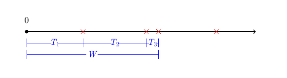

# Random Variables {#rv}

## Overview {#rv:overview}

In this Chapter we will introduce the concept of a **random variable** ([Section 5.2](#rv:des)). Random variables assign numerical values to outcomes from a sample space and these can be discrete (counts), continuous (measurements on the real-line) or mixed. Key summaries for random variables are their expectation (mean) and variance, concepts that we have already seen for summarising data and which in [Section 5.3](#rv:expect) we formalise for random variables. We introduce important classes of random variables (probability distributions), both discrete and continuous distributions. These include:  

- [Section 5.4](#rv:Bernoulli) Bernoulli random variables and their extensions such as the [Bernoulli](#rv:Bernoulli:bern), [Binomial](#rv:Bernoulli:bin), [Geometric](#rv:Bernoulli:geom) and [Negative Binomial](#rv:Bernoulli:negbin) distributions  
- [Section 5.5](#rv:Poisson) Poisson distribution  
- [Section 5.6](#rv:exponential) Exponential random variables and their extensions such as the [Exponential](#rv:exponential:exp), [Gamma](#rv:exponential:gamma), [Chi-squared](#rv:exponential:chi) and [Beta](#rv:exponential:beta) distributions  
- [Section 5.7](#rv:normal) Normal (Gaussian) distribution  

## Random variables {#rv:des}

:::{.def #rv:def:rv}  
```{asis, include=knitr::is_latex_output()} 
\textcolor{red}{Definition 5.2.1.}
```
<span style="color: rgba(207, 0, 15, 1);">**Random variable.**</span>  

A *random variable* (r.v.) $X$ is a mapping from $\Omega$ to $\mathbb R$, that is 

<center>
$$X:\Omega \longrightarrow \mathbb{R}.$$
</center>
:::

For example,

- Let $X$ be the number of heads observed when tossing a fair coin three times.

- Let $T$ be the length of time you wait to be serviced by a bank teller.

**Note:** Random variables can be either discrete (*i.e.* take a finite or countable number of values), continuous, or mixed. 

An example of a mixed random variable is, $R$, the amount of rain $(ml)$ on a given day. 

:::{.def #rv:def:cdf}  
```{asis, include=knitr::is_latex_output()} 
\textcolor{red}{Definition 5.2.2.}
```
<span style="color: rgba(207, 0, 15, 1);">**Cumulative distribution function.**</span>  

The *cumulative distribution function* (c.d.f.) of a random variable $X$ is

<center>
$$F_X(x) = P(X \leq x) = P(\{\omega\in\Omega:X(\omega)\leq x\}).$$
</center>
:::

Properties of the c.d.f include

- $P(X>x) = 1 - F_X(x)$.

- $P(x_1 < X \leq x_2) = F_X(x_2) - F_X(x_1)$.

Note the c.d.f. is defined for all random variables regardless of whether they are discrete, continuous or mixed.

:::{.def #rv:def:pmf}  
```{asis, include=knitr::is_latex_output()} 
\textcolor{red}{Definition 5.2.3.}
```
<span style="color: rgba(207, 0, 15, 1);">**Probability mass function.**</span>   

If $X$ is a **discrete** random variable, then we can define a function $p_X(x)$, called the *probability mass function* (p.m.f.) such that  
<center>  
$$p_X(x_i) = P(X=x_i) = P(\{\omega:X(\omega)=x_i\}).$$  
</center>  
:::

:::{.ex #rv:ex:coin}  
```{asis, include=knitr::is_latex_output()} 
\textcolor{red}{Example 5.2.4.}
```
<span style="color: rgba(207, 0, 15, 1);">**Coin toss.**</span>  

Let $X$ be the number of heads observed when tossing a fair coin three times.  What is the p.m.f. of $X$?

<center>
$$ p_X(x) = \begin{cases}
1/8, \qquad \text{if $x=0$}, \\
3/8, \qquad \text{if $x=1$}, \\
3/8, \qquad \text{if $x=2$}, \\
1/8, \qquad \text{if $x=3$}, \\
0, \qquad \text{otherwise.}
\end{cases}$$ 
</center>
:::

:::{.def #rv:def:pdf}  
```{asis, include=knitr::is_latex_output()} 
\textcolor{red}{Definition 5.2.5.}
```
<span style="color: rgba(207, 0, 15, 1);">**Probability density function.**</span>   

Let $X$ be a **continuous** random variable.  If there exists some non-negative function $f_X$ on $\mathbb R$ such that for any interval $I$,  
<center>  
$$P(X \in I) = \int_I f_X(u) du,$$  
</center>  
the function $f_X$ is called the *probability density function* (p.d.f.) of $X$.
:::

Note that if $F_X(x)$ is the c.d.f. of a continuous random variable $X$, then the p.d.f. of $X$ is given by
$$f_X(x) = \frac{d F_X(x)}{dx}.$$

Note that  
<center>  
$$ F_X(x) = P(X \leq x) = \begin{cases}
\sum\limits_{x_i \leq x} p_X(x_i), \qquad \text{if $X$ is discrete,} \\[9pt]
\int_{-\infty}^x f_X(u)du, \qquad \text{if $X$ is continuous.}
\end{cases} $$  
</center>  

## Expectation {#rv:expect}

In this Section we formally define the [expectation](#rv:def:expect) (mean), [variance](#rv:def:variance), [median](#rv:def:median) and [mode](#rv:def:mode) of a random variable. We can note the similarities with the definitions of the [measures of location](#summary_location) (mean, median and mode) and [variance](#summary_spread) of summary statistics in [Section 2](#summary).

:::{.def #rv:def:expect}  
```{asis, include=knitr::is_latex_output()} 
\textcolor{red}{Definition 5.3.1.}
```
<span style="color: rgba(207, 0, 15, 1);">**Expectation.**</span>

The *expectation* of a random variable $X$ is defined by  
<center>
$$E[X] = \begin{cases}
\sum\limits_{x_i} x_i p_X(x_i), \quad \text{if $X$ is discrete,} \\[9pt]
\int_{-\infty}^\infty x f_X(x)dx, \quad \text{if $X$ is continuous.}
\end{cases}$$
</center>
:::

Note that $E[X]$ only exists if $E[|X|]<\infty$ and that $E[X]$ is a measure of the *centre* of the distribution, that is the centre of mass. We can also define expectations of functions of random variables.

:::{.def #rv:def:expect2}  
```{asis, include=knitr::is_latex_output()} 
\textcolor{red}{Definition 5.3.2.}
```
\
If $Y=g(X)$ then the *expectation* of $Y$ is given by  
<center>
\begin{align*}
E[Y] &= E[g(X)] 
&= \begin{cases}
\sum\limits_{x_i} g(x_i) p_X(x_i), \quad \text{if $X$ is discrete,} \\[9pt]
\int_{-\infty}^\infty g(x) f_X(x) \,dx, \quad \text{if $X$ is continuous.}
\end{cases}
\end{align*}
</center>
:::

For constants $c$, $c_i$ and $d$, the following are properties of the expectation:

- $E[c]=c$;  
- $E[c g(X) + d]= c E[g(X)] + d$;  
- $E \left[ \sum\limits_{i=1}^n c_i g_i(X_i) \right] = \sum\limits_{i=1}^n c_i E[g_i(X_i)]$;  
- A special case of the above results is $c_1 = \ldots =c_n =1$ and $g_i (\cdot)$ is the identity transform, $g_i (X_i) =X_i$. Then $E \left[ \sum\limits_{i=1}^n X_i \right] = \sum\limits_{i=1}^n E \left[  X_i \right]$.  

:::{.def #rv:def:variance}  
```{asis, include=knitr::is_latex_output()} 
\textcolor{red}{Definition 5.3.3.}
```
<span style="color: rgba(207, 0, 15, 1);">**Variance.**</span>  

The *variance* of $X$ is

<center>
$$ \text{Var} (X) = E \left[ (X-E[X])^2 \right].$$
</center>
The *standard deviation* of $X$ is $\sqrt{\text{Var} (X)}$.
:::

For constants $c$, $c_i$ and $d$, the following are properties of the variance:

- $\text{Var}(X) = E[X^2] - (E[X])^2$;

- $\text{Var}(X) \geq 0$;

- $\text{Var}(cX + d) = c^2 \text{Var}(X)$;

- If $X_1,\dots,X_n$ are independent, then  
<center>  
$$\text{Var} \left( \sum_{i=1}^n c_i X_i \right) = \sum_{i=1}^n c_i^2 \text{Var} (X_i).$$
</center>  

:::{.def #rv:def:median}  
```{asis, include=knitr::is_latex_output()} 
\textcolor{red}{Definition 5.3.4.}
```
<span style="color: rgba(207, 0, 15, 1);">**Median.**</span>  

The *median* of $X$ is defined as $x_{0}$ such that $F_X (x_{0}) =0.5$.
:::

For a discrete random variable it is unlikely that there exists $x_0$ such that $F_X (x_{0}) =0.5$. Therefore for discrete random variables the median is defined to be the smallest $x_0$ such that $F_X (x_0) \geq 0.5$.

:::{.def #rv:def:mode}  
```{asis, include=knitr::is_latex_output()} 
\textcolor{red}{Definition 5.3.5.}
```
<span style="color: rgba(207, 0, 15, 1);">**Mode.**</span>  

The *mode* of $X$ is the point at which $f_X (x)$ is maximised, *i.e.* mode is $x_{0}$ if and only if $f_X(x_{0}) \geq f_X(x)$ for all $x$.
:::

:::{.ex #rv:exer:cts_example}
```{asis, include=knitr::is_latex_output()} 
\textcolor{red}{Example 5.3.6.}
```
<span style="color: rgba(207, 0, 15, 1);">**Continuous distribution.**</span>

Suppose that the random variable $X$ has probability density function:  
<center>  
\[ f_X (x) = \left\{ \begin{array}{ll} k x^3 & 1 \leq x \leq 2, \\
0 & \mbox{otherwise}. \end{array} \right. \]  
</center>  

<center>
```{r density1, echo = FALSE, message=FALSE, fig.keep='all', out.width= "100%", fig.cap = "Plot of $f_X (x)$."}

```
</center>

1. Show that $k =4/15$;  
2. Find $P (\frac{5}{4}\le  X \le \frac{7}{4})$.
3. Compute the standard deviation of $X$.  
*Remember:* Standard deviation is the square root of the variance.  
4. Find the median of $X$.  
::: 

Attempt [Example 5.3.6](#rv:exer:cts_example) and then watch [Video 10](#video10) for the solutions.

```{asis, include=knitr::is_html_output()}
:::{.des #video10}
<span style="color: rgba(207, 0, 15, 1);">**Video 10: Continuous random variable**</span>  

<iframe id="kaltura_player" src="https://cdnapisec.kaltura.com/p/1355621/sp/135562100/embedIframeJs/uiconf_id/13188771/partner_id/1355621?iframeembed=true&playerId=kaltura_player&entry_id=1_m4k87ypu&flashvars[streamerType]=auto&amp;flashvars[localizationCode]=en&amp;flashvars[sideBarContainer.plugin]=true&amp;flashvars[sideBarContainer.position]=left&amp;flashvars[sideBarContainer.clickToClose]=true&amp;flashvars[chapters.plugin]=true&amp;flashvars[chapters.layout]=vertical&amp;flashvars[chapters.thumbnailRotator]=false&amp;flashvars[streamSelector.plugin]=true&amp;flashvars[EmbedPlayer.SpinnerTarget]=videoHolder&amp;flashvars[dualScreen.plugin]=true&amp;flashvars[hotspots.plugin]=1&amp;flashvars[Kaltura.addCrossoriginToIframe]=true&amp;&wid=1_ilc0iyxo" width="640" height="420" allowfullscreen webkitallowfullscreen mozAllowFullScreen allow="autoplay *; fullscreen *; encrypted-media *" sandbox="allow-downloads allow-forms allow-same-origin allow-scripts allow-top-navigation allow-pointer-lock allow-popups allow-modals allow-orientation-lock allow-popups-to-escape-sandbox allow-presentation allow-top-navigation-by-user-activation" frameborder="0" title="Continuous Distribution FINAL VERSION"></iframe>
:::
```

```{asis, include=knitr::is_latex_output()}
Watch [\textcolor{blue}{Video 10: Continuous random variable}](https://mediaspace.nottingham.ac.uk/media/Continuous+Distribution+FINAL+VERSION/1_m4k87ypu)
```  


<details><summary>Solution to Example 5.3.6.</summary>
:::{.prf}
1. Remember $\int_{-\infty}^\infty f_X (x) \, dx =1$ and therefore  
<center>  
\begin{eqnarray*}
1 &=& \int_{-\infty}^\infty f_X (x) \, dx \\
&=& \int_1^2 k x^3 \, dx \\
&=& k \left[ \frac{x^4}{4} \right]_1^2 \\
&=& k \left(\frac{2^4}{4} -\frac{1^4}{4} \right)  = k \times \frac{15}{4}.
\end{eqnarray*}
</center>  
Thus, $k=\frac{4}{15}$.   
2. It follows from the above that the c.d.f of $X$ is  
<center>  
\[ F_X (x) = \left\{ \begin{array}{ll} 0 & \mbox{for } x<1 \\ \int_1^x \frac{4}{15}y^3 \, dy = \frac{x^4-1}{15} & \mbox{for } 1 \leq x \leq 2 \\  1 & \mbox{for } x>2  \end{array} \right. \]  
</center>  
Thus
<center>  
\begin{eqnarray*}
P \left(\frac{5}{4}  \leq X \leq \frac{7}{4}\right) &=& \frac{(7/4)^4-1}{15} - \frac{(5/4)^4-1}{15} \\
&=& \frac{1}{15} \left[\left( \frac{7}{4}\right)^4 -\left( \frac{5}{4}\right)^4 \right] \\
&=& \frac{37}{80} (=0.4625).
\end{eqnarray*}  
</center>  
3. Remember that the standard deviation of $X$ is the square root of the variance. Therefore  
<center>  
\[ sd (X) = \sqrt{var(X)} = \sqrt{E[X^2]- E[X]^2}. \]  
</center>  

For any $n=1,2,\ldots$,  
<center>  
\begin{align*} E[X^n] &= \int_{-\infty}^\infty x^n f_X(x) \, dx \\
&= \int_1^2 x^n \frac{4}{15} x^3 \, dx \\
&= \frac{4}{15} \left[\frac{x^{n+4}}{n+4} \right]_1^2 \\
&= \frac{4 (2^{n+4}-1)}{15(n+4)}. \end{align*}  
</center>  

Therefore  
<center>  
\begin{align*} 
E [X] &= \frac{4 (32-1)}{15 \times 5} = \frac{124}{75} = 1.6533 \\
E [X^2] &= \frac{4 (64-1)}{15 \times 6} = \frac{14}{5} = 2.8 \end{align*}  
</center>  

Thus  
<center>  
\[ sd (X) = \sqrt{2.8 -1.6533^2} = 0.2579. \]  
</center>  
4. The median of $X$, $m$, satisfies  
<center>  
\begin{eqnarray*}
0.5 &=& P (X \leq m) = \frac{m^4 -1}{15} \\
7.5 &=& m^4 -1 \\
8.5 &=& m^4.
\end{eqnarray*}
</center>  

Therefore  
<center>  
\[ m = (8.5)^{1/4} =1.7075. \]  
</center>  
:::
</details>
\

## Bernoulli distribution and its extension {#rv:bernoulli}

In this section, we start with the [Bernoulli](#rv:Bernoulli:bern) random variable, which is the simplest non-trivial probability distribution taking two possible values (0 or 1). In itself the Bernoulli random variable might not seem particularly exciting, but it forms a key building block in probability and statistics. We consider probability distributions which arise as extensions of the Bernoulli random variable such as the [Binomial](#rv:Bernoulli:bin) distribution (sum of $n$ Bernoulli random variables),  the [Geometric](#rv:Bernoulli:geom) distribution (number of Bernoulli random variables until we get a 1) and the [Negative Binomial](#rv:Bernoulli:negbin) distribution (number of Bernoulli random variables until we get our $n^{th}$ 1).

### Bernoulli distribution {#rv:Bernoulli:bern}

:::{.def #rv:def:Bernoulli}  
```{asis, include=knitr::is_latex_output()} 
\textcolor{red}{Definition 5.4.1.}
```
<span style="color: rgba(207, 0, 15, 1);">**Bernoulli trial.**</span>  

A *Bernoulli trial* is a simple random experiment with two outcomes: success $(1)$ or failure $(0)$.  The success probability is $p$, so failure probability = $1-p (=q)$.
A Bernoulli random variable $X$ describes this:  
<center>  
\begin{eqnarray*}
X =
\left\{
\begin{array}{ll}
1 & \mbox{success - probability $p$}, \\
0 & \mbox{failure - probability $q=1-p$.}
\end{array}
\right.
\end{eqnarray*} 
</center>  
:::

The Bernoulli distribution has probability mass function:  
<center>  
\[ p_X (x) = p^x (1-p)^{1-x} \hspace{1cm} x=0,1. \]  
</center>  

[If $x =1$,
$p_X (1) = p^1 q^0 = p$ and if $x=0$, $p_X (0) = p^0 q^1 =
q$.]

We have that 
<center>  
\[
E[X]= [p \times 1] + [q \times 0] = p
\] 
</center>  
and  
<center>  
\[
E[X^{2}] = [p \times 1^{2}] + [q \times 0^{2}] = p.
\]  
</center>  
Therefore  
<center>  
\[
var (X) = E[X^{2}] - E[X]^{2} = p - p^{2} = p(1-p) =pq.
\]  
</center>  

### Binomial Distribution {#rv:Bernoulli:bin}

:::{.def #rv:def:iid}
```{asis, include=knitr::is_latex_output()} 
\textcolor{red}{Definition 5.4.2.}
```
<span style="color: rgba(207, 0, 15, 1);">**Independent and identically distributed**</span>   
Two discrete random variables $X$ and $Y$ are said to be **independent and
identically distributed** (*i.i.d.*) if for all $x, y \in \mathbb{R}$,  
<center>  
\[ P(X=x, Y=y) = P(X=x) \times P(Y=y) \hspace{0.5cm} (\mbox{independence}) \]  
</center>  
and for all $x \in \mathbb{R}$,  
<center>  
\[ P(Y=x) = P(X=x), \]  
</center>  
(identically distributed, *i.e.* have the same pmf.)
:::

\

:::{.def #rv:def:bin}  
```{asis, include=knitr::is_latex_output()} 
\textcolor{red}{Definition 5.4.3.}
```
<span style="color: rgba(207, 0, 15, 1);">**Binomial distribution.**</span>   

Consider $n$ independent Bernoulli trials, each with
success probability $p$.  Let $X$ be the total number of successes.  Then $X$ has
a *Binomial* distribution, written  
<center>  
\[
X \sim {\rm Bin}(n,p), \; \; \mbox{or } X \sim {\rm B}(n,p)
\]  
</center>  
and for $k = 0, 1, \ldots, n$,  
<center>  
\[
p_X(k) = P(X = k) = \binom{n}{k} p^{k}(1-p)^{n-k} .
\]  
</center>  
:::

To see this: consider any particular sequence of $k$ successes and $n-k$
failures.  Each such sequence has probability $p^{k}(1-p)^{n-k}$, since the $n$ trials are independent.
There are $\binom{n}{k}$ ways of choosing the positions of the $k$ successes out of $n$ trials.


**Note:**
1. $n$ and $p$ are called the parameters of the Binomial distribution.  
2. The number of trials $n$ is fixed.  
3. There are only two possible outcomes:  'success' with probability $p$ and 'failure' with probability $q =1-p$.  
4. The probability of success $p$ in each independent trial is constant.  

:::{.lem #rv:lem:binomial_expectation}
```{asis, include=knitr::is_latex_output()} 
\textcolor{red}{Lemma 5.4.4.}
```
<span style="color: rgba(207, 0, 15, 1);">**Binomial distribution: Expectation and variance.**</span> 

Let $X \sim {\rm Bin} (n,p)$, then  
<center>  
\[ E[X]=np \hspace{0.5cm} \mbox{and} \hspace{0.5cm} var(X) = n p(1-p). \]  
</center>  
:::

:::{.prf}
We can write  
<center>  
\begin{equation}   
X = X_1 + X_2 + \ldots + X_n, 
(\#eq:bin1)  
\end{equation}  
</center>  
where $X_1, X_2, \ldots, X_n$ are independent Bernoulli random variables each with success probability $p$.

Therefore using properties of expectations  
<center>  
\begin{align*}
E [X] & = E [ X_1 + X_2 + \ldots + X_n ] \\
&=  E [ X_1 ]+ E [X_2] + \ldots + E [X_n ]  \\
& = p + p + \ldots + p = np.\end{align*}  
</center>  

Given that the $X_i$'s in \@ref(eq:bin1) are independent, we also have that  
<center>  
\begin{align*}
var (X) & = var ( X_1 + X_2 + \ldots + X_n ) \\
&= var ( X_1) + var (X_2) + \ldots + var (X_n ) \\
& = p(1-p) + p(1-p) + \ldots + p(1-p) = np(1-p).\end{align*}  
</center>  
:::
\

The cumulative distribution function is  
<center>  
\[
F_X (x) = P (X \leq x) = \sum_{k=0}^{[x]} \binom{n}{k} p^{k}(1-p)^{n-k},
\]  
</center>  
where $[x]$ is the greatest integer not greater than $x$.

An **R Shiny** app is provided to explore the Binomial distribution. 

R Shiny app: [Binomial distribution](https://shiny-new.maths.nottingham.ac.uk/pmzpn/Binomial/)


:::{.ex #rv:ex:mc}
```{asis, include=knitr::is_latex_output()} 
\textcolor{red}{Example 5.4.5.}
```
\
Twenty multiple choice questions, each with 5 options.  Suppose that you
guess at random, independently for each question.  Then if $X$ is the number of
right answers,  
<center>  
\[
X \sim Bin(20,0.2).
\]  
</center>  

Then  
<center>  
\[
P(X = 3) = \binom{20}{3} (0.2)^{3}(0.8)^{17} =0.2053,
\]  
</center>  
and  
<center>  
\[
P(X \leq 3) = \sum_{k=0}^{3} \binom{20}{k} (0.2)^{k}(0.8)^{20-k} = 0.4114.
\]  
</center>  
:::

### Geometric Distribution {#rv:Bernoulli:geom}

:::{.def #rv:def:geometric}  
```{asis, include=knitr::is_latex_output()} 
\textcolor{red}{Definition 5.4.6.}
```
<span style="color: rgba(207, 0, 15, 1);">**Geometric distribution.**</span>  

Consider a sequence of independent Bernoulli trials each with success probability $p$.  Let $Y$ denote the number of trials needed for the first success to appear.  Then $Y$ has a *Geometric* distribution with parameter $p$, written $Y \sim Geom(p)$, and  
<center>  
\[
p_Y (k) = (1-p)^{k-1}p, \; \; \; k = 1, 2, 3, \ldots .
\]
</center>  
:::

*To see this:* If the $k^{th}$ trial is the first success then the first $k-1$ trials must have
been failures.  Probability of this is $(1-p)^{k-1}p$.

Note that  
<center>  
\[
\sum_{k=1}^\infty p_Y (k)=\sum_{k=1}^\infty (1-p)^{k-1}p=p\sum_{i=0}^\infty (1-p)^i=\frac{p}{1-(1-p)}=1,
\]  
</center>  
so a success eventually occurs with probability $1$.


:::{.lem #geometric_expectation}
```{asis, include=knitr::is_latex_output()} 
\textcolor{red}{Lemma 5.4.7.}
```
<span style="color: rgba(207, 0, 15, 1);">**Geometric distribution: Expectation and variance.**</span> 

Let $Y \sim {\rm Geom} (p)$, then  
<center>  
\[ E[Y]= \frac{1}{p} \hspace{0.5cm} \mbox{and} \hspace{0.5cm} var(Y) = \frac{1-p}{p^2}. \]  
</center>  
:::

:::{.prf}
First step: Let $q=1-p$ and write
<center>
\begin{eqnarray*}
E[Y] & = & \sum_{k=1}^{\infty} k P(Y=k) \\ & = & \sum_{k=1}^{\infty} k (1-p)^{k-1}p \\
 & = & p \sum_{k=1}^{\infty} k q^{k-1} \end{eqnarray*}
</center>
 
Note that $k q^{k-1}$ is the derivative of $q^k$ with respect to $q$. Hence,
<center>
\begin{eqnarray*}
E[Y] & = & p \sum_{k=1}^{\infty} \frac{{\rm d} \;}{{\rm d}q} \left\{ q^{k} \right\}.
\end{eqnarray*}  
</center>
We can interchange the order of summation and differentiation (we won't go into the technical requirements):
<center>
\begin{eqnarray*}
E [Y] & = & p \frac{{\rm d} \;}{{\rm d}q} \left( \sum_{k=1}^{\infty} q^k\right) \\
& = & p \frac{{\rm d} \;}{{\rm d}q} \left( \frac{q}{1-q}\right),
 \end{eqnarray*}
</center> 
since $\sum_{k=1}^\infty x^k = x/(1-x)$ if $|x| <1$.

Therefore
<center>
 \begin{eqnarray*}
E [Y] & = & p \frac{(1)(1-q)- q(-1)}{(1-q)^2}\\
& = & \frac{p}{p^2} = \frac{1}{p}.
 \end{eqnarray*}
</center>

By a similar method, we obtain
<center>
\[
E[Y(Y-1)] =  \frac{2(1-p)}{p^{2}}.
\]
</center>
Since
\begin{equation}
E[Y(Y-1)]= E[Y^2-Y] = E[Y^2] -E[Y], 
(\#eq:sec)
\end{equation}
we have that
<center>
\[
var(Y) = E[Y(Y-1)] + E[Y] - E[Y]^{2} = \frac{1-p}{p^{2}}.
\]
</center>
:::

### Negative binomial Distribution {#rv:Bernoulli:negbin}

:::{.def #rv:def:neg_binom}  
```{asis, include=knitr::is_latex_output()} 
\textcolor{red}{Definition 5.4.8.}
```
<span style="color: rgba(207, 0, 15, 1);">**Negative binomial distribution.**</span>  

Consider a sequence of independent Bernoulli trials, each with success probability $p$.  If $W$ is
the number of trials needed until $r$ successes have occurred then $W$ has a *Negative
Binomial* distribution, $W \sim {\rm Neg Bin} (r,p)$, with probability mass function
<center>
\[
p_W (k) = \binom{k-1}{r-1}p^{r}(1-p)^{k-r} \; \; \; k = r, r+1, \ldots
\]
</center>
:::

*To see this:* We must have the $k^{th}$ trial is successful and that it is the $r^{th}$ success. Therefore we have $r-1$ successes in first $k-1$ trials, the locations of which can be chosen in $\binom{k-1}{r-1}$ ways. 

:::{.lem #rv:lem:neg_binom_expectation}
```{asis, include=knitr::is_latex_output()} 
\textcolor{red}{Lemma 5.4.9.}
```
<span style="color: rgba(207, 0, 15, 1);">**Negative binomial distribution: Expectation and variance.**</span> 

Let $W \sim {\rm Neg Bin} (r,p)$, then
<center>
\[ E[W]= \frac{r}{p} \hspace{0.5cm} \mbox{and} \hspace{0.5cm} var(W) =  \frac{r(1-p)}{p^2}. \]
</center>
:::

:::{.prf}
Note that we can write 
<center>
\[
W = Y_{1} + Y_{2} + \ldots + Y_{r},
\]
</center>
where $Y_1$ is the number of trials until the first success and, for $i=2,3,\dots,r$, $Y_i$ is the number of trials after the $(i-1)^{st}$ success until the $i^{th}$ success.

We observe that $Y_1, Y_2,\dots,Y_r$  are independent ${\rm Geom}(p)$ random variables, so
<center>
\[
E[Y_1]= \frac{1}{p} \qquad\mbox{and}\qquad var(Y_1)= \frac{1-p}{p^2},
\]
</center>
whence
<center>
\[
E[W] = E[Y_{1} + Y_{2} +\ldots + Y_{r}] =E[Y_{1}]+E[Y_{2}]+\ldots+E[Y_{r}]  = \frac{r}{p},
\]
</center>
and
<center>
\[
var(W) = var(Y_{1} + Y_{2} +\ldots +Y_{r}) =var(Y_{1})+var(Y_{2})+\ldots+var(Y_{r}) = \frac{r(1-p)}{p^{2}}.
\]
</center>
:::
\

The negative binomial distribution $W \sim {\rm Neg Bin} (r,p)$ is the sum of $r$ independent geometric, $Y \sim {\rm Geom} (p)$ distributions in the same way that the binomial distribution $X \sim {\rm Bin} (n,p)$ is the sum of $n$ independent Bernoulli random variables with success probability $p$.

An **R Shiny** app is provided to explore the Negative Binomial distribution. 

R Shiny app: [Negative Binomial distribution](https://shiny-new.maths.nottingham.ac.uk/pmzpn/NegBin/)

[Example 5.4.10](#rv:exer:crazy_golf) draws together the different Bernoulli-based distributions and demonstrates how they are used to answer different questions of interest.

:::{.ex #rv:exer:crazy_golf}
```{asis, include=knitr::is_latex_output()} 
\textcolor{red}{Example 5.4.10.}
```
<span style="color: rgba(207, 0, 15, 1);">**Crazy golf.**</span>  
\
<center>
```{r golf1, echo = FALSE, message=FALSE, fig.keep='all', out.width= "80%", fig.cap = "Crazy golf picture."}
knitr::include_graphics("Images/crazygolf1.jpg")
```
</center>

A child plays a round of crazy golf. The round of golf consists of 9 holes. The number of shots the child takes at each
hole is geometrically distributed with success probability 0.25.

(a) Calculate the probability that the child gets a 'hole in
one' on the first hole. (A 'hole in one' means the child only takes
one shot on that hole.)  
(b) Calculate the probability that the child takes more than five shots on the first hole.  
(c) Calculate the probability that the child gets three `hole in one' during their round.
(d) Calculate the mean and variance for the total number of shots the child takes.  
(e) Calculate the probability that the child takes 36 shots in completing their round.  
:::

Attempt [Example 5.4.10 (Crazy golf)](#rv:exer:crazy_golf) and then watch [Video 11](#video11) for the solutions.

```{asis, include=knitr::is_html_output()}
:::{.des #video11}
<span style="color: rgba(207, 0, 15, 1);">**Video 11: Crazy Golf Example**</span>  

<iframe id="kaltura_player" src="https://cdnapisec.kaltura.com/p/1355621/sp/135562100/embedIframeJs/uiconf_id/13188771/partner_id/1355621?iframeembed=true&playerId=kaltura_player&entry_id=1_n6lfsnjm&flashvars[streamerType]=auto&amp;flashvars[localizationCode]=en&amp;flashvars[sideBarContainer.plugin]=true&amp;flashvars[sideBarContainer.position]=left&amp;flashvars[sideBarContainer.clickToClose]=true&amp;flashvars[chapters.plugin]=true&amp;flashvars[chapters.layout]=vertical&amp;flashvars[chapters.thumbnailRotator]=false&amp;flashvars[streamSelector.plugin]=true&amp;flashvars[EmbedPlayer.SpinnerTarget]=videoHolder&amp;flashvars[dualScreen.plugin]=true&amp;flashvars[hotspots.plugin]=1&amp;flashvars[Kaltura.addCrossoriginToIframe]=true&amp;&wid=1_xpthkbxs" width="640" height="420" allowfullscreen webkitallowfullscreen mozAllowFullScreen allow="autoplay *; fullscreen *; encrypted-media *" sandbox="allow-downloads allow-forms allow-same-origin allow-scripts allow-top-navigation allow-pointer-lock allow-popups allow-modals allow-orientation-lock allow-popups-to-escape-sandbox allow-presentation allow-top-navigation-by-user-activation" frameborder="0" title="Crazy Golf FINAL VERSION"></iframe>
:::
```

```{asis, include=knitr::is_latex_output()}
Watch [\textcolor{blue}{Video 11: Crazy Golf Example}](https://mediaspace.nottingham.ac.uk/media/Crazy+Golf+FINAL+VERSION/1_n6lfsnjm)
```  


<details><summary>Solution to Example 5.4.10.</summary>
:::{.prf}
Let $X_i$ denote the number of shots taken on hole $i$. Then $X_i \sim {\rm Geom} (0.25)$.

(a) A 'hole in one' on the first hole is the event $\{ X_1 =1\}$. Therefore

<center>
\[ P(\mbox{Hole in one}) = P(X_1 =1) =0.25. \] 
</center>
(b) More than five shots on the first hole is the event $\{X_1 >5\}$. Therefore

<center>
\[ P(X_1 >5) =0.75^5 = 0.2373. \]
</center>
(c) This is a binomial question since there are $n=9$ holes and on each hole there is $p=P(X_1 =1) =0.25$ of obtaining a hole in one. Let $Y \sim {\rm Bin} (9,0.25)$ denote the number of holes in one in a round, then

<center>
\[ P(Y=3) = \binom{9}{3} (0.25)^3 (0.75)^6 =0.2336. \]  
</center>
(d) The total number of shots taken is 

<center>
\[Z = X_1 + X_2 + \ldots +X_9 \sim {\rm Neg Bin} (9,0.25). \]
</center>

Thus the mean number of shots taken is $E[Z] = \frac{9}{0.25} = 36$ and the variance of the number of shots is $var (Z) = \frac{9 (1-0.25)}{0.25^2} =108$.  
(e) The probability that the child takes exactly 36 (mean number of) shots is

<center>
\[ P(Z=36) = \binom{36-1}{9-1} (0.25)^9 (0.75)^{27} = 0.0380. \]  
</center>
:::
</details>

## Poisson distribution {#rv:Poisson}

The Poisson distribution is often used to model
'random' events - *e.g.* hits on a website; traffic accidents; customers
joining a queue etc.


Suppose that events occur at rate $\lambda > 0$ per unit time.  Divide the time interval $[0,1)$
into $n$ small equal parts of length $1/n$. 

<center>
\[
[0,1) = \left[ 0, \frac{1}{n} \right) \cup \left[ \frac{1}{n}, \frac{2}{n} \right) \cup \ldots \cup \left[ \frac{i}{n},\frac{i+1}{n} \right)
\cup \ldots \cup \left[ \frac{n-1}{n},1 \right).
\]
</center>

Assume that each interval can have either zero or one event, independently of other intervals, and

<center>
\[
P \left[ \mathrm{1~event~in} \left[ \frac{i}{n}, \frac{i+1}{n} \right) \right] = \frac{\lambda}{n}.
\]
</center>

<center>
```{r pois1, echo = FALSE, message=FALSE, fig.keep='all', out.width= "100%", fig.cap = "Four events (red crosses) in 50 sub-intervals of [0,1]."}

```
</center>

Let $X$ be the number of events in the time interval $[0,1)$. 
Then 
<center>
\[ X \sim \mathrm{Bin} (n, \lambda/n) \]
</center>
and letting $n \to \infty$, (the number of intervals grows but the chance of observing an event in a given interval decreases), we have that
<center>
\begin{eqnarray*}
P (X=k) & = & \binom{n}{k} \left( \frac{\lambda}{n} \right)^{k} \left( 1 - \frac{\lambda}{n}
\right)^{n-k} \\
& = & \frac{n (n-1) \ldots (n-k+1)}{k!} \times \frac{\lambda^{k}}{n^k} \times \left( 1 - \frac{\lambda}{n}
\right)^{n-k} \\
& = & \frac{n (n-1) \ldots (n-k+1)}{n^k} \times \frac{\lambda^{k}}{k!}\times
\frac{ (1 - \lambda / n)^n}{(1 - \lambda / n )^k}  \\
& = & 1 \left(1 - \frac{1}{n} \right) \cdots \left(1 - \frac{(k-1)}{n} \right) \times \frac{\lambda^k}{k!}
\times \frac{ (1 - \lambda / n)^n}{(1 - \lambda / n )^k}  \\
& \rightarrow & 1 \times  \frac{\lambda^k}{k!} \times \exp(-\lambda)
\; \; \mbox{ as $n \to \infty$, for fixed $k$}.
\end{eqnarray*}
</center>

:::{.def #rev:def:Poisson}  
```{asis, include=knitr::is_latex_output()} 
\textcolor{red}{Definition 5.5.1.}
```
<span style="color: rgba(207, 0, 15, 1);">**Poisson distribution**</span>   

Let $X$ be a **discrete** random variable with parameter $\lambda >0$ and p.m.f.

<center>
$$P(X=x) = \frac{\lambda^x}{x!} \exp(-\lambda) \hspace{1cm} (x=0,1,\ldots).$$ 
</center>

Then $X$ is said to follow a **Poisson** distribution with parameter $\lambda$, denoted $X \sim {\rm Po} (\lambda)$. 
:::

:::{.lem #rev:lem:poisson_expectation}
```{asis, include=knitr::is_latex_output()} 
\textcolor{red}{Lemma 5.5.2.}
```
<span style="color: rgba(207, 0, 15, 1);">**Poisson distribution: Expectation and variance.**</span>

Let $X \sim {\rm Po} (\lambda)$, then

<center>
\[ E[X]= \lambda \hspace{0.5cm} \mbox{and} \hspace{0.5cm} var(X) =  \lambda. \]
</center>
:::

:::{.prf}
By definition of expectation,
<center>
\[
E[X] = \sum_{x=0}^\infty x P(X=x) = \sum_{x=1}^\infty x P(X=x), \]
</center>
since $0 \times P(X=0) =0$.

Now 

<center>
\begin{eqnarray*}
E[X] &=& \sum_{x=1}^\infty x \times \frac{\lambda^x}{x!} \exp(-\lambda) \\
&=& \exp(-\lambda) \sum_{x=1}^\infty \frac{x \lambda^x}{x!} = \lambda \exp(-\lambda) \sum_{x=1}^\infty \frac{ \lambda^{x-1}}{(x-1)!}. \end{eqnarray*}
</center>

Using a change of variable $k=x-1$,

<center>
\[ E[X]= \lambda \exp(-\lambda) \sum_{k=0}^\infty \frac{ \lambda^k}{k!} = \lambda \exp(-\lambda) \exp(\lambda) =\lambda. \]
</center>

Similarly, we can show that
<center>
\[ E[X(X-1)] = \sum_{x=0}^\infty x (x-1) \left( \frac{\lambda^x}{x!} \exp(-\lambda) \right) = \lambda^2.  \]
</center>

Therefore, as noted in [Lemma 5.4.7](#geometric_expectation) \@ref(eq:sec), we have that $E[X^2]=E[X(X-1)] + E[X]$ giving

<center>
\begin{eqnarray*}
var(X) &=& E[X(X-1)] + E[X] - E[X]^2 \\
 &=&  \lambda^2 + \lambda - \lambda^2 = \lambda. 
\end{eqnarray*} 
</center> 
:::


## Exponential distribution and its extensions {#rv:exponential}

In this section we start with the [Exponential](#rv:exponential:exp) random variable which is an important continuous distribution that can take positive values (on the range $[0,\infty)$). The Exponential distribution is the continuous analogue of the [Geometric](#rv:Bernoulli:geom) distribution. The sum of exponential distributions leads to the [Erlang distribution](https://en.wikipedia.org/wiki/Erlang_distribution) which is a special case of the [Gamma distribution](#rv:exponential:gamma). Another special case of the Gamma distribution is the [$\chi^2$ (Chi squared) distribution](#rv:exponential:chi) which is important in statistics. Finally, we consider the [Beta distribution](#rv:exponential:beta) which is continuous distribution taking values on the range $(0,1)$ and can be constructed from Gamma random variables via a transformation. (See [Section 14](#Transform) for details on transformations.)


### Exponential distribution {#rv:exponential:exp}

Let $X$ denote the total number of hits on a website in time $t$.
Let $\lambda$ - rate of hits per unit time, and so, $\lambda t$ -
rate of hits per time $t$.

A suitable model as we have observed in [Section 5.5](#rv:Poisson) for $X$ is ${\rm Po} (\lambda t)$.

Let $T$ denote the time, from a fixed point, until the first hit. Note that $T$ is
continuous $0 < T < \infty$ whilst the number of hits $X$ is
discrete. Then $T > t$ if and only if $X=0$. Hence,
<center>
\[  P(T > t) = P (X=0) = \exp(-\lambda t) \] 
</center>
and so,
<center>
\[ P (T \leq t) = 1 - \exp(-\lambda t) \; \; \; (t > 0). \]
</center>
Therefore the cumulative distribution function of T is
<center>
\[ F_T (t) = \left\{ \begin{array}{ll} 0 & t < 0 \\ 1 - \exp(-\lambda
t) & t \geq 0 \end{array} \right. \]
</center>
Differentiating $F_T (t)$ with respect to $t$ gives
<center>
\[ f_T (t) = \left\{ \begin{array}{ll} 0 & t < 0 \\ \lambda \exp(- \lambda t) & t \geq 0 \end{array} \right. \]
</center>

:::{.def #rv:def:exponential}  
```{asis, include=knitr::is_latex_output()} 
\textcolor{red}{Definition 5.6.1.}
```  
<span style="color: rgba(207, 0, 15, 1);">**Exponential distribution**</span>   

A random variable $T$ is said to have an exponential distribution
with parameter $\lambda > 0$, written $T \sim {\rm Exp} (\lambda)$ if its
c.d.f. is given by
\[ F_T (t) = \left\{ \begin{array}{ll} 1- e^{- \lambda t} & t>0 \\
0 & t \leq 0, \end{array} \right. \]
and its p.d.f. is
\[ f_T (t) = \frac{d \;}{dt} F_T (t) = \left\{ \begin{array}{ll} \lambda
e^{- \lambda t} & t>0 \\
0 & t \leq 0 \end{array} \right. \]
:::


:::{.lem #rv:lem:exponential_expectation}  
```{asis, include=knitr::is_latex_output()} 
\textcolor{red}{Lemma 5.6.2.}
```
<span style="color: rgba(207, 0, 15, 1);">**Exponential distribution: Expectation and variance.**</span>

Let $T \sim {\rm Exp} (\lambda)$, then
\[ E[T]= \frac{1}{\lambda} \hspace{0.5cm} \mbox{and} \hspace{0.5cm} var(T) = \frac{1}{\lambda^2}. \]
:::

:::{.prf}
The expectation of $T$ is
<center>
\[ E[T] = \int_{-\infty}^\infty t f_T (t) \, dt = \int_0^\infty t
\lambda e^{- \lambda t} \, dt. \]
</center>

Using integration by parts, we have that
<center>
\begin{eqnarray*} E[T] &=& \left[ t \times - e^{-\lambda t} \right]_0^\infty -
\int_0^\infty - e^{-\lambda t} \, dt \\
&=& (0-0) + \left[ - \frac{1}{\lambda} e^{-\lambda t}
\right]_0^\infty  = \frac{1}{\lambda}.\end{eqnarray*}
</center>

Similarly, by using integration parts twice, 
<center>
\[ E[T^2] = \int_0^\infty
t^2 \lambda e^{- \lambda t} \, dx = \frac{2}{\lambda^2}. \] 
</center>
Therefore
the variance of $T$ is
<center>
\[ var (T) = E[T^2] - E[T]^2 = \frac{2}{\lambda^2} -
\frac{1}{\lambda^2} = \frac{1}{\lambda^2}. \]
</center>
:::
\

### Gamma distribution {#rv:exponential:gamma}

Suppose that we want to know, $W$, the time until the $m^{th}$ $(m=1,2,\ldots)$ hit on a website. Then $$W=T_1 + T_2 + \ldots + T_m $$
where $T_i$ is the time from the $(i-1)^{st}$ hit on the website until the $i^{th}$ hit on the website. 

<center>
```{r gamma1, echo = FALSE, message=FALSE, fig.keep='all', out.width= "100%", fig.cap = "Illustration with $m=3$, $W=T_1 +T_2 +T_3$."}

```
</center>

Note that $T_1,T_2, \ldots$ are independent and identically distributed [i.i.d.](#rv:def:iid) according to $T \sim {\rm Exp} (\lambda)$. That is, $W$ is the sum of $m$ exponential random variables with parameter $\lambda$. Then $W$ follows a Gamma distribution with $W \sim {\rm Gamma} (m,\lambda)$.

:::{.def #rv:def:gamma_rv}  
```{asis, include=knitr::is_latex_output()} 
\textcolor{red}{Definition 5.6.3.}
```
<span style="color: rgba(207, 0, 15, 1);">**Gamma distribution**</span>  

A random variable $X$ is said to have a Gamma distribution with
parameters $\alpha, \beta > 0$, written $X \sim {\rm Gamma} (\alpha, \beta)$
if its p.d.f. is given by
<center>
\[ f_X (x) = \left\{ \begin{array}{ll} \frac{\beta^\alpha}{\Gamma (\alpha)}
x^{\alpha -1} \exp(- \beta x) & x>0 \\
0 & x \leq 0, \end{array} \right. \]
</center>
where $\Gamma (\alpha) =
\int_0^\infty y^{\alpha -1} \exp(-y) \, dy$.
:::

Note that if $\alpha$ is an integer $\Gamma (\alpha) = (\alpha -1)!$. Also $\Gamma \left( \frac{1}{2} \right) = \sqrt{\pi}$ and for
$\alpha > 1$,
<center>
\[ \Gamma (\alpha) = (\alpha -1) \Gamma (\alpha -1). \]
</center>

By definition, for $\alpha =1$, $X \sim {\rm Exp} (\beta)$ and for $\alpha \in \mathbb{N}$, the Gamma distribution is given by the sum of $\alpha$ exponential random variables. The special case where $\alpha$ is integer is sometimes referred to as the **Erlang distribution**. However, the gamma distribution is defined for positive, real-valued $\alpha$.

The $\alpha$ parameter is known as the *shape* parameter and determines the shape of the Gamma distribution. In particular, the shape varies dependent on whether $\alpha <1$, $\alpha =1$ or $\alpha >1$.

- $\alpha <1$, the modal value of $X$ is at 0 and $f(x) \to \infty$ as $x \downarrow 0$ ($x$ tends to 0 from above).  
- $\alpha =1$, the exponential distribution. The modal value of of $X$ is at 0 and $f(0)=\beta$.  
- $\alpha >1$, $f(0)=0$ and the modal value of $X$ is at $\frac{\alpha-1}{\beta}$.  

The $\beta$ parameter is known as the *scale* parameter. It does not affect the shape of the Gamma distribution but has the property that if $U \sim {\rm Gamma} (\alpha,1)$, then $X$ has the same distribution as $U/\beta$. This can be written as 
<center>
\[ X \stackrel{D}{=} \frac{U}{\beta} \sim \frac{1}{\beta} {\rm Gamma} (\alpha,1). \]
</center>


:::{.def #rv:def:eqd} 
```{asis, include=knitr::is_latex_output()} 
\textcolor{red}{Definition 5.6.4.}
```
<span style="color: rgba(207, 0, 15, 1);">**Equality in distribution**</span>  

Two random variables $X$ and $Y$ are said to be *equal in distribution*, denoted $X \stackrel{D}{=} Y$, if for all $x \in \mathbb{R}$,
<center>
\[ P(X \leq x) = P(Y \leq x). \]
</center>
That is, $X$ and $Y$ have the same c.d.f., or equivalently, $X$ and $Y$ have the same p.d.f. (p.m.f.) if $X$ and $Y$ are continuous (discrete).
:::


An **R Shiny** app is provided to explore the Gamma distribution. 

R Shiny app: [Gamma distribution](https://shiny-new.maths.nottingham.ac.uk/pmzpn/Gamma/)

:::{.lem #rv:lem:gamma_expectation}
```{asis, include=knitr::is_latex_output()} 
\textcolor{red}{Lemma 5.6.5.}
```
<span style="color: rgba(207, 0, 15, 1);">**Gamma distribution: Expectation and variance.**</span>

If $X \sim {\rm Gamma} (\alpha, \beta)$ then
<center>
\[
E[X] = \frac{\alpha}{\beta}, \; \; \; var(X) = \frac{\alpha}{\beta^{2}}.
\]
</center>
:::

:::{.prf}
The proof is straightforward if $\alpha =m \in \mathbb{N}$ since then $X= T_1 +T_2 + \ldots +T_m$, where the $T_i$ are *i.i.d.* according to $T \sim {\rm Exp} (\beta)$. (Compare with the proof of [Lemma 5.4.9](#rv:lem:neg_binom_expectation) for the mean and variance of the negative binomial distribution.)

We omit the general proof for $\alpha \in \mathbb{R}^+$, which can be proved by integration by parts.
:::

We have noted that the Gamma distribution arises as the sum of exponential distributions. More general if $X_1 \sim {\rm Gamma} (\alpha_1, \beta)$ and $X_2 \sim {\rm Gamma} (\alpha_2, \beta)$ are independent gamma random variables with a common scale parameter $\beta >0$, then
<center>
\[
X_1 + X_2 \sim {\rm Gamma} (\alpha_1 + \alpha_2, \beta).
\]
</center>


### Chi squared distribution {#rv:exponential:chi}

The chi squared ($\chi^2$) distribution is a special case of the Gamma distribution which plays an important role in statistics. For $k \in \mathbb{N}$, if 
<center>
$$ X \sim {\rm Gamma} \left(\frac{k}{2}, \frac{1}{2} \right) $$ 
</center>
then $X$ is said to follow a chi squared distribution with $k$ degrees of freedom. Note that $X$ has probability density function
<center>
\[ f_X (x) = \left\{ \begin{array}{ll} \frac{x^{\frac{k}{2}-1} \exp\left(-\frac{x}{2}\right)}{2^{\frac{k}{2}} \Gamma \left( \frac{k}{2}\right)} & x>0 \\
0 & x \leq 0, \end{array} \right. \]
</center>
with $E[X] =k$ and $var(X) =2k$.


### Beta distribution {#rv:exponential:beta}

Suppose that $X$ and $Y$ are **independent** random variables such that $X \sim {\rm Gamma} (\alpha, \gamma)$ and $Y \sim {\rm Gamma} (\beta, \gamma)$ for some $\alpha, \beta, \gamma >0$. Note that both $X$ and $Y$ have the same scale parameter $\gamma$. Let 
<center>
$$ Z = \frac{X}{X+Y},$$
</center>
the proportion of the sum of $X$ and $Y$ accounted for by $X$. Then $Z$ will take values on the range $[0,1]$ and $Z$ follows a Beta distribution with parameters $\alpha$ and $\beta$.

:::{.def #rv:def:beta}  
```{asis, include=knitr::is_latex_output()} 
\textcolor{red}{Lemma 5.6.6.}
```
<span style="color: rgba(207, 0, 15, 1);">**Beta distribution**</span>   

A random variable $Z$ is said to have a Beta distribution with
parameters $\alpha, \beta > 0$, written $Z \sim {\rm Beta}  (\alpha,
\beta)$ if its pdf is given by
<center>
\[ f_Z (z) = \left\{ \begin{array}{ll} \frac{\Gamma (\alpha + \beta)}{
\Gamma (\alpha) \Gamma (\beta)} z^{\alpha -1} (1- z)^{\beta -1} & 0 < z < 1 \\
0 & \mbox{otherwise.} \end{array} \right. \]
</center>
:::

Note that if $Z \sim {\rm Beta}  (\alpha,
\beta)$, then
<center>
\[ E[Z] = \frac{\alpha}{\alpha+\beta} \hspace{.5cm} \mbox{and} \hspace{.5cm} var (Z) = \frac{\alpha \beta}{(\alpha + \beta)^2 (\alpha + \beta +1)}.  \]
</center>

The special case where $\alpha = \beta =1$, $f_Z (z)=1$ $(0<z<1)$ and $Z$ is uniformly distributed on $[0,1]$ denoted $Z \sim U(0,1)$. That is, 
<center>
$$ {\rm Beta} (1,1) \stackrel{D}{=} U(0,1). $$ 
</center>


An **R Shiny** app is provided to explore the Beta distribution. 

R Shiny app: [Beta distribution](https://shiny-new.maths.nottingham.ac.uk/pmzpn/Beta/)

[Example 5.6.7 (Catching a bus)](#rv:exer:catch_bus) draws together the different Exponential-based distributions and demonstrates how they are used to answer different questions of interest.


:::{.ex #rv:exer:catch_bus}
```{asis, include=knitr::is_latex_output()} 
\textcolor{red}{Example 5.6.7.}
```
<span style="color: rgba(207, 0, 15, 1);">**Catching a bus.**</span>

<center>
```{r bus, echo = FALSE, message=FALSE, fig.keep='all', out.width= "80%", fig.cap = "Bus picture."}
knitr::include_graphics("Images/bus.jpg")
```
</center>

Suppose that the time (in minutes) between buses arriving at a bus stop follows an Exponential distribution,  $Y \sim {\rm Exp} (0.5)$. Given you arrive at the bus stop just as one bus departs:


(a) Calculate the probability that you have to wait more than 2
minutes for the bus.  
(b) Calculate the probability that you have to wait more than 5
minutes for the bus given that you wait more than 3 minutes.  
(c) Given that the next two buses are full, what is the probability you have to wait more than 6 minutes for a bus (the third bus to arrive)?  
(d) What is the probability that the time until the third bus arrives is more than double the time until the second bus arrives?  
:::

Attempt [Example 5.6.7 (Catching a bus)](#rv:exer:catch_bus) and then watch [Video 12](#video12) for the solutions.

```{asis, include=knitr::is_html_output()}
:::{.des #video12}
<span style="color: rgba(207, 0, 15, 1);">**Video 12: Catching a bus**</span>  

<iframe id="kaltura_player" src="https://cdnapisec.kaltura.com/p/1355621/sp/135562100/embedIframeJs/uiconf_id/13188771/partner_id/1355621?iframeembed=true&playerId=kaltura_player&entry_id=1_vtwjyiai&flashvars[streamerType]=auto&amp;flashvars[localizationCode]=en&amp;flashvars[sideBarContainer.plugin]=true&amp;flashvars[sideBarContainer.position]=left&amp;flashvars[sideBarContainer.clickToClose]=true&amp;flashvars[chapters.plugin]=true&amp;flashvars[chapters.layout]=vertical&amp;flashvars[chapters.thumbnailRotator]=false&amp;flashvars[streamSelector.plugin]=true&amp;flashvars[EmbedPlayer.SpinnerTarget]=videoHolder&amp;flashvars[dualScreen.plugin]=true&amp;flashvars[hotspots.plugin]=1&amp;flashvars[Kaltura.addCrossoriginToIframe]=true&amp;&wid=1_aw89rvp6" width="640" height="420" allowfullscreen webkitallowfullscreen mozAllowFullScreen allow="autoplay *; fullscreen *; encrypted-media *" sandbox="allow-downloads allow-forms allow-same-origin allow-scripts allow-top-navigation allow-pointer-lock allow-popups allow-modals allow-orientation-lock allow-popups-to-escape-sandbox allow-presentation allow-top-navigation-by-user-activation" frameborder="0" title="Catch The Bus FINAL VERSION"></iframe>
:::
```

```{asis, include=knitr::is_latex_output()}
Watch [\textcolor{blue}{Video 12: Catching a bus}](https://mediaspace.nottingham.ac.uk/media/Catch+The+Bus+FINAL+VERSION/1_vtwjyiai)
``` 

<details><summary>Solution to Example 5.6.7.</summary>
:::{.prf}
For an exponential random variable, $X \sim {\rm Exp} (\beta)$, we have that for any $x>0$,
<center>
$$ P(X >x) = 1 - P(X \leq x) = 1- \{ 1 -\exp(-\beta x) \} = \exp(-\beta x).$$ 
</center>
(a) Since $Y \sim {\rm Exp} (0.5)$, 
<center>
$$ P(Y >2) = \exp (-0.5(2)) = \exp(-1) =0.3679.$$
</center>
(b) Note that $\{Y>5\}$ implies that $\{Y > 3\}$. Therefore
<center>
$$ P(Y>5|Y>3) = \frac{P(Y >5)}{P(Y>3)} = \frac{\exp(-0.5(5))}{\exp(-0.5(3))} = \exp(-1) =0.3679.$$
</center>  
Therefore 
<center>  
$$ P(Y > 5 |Y >3) = P(Y>2). $$ 
</center>  
This property is known as the **memoryless** property of the exponential distribution, for any $s,t>0$, 
<center>
$$ P(Y > s+t| Y>s) = P(Y >t).$$ 
</center>  
(c) The time, $W$, until the third bus arrives is $W \sim {\rm Gamma} (3,0.5)$. Therefore
<center>
$$ f_W (w) = \frac{0.5^3}{(3-1)!} w^{3-1} \exp(-0.5 w)  \hspace{1cm} (w>0), $$
</center>
and
<center>
$$ F_W (w) = 1- \exp (-0.5 w) \left[ 1 + 0.5 w + \frac{(0.5w)^2}{2} \right]. $$
</center>

Hence,  
<center>
$$P(W>6) = 1 -F_W(6) = \exp(-0.5(6)) \left[ 1 +0.5(6) + \frac{(0.5\times 6)^2}{2} \right] = 0.4232.$$  
</center>  
(d) This question involves the beta distribution. Let $Z$ denote the time until the second bus arrives and let $T$ denote the time between the second and third bus arriving. Then we want $$P(Z+T>2Z). $$
Rearranging $Z+T >2 Z$, we have that this is equivalent to 
<center>
$$\frac{1}{2}> \frac{Z}{Z+T},$$
</center>
where 
<center>
$$\frac{Z}{Z+T} = U \sim {\rm Beta} (2,1)$$ </center> with $U$ having p.d.f. 
<center>
$$ f_U (u) = \frac{(2+1-1)!}{(2-1)! (1-1)!} u^{2-1} (1-u)^{1-1} = 2u \hspace{1cm} (0<u<1).$$ 
</center>
Hence
<center>
\begin{eqnarray*} P(Z+T>2Z) &=&P(U < 0.5)  \\ &=& \int_0^{0.5} 2 u \, du \\ &=& \left[ u^2 \right]_0^{0.5} =0.25. 
\end{eqnarray*}
</center>
:::
</details>


## Normal (Gaussian) Distribution {#rv:normal}

:::{.def #rv:def:normal}
```{asis, include=knitr::is_latex_output()} 
\textcolor{red}{Definition 5.7.1.}
```
<span style="color: rgba(207, 0, 15, 1);">**Normal (Gaussian) distribution.**</span>  

$X$ is said to have a normal distribution, $X \sim N(\mu, \sigma^{2})$, if it has p.d.f.
<center>
\[
f_X (x) = \frac{1}{\sqrt{2 \pi} \, \sigma} \exp \left( - \frac{1}{2 \sigma^2} [x-\mu]^2 \right), \quad \quad  x \in \mathbb{R},
\]
</center>
where $\mu \in \mathbb{R}$ and $\sigma > 0$.
:::

The parameters $\mu$ and $\sigma$ of the normal distribution specify the mean and standard deviation with
<center>
$$ E[X] = \int_{- \infty}^{\infty} x f_X(x) \; dx = \mu$$
</center>
and
<center>
$$ E[X^2] =  \int_{- \infty}^{\infty} x^{2} f_X(x) \; dx = \sigma^{2} + \mu^{2}$$
</center>
giving
<center>
$$ var (X) = E[X^2] - E[X]^2 = \sigma^2.$$
</center>

The normal distribution is symmetric about its mean $\mu$ with the p.d.f. decreasing as $[x-\mu]^2$ increases. Therefore the median and mode of the normal distribution are also equal to $\mu$. See Figure \@ref(fig:normalpdf) for the p.d.f. and c.d.f. of $N(0,1)$.

:::{.def #rv:def:normal_cdf}
```{asis, include=knitr::is_latex_output()} 
\textcolor{red}{Definition 5.7.2.}
```
\
The c.d.f. of the normal distribution $X \sim N(\mu,\sigma^2)$ is 
\[ F_X(x) = \int_{-\infty}^x f(y) \;dy = \int_{-\infty}^x \frac{1}{\sqrt{2 \pi} \sigma} \exp \left( - \frac{1}{2 \sigma^2} [y-\mu]^2 \right) \;dy, \] 
and has no analytical solution. (*i.e.* We cannot solve the integral.)
:::

How do we proceed with the Normal distribution if we cannot compute its c.d.f.? 

The simplest solution is to use a statistical package such as **R** to compute probabilities (c.d.f.) for the Normal distribution. This can be done using the `pnorm` function. However, it is helpful to gain an understanding of the Normal distribution and how to compute probabilities (c.d.f.) for the Normal distribution using the good old-fashioned method of Normal distribution tables. 

The starting point is to define the *standard normal distribution*, $Z \sim N(0,1)$.  We can then show that for any $X \sim N(\mu,\sigma^2)$ and $a, b \in \mathbb{R}$, $P(a < X<b)$ can be rewritten as 
$$ P(a <X <b) = P(c <Z<d) = P(Z<d) - P(Z<c)$$ 
where $c$ and $d$ are functions of $(a,\mu,\sigma)$ and $(b,\mu,\sigma)$, respectively. It is thus sufficient to know the c.d.f. of $Z$. Note that when $Z$ is used to define a normal distribution it will always be reserved for the standard normal distribution. 

Traditionally, probabilities for $Z$ are obtained from *Normal tables*, tabulated values of $P(Z<z)$ for various values of $z$. Typically, $P(Z <z)$ for $z=0.00,0.01,\ldots,3.99$ are reported with the observation $$P(Z <-z) = 1-P(Z<z)$$ used to obtain probabilities for negative values.

```{r,echo=F}
U=round(pnorm(seq(0,0.09,0.01)),4)
V=round(pnorm(seq(0.1,0.19,0.01)),4)
W=round(pnorm(seq(1.2,1.29,0.01)),4)
```

A normal table will usually look similar to the table below.
  
  |  z   |     0    |      1   |      2   |      3   |      4   |  $\cdots$ |
  |------|----------|----------|----------|----------|----------|-----------| 
  | 0.0  |  `r U[1]`| `r U[2]` | `r U[3]` | `r U[4]` | `r U[5]` |  $\cdots$ |
  | 0.1  |  `r V[1]`| `r V[2]` | `r V[3]` | `r V[4]` | `r V[5]` |  $\cdots$ |
  | $\vdots$ |$\vdots$ |$\vdots$ |$\vdots$ |$\vdots$ | $\vdots$ |  $\ddots$ | 
  | 1.2  | `r W[1]`| `r W[2]` | `r W[3]` | `r W[4]` | `r W[5]` |  $\cdots$ |
  | $\vdots$ |$\vdots$ |$\vdots$ |$\vdots$ |$\vdots$ | $\vdots$ |  $\ddots$ | 

The first column, labelled $z$, increments in units of $0.1$. Columns 2 to 11 are headed 0 through to 9. To find $P(Z <z) = P(Z<r.st)$ where $z=r.st$ and $r,s,t$ are integers between 0 and 9, inclusive, we look down the $z$ column to the row $r.s$ and then look along the row to the column headed $t$. The entry in row "$r.s$" and column "$t$" is $P(Z<r.st)$. For example, $P(Z <1.22) = `r W[3]`$. 

:::{.def #standard_normal}
```{asis, include=knitr::is_latex_output()} 
\textcolor{red}{Definition 5.7.3.}
```
<span style="color: rgba(207, 0, 15, 1);">**Standard Normal distribution.**</span>

If $\mu = 0$ and $\sigma = 1$ then $Z \sim N(0,1)$ has a *standard normal* distribution with p.d.f.
\[
\phi(x) = \frac{1}{\sqrt{2 \pi}} \, {\rm e}^{-x^{2}/2 }, \; \; \; x \in \mathbb{R},
\]
and c.d.f.
\[
\Phi (x)  = \int_{- \infty}^{x} \frac{1}{\sqrt{2 \pi}} \, {\rm e}^{-y^{2}/2 } \; dy
\]
Note the notation $\phi (\cdot)$ and $\Phi (\cdot)$ which are commonly used for the p.d.f. and c.d.f. of $Z$.
:::

<center>
```{r normalpdf, echo = FALSE, message=FALSE, fig.keep='high', out.width= "70%", fig.cap = "Standard normal, Z~N(0,1), p.d.f. and c.d.f."}

x=seq(-2.999,2.999,0.001)
y=dnorm(x)
yy=pnorm(x)
phiy=expression(phi(z))
Phiy=expression(Phi(z))

par(mfcol=c(1,2))
plot(x,y,xlab="z",ylab="",type="l",lwd=2,cex.lab=1.2,cex.axis=1.2)
title(ylab=phiy,line=2)
plot(x,yy,xlab="z",ylab="",type="l",lwd=2,cex.lab=1.2,cex.axis=1.2)
title(ylab=Phiy,line=2)
```
</center>

:::{.lem #rv:lem:tranform_normal}
```{asis, include=knitr::is_latex_output()} 
\textcolor{red}{Lemma 5.7.4.}
```
<span style="color: rgba(207, 0, 15, 1);">**Transformation of a Normal random variable.**</span>

If $X \sim N(\mu, \sigma^2)$ and $Y=aX+b$ then
$$ Y \sim N (a \mu +b, a^2 \sigma^2).$$ 
:::

An immediate Corollary of [Lemma 5.7.4](#rv:lem:tranform_normal) is that if $X \sim N(\mu, \sigma^2)$, then 
$$ \frac{X - \mu}{\sigma} = Z \sim N(0,1).$$
This corresponds to setting $a=1/\sigma$ and $b=-\mu/\sigma$ in [Lemma 5.7.4](#rv:lem:tranform_normal).

Hence, for any $x \in \mathbb{R}$,
<center>
$$ P (X \leq x) = P \left( \frac{X-\mu}{\sigma} \leq \frac{x-\mu}{\sigma} \right) = P \left( Z \leq \frac{x-\mu}{\sigma} \right) = \Phi \left( \frac{x-\mu}{\sigma} \right).$$ 
</center>

:::{.def #rv:def:normal_quantile}
```{asis, include=knitr::is_latex_output()} 
\textcolor{red}{Definition 5.7.5.}
```
<span style="color: rgba(207, 0, 15, 1);">**Percentage points**</span>  

The inverse problem of finding for a given $q$ $(0<q<1)$, the value of $z$ such that $P(Z < z)=q$ is often tabulated for important choices of $q$. The function `qnorm` in **R** performs this function for general $X \sim N(\mu,\sigma^2)$.
:::

:::{.def #rv:def:normal_sums}
```{asis, include=knitr::is_latex_output()} 
\textcolor{red}{Definition 5.7.6.}
```
<span style="color: rgba(207, 0, 15, 1);">**Sums of Normal random variables**</span>    
 
Suppose that $X_1, X_2, \ldots, X_n$ are *independent* normal random variables with $X_i \sim N(\mu_i, \sigma_i^2)$. Then for $a_1, a_2, \ldots, a_n \in \mathbb{R}$, 
<center>
$$ Y = \sum_{i=1}^n a_i X_i \sim N \left( \sum_{i=1}^n a_i \mu_i, \sum_{i=1}^n a_i^2 \sigma_i^2 \right).$$
</center>
:::
\

:::{.ex #rv:exer:lemonade} 
```{asis, include=knitr::is_latex_output()} 
\textcolor{red}{Example 5.7.7.}
```
<span style="color: rgba(207, 0, 15, 1);">**Lemonade dispenser**</span>  

Suppose that the amount of lemonade dispensed by a machine into a cup is
normally distributed with mean $250 \, ml$ and standard deviation $5\, ml$. Suppose that the cups used for the lemonade are normally
distributed with mean $260 \, ml$ and standard deviation $4 \, ml$. 

(a) What is the probability that the lemonade overflows the cup?  
(b) What is the probability that the total lemonade in 8 cups exceeds $1970 ml$?  
:::

Attempt [Example 5.7.7 (Lemonade dispenser)](#rv:exer:lemonade) and then watch [Video 13](#video13) for the solutions.

```{asis, include=knitr::is_html_output()}
:::{.des #video13}
<span style="color: rgba(207, 0, 15, 1);">**Video 13: Lemonade dispenser**</span>  

<iframe id="kaltura_player" src="https://cdnapisec.kaltura.com/p/1355621/sp/135562100/embedIframeJs/uiconf_id/13188771/partner_id/1355621?iframeembed=true&playerId=kaltura_player&entry_id=1_prbx0h86&flashvars[streamerType]=auto&amp;flashvars[localizationCode]=en&amp;flashvars[sideBarContainer.plugin]=true&amp;flashvars[sideBarContainer.position]=left&amp;flashvars[sideBarContainer.clickToClose]=true&amp;flashvars[chapters.plugin]=true&amp;flashvars[chapters.layout]=vertical&amp;flashvars[chapters.thumbnailRotator]=false&amp;flashvars[streamSelector.plugin]=true&amp;flashvars[EmbedPlayer.SpinnerTarget]=videoHolder&amp;flashvars[dualScreen.plugin]=true&amp;flashvars[hotspots.plugin]=1&amp;flashvars[Kaltura.addCrossoriginToIframe]=true&amp;&wid=1_b8rberim" width="640" height="420" allowfullscreen webkitallowfullscreen mozAllowFullScreen allow="autoplay *; fullscreen *; encrypted-media *" sandbox="allow-downloads allow-forms allow-same-origin allow-scripts allow-top-navigation allow-pointer-lock allow-popups allow-modals allow-orientation-lock allow-popups-to-escape-sandbox allow-presentation allow-top-navigation-by-user-activation" frameborder="0" title="Lemonade Example FINAL VERSION"></iframe>
:::
```

```{asis, include=knitr::is_latex_output()}
Watch [\textcolor{blue}{Video 13: Lemonade dispenser}](https://mediaspace.nottingham.ac.uk/media/Lemonade+Example+FINAL+VERSION/1_prbx0h86)
```  


<details><summary>Solution to Example 5.7.7</summary>
:::{.prf}
(a) Let $L$ and $C$ denote the amount of lemonade dispensed and the size of a cup (in $ml$), respectively. Then $L \sim N(250,5^2)$ and $C \sim N(260,4^2)$, and we want:
<center>
$$ P(C <L) = P(C-L <0).$$ 
</center>
Note that $C-L$ follows a normal distribution (use [Definition 5.7.6. Sums of Normal random variables](#rv:def:normal_sums) with $n=2$, $X_1 =C$, $X_2=L$, $a_1 =1$ and $a_2 =-1$) with $C-L \sim N(260-250,25+16) = N(10,41)$.  

Therefore, if $Y \sim N(10,41)$,
<center>
$$ P(C<L) = P(Y <0) = P \left( \frac{Y-10}{\sqrt{41}} < \frac{0-10}{\sqrt{41}} \right) = \Phi \left(-1.56 \right) = `r round(pnorm(-1.56),4)`.$$  
</center>
Note that the answer is given by `pnorm(-1.56)` and for the answer rounded to 4 decimal places `round(pnorm(-1.56),4)`.

(b) Let $L_i \sim N(250,5^2)$ denote the total number of lemonade dispensed into the $i^{th}$ cup. Then the total amount of lemonade dispensed into 8 cups is $S = L_1 + L_2 + \ldots + L_8 \sim N (2000,200)$. Therefore
<center>
$$ P(S >1970) = P \left( \frac{S -2000}{\sqrt{200}} >\frac{1970 -2000}{\sqrt{200}} \right) = P(Z>-2.12) = 1 - \Phi (-2.12) = 0.9830. $$ 
</center>
:::
</details>
\


## <span style="color: rgba(15, 0, 207, 1);">**Student Exercises**</span>  {- #prob:lab}

Attempt the exercises below. 

:::{.exer #exer5:1}
```{asis, include=knitr::is_latex_output()} 
\textcolor{red}{Exercise 5.1.}
```
\
Let $X$ be a continuous random variable with pdf
$$ f_X(x)= \left\{ \begin{array}{ll} k x^3 & \text{if } 0<x<1, \\
k e^{1-x} & \text{if } x \ge 1, \\
0 & \text{otherwise.} \end{array} \right.$$  


(a) Evaluate $k$ and find the (cumulative) distribution function of $X$.  
(b) Calculate $P (0.5<X<2)$ and $P(X>2|X>1)$.
:::

```{asis, include=knitr::is_html_output()}
<details><summary>Solution to Exercise 5.1.</summary>

:::{.ans #Question01_2}
(a) Since $f$ is a pdf, $\int_{-\infty}^\infty f(x) dx=1$. Thus,
$$ \int_0^1 k x^3 dx + \int_1^\infty k e^{1-x} dx = 1 \quad\Rightarrow\quad
k\left(\frac{1}{4}+1\right) = 1 \quad\Rightarrow\quad k=\frac{4}{5}.$$
Recall that $F_X(x)=\int_{-\infty}^x f(t) dt$. Thus, $F_X(x)=0$ if $x\le0$.  If $0<x<1$, then
<center>
$$ F_X(x) = \int_0^x \frac{4}{5} t^3 dt = \frac{x^4}{5} $$
</center>
and, if $x>1$, then
<center>
$$ F_X(x) = \int_0^1 \frac{4}{5} t^3 dt + \int_1^x \frac{4}{5} e^{1-t} dt = \frac{1}{5} + \frac{4}{5} (1-e^{1-x}) = 1-\frac{4}{5}e^{1-x}.$$
</center>
Thus,
<center>
$$ F_X(x) = \begin{cases} 0 & \text{if } x\le0, \\ \frac{x^4}{5} & \text{if } 0<x\le1, \\ 1-\frac{4}{5}e^{1-x} & \text{if } x>1. \end{cases} $$
</center>
Below are plots of $f_X(x)$ and $F_X (x)$ on the range $(0,5)$.

<center>
```{r,echo=FALSE}
x=seq(0,5,0.01)
fX=0
FX=0
k=4/5
for(i in 1:length(x))
{
  if(x[i]<1) 
  {
    fX[i]=4*x[i]^3/5
    FX[i]=x[i]^4/5
  }
  else
  {
    fX[i]=k*exp(1-x[i])
    FX[i]=1-k*exp(1-x[i])
  }
}
plot(x,fX,type="l",lwd=2,xlab="x",ylab="f (x)",main="pdf of X")
plot(x,FX,type="l",lwd=2,xlab="x",ylab="F (x)",main="cdf of X")
```
</center>

```{asis, include=knitr::is_html_output()}
(b) 
<center>
\begin{eqnarray*}
P( 1/2<X<2 ) &=& \int_{1/2}^2 f_X(x) dx = \int_{1/2}^1 \frac{4}{5}x^3 dx + \int_1^2 \frac{4}{5} e^{1-x} dx \\
&=& \left[\frac{x^4}{5}\right]_{1/2}^1 + \left[-\frac{4}{5}e^{1-x}\right]_1^2 = \frac{3}{16}+\frac{4}{5}(1-e^{-1}) \\
&=& 0.6932.
\end{eqnarray*}
</center>
Since
<center>
$$ P(X>2)= \int_2^\infty \frac{4}{5}  e^{1-x} dx = \left[-\frac{4}{5} e^{1-x} \right]_2^\infty = \frac{4}{5} e^{-1} $$
</center>
and
<center>
$$ P(X>1) = \int_1^\infty \frac{4}{5} e^{1-x} dx = \left[-\frac{4}{5} e^{1-x} \right]_1^\infty = \frac{4}{5} ,$$
</center>
we have
<center>
$$ P(X>2|X>1)= \frac{P(X>2,X>1)}{P(X>1)} = \frac{P(X>2)}{P(X>1)}= e^{-1} =0.3679.$$
</center>
:::

</details>
```
\

:::{.exer #exer5:2}
```{asis, include=knitr::is_latex_output()} 
\textcolor{red}{Exercise 5.2.}
```
\
The time that a butterfly lives after emerging from its chrysalis is a random variable $T$, and the probability that it survives for more than $t$ days is equal to $36/(6+t)^2$ for all $t>0$.  

(a) What is the probability that it will die within six days of emerging?  
(b) What is the probability that it will live for between seven and fourteen days?  
(c) If it has lived for seven days, what is the probability that it will live at least seven more days?  
(d) If a large number of butterflies emerge on the same day, after how many days would you expect only $5\%$ to be alive?  
(e) Find the pdf of $T$.  
(f) Calculate the mean life of a butterfly after emerging from its chrysalis.  
:::

```{asis, include=knitr::is_html_output()}
<details><summary>Solution to Exercise 5.2.</summary>
:::{.ans #Question01_3}
(a) $P(T \leq 6) = 1-P (T>6) = 1-\frac{36}{12^2} = \frac{3}{4}$.  
(b) $P(7<T\le14)= P(T>7)-P(T>14) = \frac{36}{13^2}-\frac{36}{20^2} = \frac{2079}{16900}=0.1230.$  
(c) $P(T>14|T>7)= \frac{P(T>14,T>7)} {P(T>7)}=\frac{P(T>14)} {P(T>7)} =\left(\frac{13}{20}\right)^2=0.4225.$  
(d) Let $d$ be the number of days after only which 5\% of the butterflies are expected to be alive. Then, $P(T>d)=1/20$. Thus,
<center>
\begin{eqnarray*}
\frac{36}{(6+d)^2}= \frac{1}{20} \quad &\Rightarrow& \quad (6+d)^2=20\times36 \quad \Rightarrow \quad 6+d = 12\sqrt5 \\
\quad &\Rightarrow& \quad d=12\sqrt5-6=20.83.
\end{eqnarray*}  
</center>
(e)
Let $f_T$ and $F_T$ be the pdf and distribution function of $T$, respectively.  Then, for $t>0$,
<center>
$$ F_T(t)= P(T\le t) = 1-P(T>t) = 1- \frac{36}{(6+t)^2},$$
</center>
so
<center>
$$ f_T(t)= \frac{d \;}{dt} F_T(t)=\frac{72}{(6+t)^3}.$$
</center>
Clearly, $f_T(t)=0$ for $t\le0$.  
(f)
<center>
$$E[T]=\int_{-\infty}^\infty t f_T(t) dt = \int_0^\infty \dfrac{72t}{(6+t)^3}dt.$$
</center>
Substituting $x=6+t$ gives
<center>
$$ E[T]=\int_6^\infty \frac{72(x-6)}{x^3}dx=\left[-\frac{72}{x}+\frac{3\times72}{x^2}\right]_6^\infty=6.$$
</center>
:::
</details>
```
\


:::{.exer #exer5:3}
```{asis, include=knitr::is_latex_output()} 
\textcolor{red}{Exercise 5.3.}
```
\
A type of chocolate bar contains, with probability $0.1$, a prize voucher.
Whether or not a bar contains a voucher is independent of other bars. A hungry
student buys 8 chocolate bars. Let $X$ denote the number of vouchers that she finds.  

(a) What sort of distribution does $X$ have?  
(b) How likely is it that the student finds no vouchers?  
(c) How likely is it that she finds at least two vouchers?   
(d) What is the most likely number of vouchers that she finds?   

A second student keeps buying chocolate bars until he finds a voucher. Let $Y$
denote the number of bars he buys.

(e) What is the probability mass function of $Y$?  
(f) How likely is it that the student buys more than 5 bars?  
(g) What is $E[Y]$?
(h) If each bar costs 35p, what is the expected cost to the student?  

A third student keeps buying chocolate bars until they find 4 vouchers. In
doing so, they buys a total of $W$ bars.

(i) What is the distribution of $W$?  
(j) What is the probability that this student buys exactly 10 bars?  
:::

```{asis, include=knitr::is_html_output()}
<details><summary>Solutions to Exercise 5.3.</summary>
:::{.ans #Question01_4_a}
(a) $X \sim {\rm Bin} (8,0.1)$.  
(b) $P(X=0) = (0.9)^8 = 0.4305$.  
(c)
<center>
$$P(X \geq 2) = 1 - P(X =0) - P(X=1) = 1 - (0.9)^8 - 8(0.9)^7(0.1) = 0.1869.$$  
</center>
(d) $X=0$  Since the probability mass function has only one maximum, and
$0.4305= P(X=0) > P(X=1) =0.3826$.  
(e)  $Y \sim {\rm Geom}(0.1)$, so $P(Y=k) = (0.9)^{k-1}(0.1), \; \; k=1, 2, 3, \ldots$.  
(f) $P(Y >5) =0.9^5$ (the probability of starting with 5 failures), so $P(Y > 5) =0.5905$.  
(g)  For a ${\rm Geom}(p)$, the mean is $1/p$, so $E [Y] = 1/(0.1) = 10$.  
(h)  Cost (in pence) is $35Y$, so $E [35Y]= 35E [Y] = 350p$, or 3.50.  
(i) $W$ is negative binomial with parameters 4 and 0.1. $W \sim {\rm Neg Bin} (4,0.1)$.   
(j) $P(W=10) = \binom{9}{3} (0.1)^4 (0.9)^6 = 0.004464$.   
:::
</details>
```
\


:::{.exer #exer5:4}
```{asis, include=knitr::is_latex_output()} 
\textcolor{red}{Exercise 5.4.}
```
\
A factory produces nuts and bolts on two independent machines. The external diameter of the bolts is normally distributed with mean 0.5 cm and the internal diameter of the nuts is normally distributed with mean 0.52 cm.  The two machines have the same variance which is determined by the rate of production.  The nuts and bolts are produced at rate which corresponds to a standard deviation $\sigma=0.01$ cm and a third machine fits each nut on to the corresponding bolt as they are produced, provided the diameter of the nut is strictly greater than that of the bolt, otherwise it rejects both.

(a) Find the probability that a typical pair of nut and bolt is rejected.  
(b) If successive pairs of nut and bolt are produced independently, find the probability that in 20 pairs of nut and bolt at least 1 pair is rejected.  
(c) The management wishes to reduce the probability that a typical pair of nut and bolt is rejected to 0.01.  What is the largest value of $\sigma$ to achieve this? 
:::

```{asis, include=knitr::is_html_output()}
<details><summary>Solutions to Exercise 5.4.</summary>
:::{.ans #Question01_5}
(a) Let $X$ denote the internal diameter of a typical nut and $Y$ denote the external diameter of a typical bolt.  Then $X \sim N(0.52,0.01^2)$ and $Y \sim N(0.50,0.01^2)$.  
A pair of nut and bolt is rejected if $W=X-Y\le 0$.  Since $X$ and $Y$ are independent, $W \sim N(0.52-0.50, 0.01^2+0.01^2)=N(0.02, 0.0002)$.  Thus the probability that a pair is rejected is 
<center>
\[P(W \le 0)=P\left(\frac{W-0.02}{\sqrt{0.0002}} \le \frac{0-0.02}{\sqrt{0.0002}} \right)=P(Z \le -\sqrt{2}), \] 
</center>  
where $Z=(W-0.02)/\sqrt{0.0002} \sim N(0,1)$.  

Hence the required probability is $\Phi(-\sqrt{2})=  0.0786$  using `pnorm(-sqrt(2))`.    

(b) The probability that no pair is rejected is $(1-0.0786)^{20}$, since successive pairs are produced independently, so the probability that at least one pair is rejected is $1-(1-0.0786)^{20}= 0.8055$.  
(c) Arguing as in (a), the probability a pair is rejected is $\Phi(-0.02/(\sqrt{2}\sigma))$. We want $c$ such that $\Phi(c)=0.01$ which gives $c = -2.3263$. (This is given by `qnorm(0.01)`).
Therefore we require \[-0.02/(\sqrt{2}\sigma) \le -2.3623 \iff \sigma \le 0.02/(2.362 \times \sqrt{2})= 0.0060.\] Hence the largest value of $\sigma$  is 0.0060.
:::
</details>
```
\


