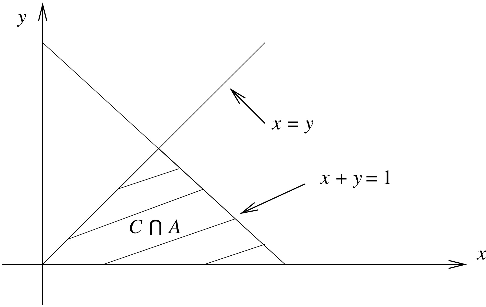

# Joint Distribution Functions {#jointdis}

## Overview {#jointdis:intro}

In [Section 5](#rv) we have introduced the concept of a random variable and a variety of discrete and continuous random variables. However, often in statistics it is important to consider the joint
behaviour of two (or more) random variables.  For example:

(i) Height, Weight.  
(ii) Degree class, graduate salary.  

In this section we explore the joint distribution between two random variables $X$ and $Y$.


## Joint c.d.f. and p.d.f. {#jointdis:cdf}

:::{.def #jointdis:def:cdf} 
```{asis, include=knitr::is_latex_output()} 
\textcolor{red}{Definition 6.2.1.}
```
<span style="color: rgba(207, 0, 15, 1);">**Joint c.d.f.**</span>  

The *joint (cumulative) probability distribution function* (joint c.d.f.) of $X$ and $Y$ is defined by
<center>
\begin{align*}
F_{X,Y}(x,y) &= P( \{ \omega: X(\omega) \leq x \text{ and } Y(\omega) \leq y \} )\\
&= P (X \leq x, Y \leq y),
\end{align*}
</center>
where $x,y \in \mathbb{R}$.
:::

:::{.def #jointdis:def:pdf} 
```{asis, include=knitr::is_latex_output()} 
\textcolor{red}{Definition 6.2.2.}
```
<span style="color: rgba(207, 0, 15, 1);">**Joint p.d.f.**</span>  

Two r.v.'s $X$ and $Y$ are said to be *jointly continuous*, if there exists a function $f_{X,Y}(x,y) \geq 0$ such that for every "nice" set $C \subseteq {\mathbb R}^2$,
<center>
$$P( (X,Y) \in C) = \int\int_C f_{X,Y}(x,y) \,dx \,dy.$$
</center>
The function $f_{X,Y}$ is called the *joint probability density function* (joint p.d.f.) of $X$ and $Y$.
:::

If $X$ and $Y$ are jointly continuous, then
<center>
\begin{align*}
F_{X,Y}(x,y) &= P(X \leq x, Y \leq y) \\
&= \int_{-\infty}^y \int_{-\infty}^x f_{X,Y}(u,v) \,du \,dv.
\end{align*}
</center>
Hence we differentiate the c.d.f. $F_{X,Y}(x,y)$  with respect to both $x$ and $y$ to obtain the p.d.f.
<center>
$$f_{X,Y}(x,y) = \frac{ \partial^2 \; \; \;\;} {\partial x \partial y} F_{X,Y}(x,y).$$
</center>

We note, as in the following example, that often the joint p.d.f. is non-zero on a subset of $\mathbb{R}^2$.


:::{.ex #jointdis:ex:joint_density_function_ex}
```{asis, include=knitr::is_latex_output()} 
\textcolor{red}{Example 6.2.3.}
```
\
Suppose that
<center>
$$f_{X,Y}(x,y) = \begin{cases}
24x(1-x-y) \quad \text{if } x,y \geq 0 \text{ and } x+y \leq 1, \\
0 \qquad \qquad \qquad \quad \text{otherwise.}
\end{cases}$$
</center>

(a) Find $P(X>Y)$,  
(b) Find $P(X>\frac{1}{2})$.  
:::

:::{.ans #jointdis:ex:joint_density_function_sol}
(a) Let $C = \{ (x,y): x>y \}$ and write $A=\{ (x,y):f_{X,Y}(x,y)>0\}$. Then,

<center>
$$ C \cap A = \{ (x,y); x>0, y>0, x+y<1, x>y \}.$$
</center>

<center></center>
\

Therefore
<center>
\begin{align*}
P(X>Y) &= P((X,Y) \in C) \\
&= \int\int_C f_{X,Y}(x,y) \,dx \,dy \\
&= \int\int_{C \cap A} 24x(1-x-y) \,dx \,dy \\
&= \int_0^{1/2} \int_y^{1-y} 24x(1-x-y) \,dx \,dy \\
&= \int_0^{1/2} \left[ 12x^2 - 8x^3 - 12yx^2 \right]_y^{1-y} \,dy \\
&= \int_0^{1/2} \left( 4 - 12y + 16y^3 \right) dy \\
&= \left[ 4y - 6y^2 + 4y^4 \right]_0^{1/2} \\
&= 2 - \frac{3}{2} + \frac{1}{4} = \frac{3}{4}.
\end{align*}
</center>

(b) Let $D = \{ (x,y): x>1/2 \}$, then

<center>
$$ D \cap A = \{ (x,y); x>1/2, y>0, x+y<1 \}.$$
</center>

Therefore
<center>
\begin{align*}
P(X>1/2) &= P((X,Y) \in D) \\
&= \int\int_D f_{X,Y}(x,y) \,dx \,dy \\
&= \int\int_{D \cap A} 24x(1-x-y) \,dx \,dy \\
&= \int_{1/2}^1 \int_0^{1-x} 24x(1-x-y) \,dy \,dx \\
&= \int_{1/2}^1 \left[ 24xy \left( 1 - x - \frac{1}{2}y \right) \right]_0^{1-x} \,dx \\
&= \int_{1/2}^1 12x(1-x)^2 \,dx \\
&= \left[ \frac{12}{2}x^2 - \frac{24}{3}x^3 + \frac{12}{4}x^4 \right]_{1/2}^1 \\
&= 6 - 8 +3 - \frac{3}{2} + 1 - \frac{3}{16} = \frac{5}{16}.
\end{align*}
</center>
:::
\

## Marginal c.d.f. and p.d.f. {#jointdis:marginal}

There are many situations with bivariate distributions where we are interested in one of the random variables. For example, we might have the joint distribution of height and weight of individuals but only be interested in the weight of individuals. This is known as the [**marginal distribution**](#jointdis:def:marginal).

:::{.def #jointdis:def:marginal}  
```{asis, include=knitr::is_latex_output()} 
\textcolor{red}{Definition 6.3.1.}
```
<span style="color: rgba(207, 0, 15, 1);">**Marginal c.d.f.**</span>  

Suppose that the c.d.f. of $X$ and $Y$ is given by $F_{X,Y}$, then the c.d.f. of $X$ can be obtained from $F_{X,Y}$ since
\begin{align*}
F_X(x) &= P(X \leq x) \\
&=P( X \leq x, Y<\infty ) \\
&= \lim_{y\rightarrow\infty} F_{X,Y}(x,y).
\end{align*}
$F_X$ is called the *marginal distribution* (marginal c.d.f.) of $X$.
:::

:::{.def #jointdis:def:marginal:pdf}  
```{asis, include=knitr::is_latex_output()} 
\textcolor{red}{Definition 6.3.2.}
```
<span style="color: rgba(207, 0, 15, 1);">**Marginal p.d.f.**</span>   

If $f_{X,Y}$ is the joint p.d.f. of $X$ and $Y$, then the *marginal probability density function* (marginal p.d.f.) of $X$ is given by
$$f_X(x) = \int_{-\infty}^\infty f_{X,Y}(x,y) \,dy.$$
:::

:::{.ex #jointdis:ex:marginal_distributions_ex}
```{asis, include=knitr::is_latex_output()} 
\textcolor{red}{Example 6.3.3}
```
\
Consider [Example 6.2.3](#jointdis:ex:joint_density_function_ex). 

Find the marginal p.d.f. and c.d.f of Y.
:::

:::{.ans #jointdis:ex:marginal_distributions_sol}
<center>
\begin{align*}
f_Y(y) &= \int_{-\infty}^\infty f_{X,Y}(x,y) \,dx \\[9pt]
&= \begin{cases} \int_0^{1-y} 24x(1-x-y) \,dx \quad &0 \leq y \leq 1, \\[5pt]
0 \quad &\text{otherwise.} \end{cases} \\[9pt]
&= \begin{cases} 4(1-y)^3 \quad & 0 \leq y \leq 1, \\[5pt]
0 \quad  &\text{otherwise.} \end{cases}
\end{align*}
</center>

Note that marginal distribution of $Y$ is a ${\rm Beta} (1,4)$ distribution.

Hence,
<center>
\begin{align*}
F_Y(y) &= \begin{cases} 0, \quad &y < 0,\\[5pt]
\int_0^y4 (1-u)^3 du = 1-(1-y)^4, \quad &0 \leq y \leq 1,\\[5pt]
1, \quad &y > 1.\end{cases}
\end{align*}
</center>
:::
\

:::{.ex #jointdis:exer:joint_Z_Exp}
```{asis, include=knitr::is_latex_output()} 
\textcolor{red}{Example 6.3.4.}
```
\
Find the p.d.f. of $Z=X/Y$, where
<center>
$$f_{X,Y}(x,y) =\begin{cases} e^{-(x+y)} \quad &0<x,y<\infty, \\[5pt]
0 \qquad \qquad &\text{otherwise.} \end{cases} $$
</center>
:::

Attempt [Example 6.3.4](#jointdis:exer:joint_Z_Exp) and then watch [Video 14](#video14) for the solutions.

```{asis, include=knitr::is_html_output()}
:::{.des #video14}
<span style="color: rgba(207, 0, 15, 1);">**Video 14: Ratio of Exponentials**</span>  

<iframe id="kaltura_player" src="https://cdnapisec.kaltura.com/p/1355621/sp/135562100/embedIframeJs/uiconf_id/13188771/partner_id/1355621?iframeembed=true&playerId=kaltura_player&entry_id=1_iuf9blt3&flashvars[streamerType]=auto&amp;flashvars[localizationCode]=en&amp;flashvars[sideBarContainer.plugin]=true&amp;flashvars[sideBarContainer.position]=left&amp;flashvars[sideBarContainer.clickToClose]=true&amp;flashvars[chapters.plugin]=true&amp;flashvars[chapters.layout]=vertical&amp;flashvars[chapters.thumbnailRotator]=false&amp;flashvars[streamSelector.plugin]=true&amp;flashvars[EmbedPlayer.SpinnerTarget]=videoHolder&amp;flashvars[dualScreen.plugin]=true&amp;flashvars[hotspots.plugin]=1&amp;flashvars[Kaltura.addCrossoriginToIframe]=true&amp;&wid=1_uztmpz1n" width="640" height="420" allowfullscreen webkitallowfullscreen mozAllowFullScreen allow="autoplay *; fullscreen *; encrypted-media *" sandbox="allow-downloads allow-forms allow-same-origin allow-scripts allow-top-navigation allow-pointer-lock allow-popups allow-modals allow-orientation-lock allow-popups-to-escape-sandbox allow-presentation allow-top-navigation-by-user-activation" frameborder="0" title="Ratio of Exponentials FINAL VERSION"></iframe>
:::
```

```{asis, include=knitr::is_latex_output()}
Watch [\textcolor{blue}{Video 14: Ratio of Exponentials}](https://mediaspace.nottingham.ac.uk/media/Ratio+of+Exponentials+FINAL+VERSION/1_iuf9blt3)
```  

<details><summary>Solution to Example 6.3.4.</summary>
:::{.ans}
Clearly, $Z>0$. For $z>0$,

<center>
```{r rat1, echo = FALSE, message=FALSE, fig.keep='all', out.width= "70%"}

```
</center>

Therefore
<center>
\begin{align*}
F_Z(z) &= P( Z \leq z) = P(X/Y \leq z)\\
&= \int\int_{\{(x,y):x/y \leq z\}} f_{X,Y}(x,y) \,dx \,dy \\
&= \int_0^\infty \int_0^{yz} e^{-(x+y)} \,dx\,dy \\
&= \int_0^\infty -e^{-y(1+z)} + e^{-y} \,dy \\
&= 1-\frac{1}{1+z}
\end{align*}
</center>

and so
<center>
$$ f_Z(z) = \frac{dF_Z(z)}{dz} =\begin{cases} \frac{1}{(1+z)^2}, \quad &z>0, \\
0, \quad  &z \leq 0. \end{cases} $$
</center>
:::
</details>
\


Note that we can extend the notion of joint and marginal distributions to random variables $X_1,X_2,\dots,X_n$ in a similar fashion.

## Independent random variables {#jointdis:independent}

:::{.def #jointdis:def:independent}
```{asis, include=knitr::is_latex_output()} 
\textcolor{red}{Definition 6.4.1.}
```
<span style="color: rgba(207, 0, 15, 1);">**Independent random variables**</span>   

Random variables $X$ and $Y$ are said to be *independent* if, for all $x,y \in
\mathbb{R}$,

<center>
$$ P(X \leq x, Y \leq y) = P(X \leq x) P(Y \leq y),$$
</center>
that is, for all $x,y\in\mathbb R$, $F_{X,Y}(x,y) = F_X(x) F_Y(y)$.
:::

If $X$ and $Y$ are discrete random variables  with joint p.m.f. $p_{X,Y}(x,y)$ and marginal p.m.f.'s $p_X(x)$ and $p_Y(y)$, respectively, then $X$ and $Y$ are independent if and only if for all $x,y\in\mathbb R$,
<center>
$$ p_{X,Y}(x,y) = p_X(x)p_Y(y).$$
</center>

If $X$ and $Y$ are continuous random variables  with joint p.d.f. $f_{X,Y}(x,y)$ and marginal p.d.f.'s $f_X(x)$ and $f_Y(y)$, respectively, then $X$ and $Y$ are independent if and only if for all $x,y\in\mathbb R$,
<center>
$$ f_{X,Y}(x,y) = f_X(x)f_Y(y).$$
</center>

For example, in [Example 6.3.4](#jointdis:exer:joint_Z_Exp) $X$ and $Y$ have joint probability density function:
<center>
\begin{eqnarray*} f_{X,Y} (x,y) &=& \exp(-\{ x + y\}) \\ &=& \exp (-x) \exp(-y) = f_X (x) f_Y(y), \hspace{0.4cm}(x,y>0),
\end{eqnarray*}
</center>
where both $X$ and $Y$ are distributed according to ${\rm Exp} (1)$. Thus the distribution $Z$ given in [Example 6.3.4](#jointdis:exer:joint_Z_Exp) is the ratio of two independent exponential random variables with mean 1.


Note that we can easily extend the notion of independent random variables to random variables $X_1,X_2,\dots,X_n$.

:::{.def #jointdis:def:iid2}
```{asis, include=knitr::is_latex_output()} 
\textcolor{red}{Definition 6.4.2.}
```
<span style="color: rgba(207, 0, 15, 1);">**Independent and identically distributed**</span>   

The random variables $X_1,X_2,\dots,X_n$ are said to *independent and identically distributed* (i.i.d.) if,

- $X_1,X_2,\dots,X_n$ are independent.

- $X_1,X_2,\dots,X_n$ all have the same distribution, that is, $X_i \sim F$ for all $i=1,\dots,n$.
:::

[Definition 6.4.2](#jointdis:def:iid2) extends the notion of *i.i.d.* given at the start of [Section 5.4.2](#rv:Bernoulli:bin) for discrete random variables.

:::{.def #jointdis:def:sample}
```{asis, include=knitr::is_latex_output()} 
\textcolor{red}{Definition 6.4.3.}
```
<span style="color: rgba(207, 0, 15, 1);">**Random sample**</span>  

The random variables $X_1,X_2,\dots,X_n$ are said to be a *random sample* if they are i.i.d.
:::

:::{.ex}
```{asis, include=knitr::is_latex_output()} 
\textcolor{red}{Definition 6.4.4.}
```
\
Suppose $X_1,X_2,\dots,X_n$ are a random sample from the Poisson distribution with mean $\lambda$.  Find the joint p.m.f. of $X_1,X_2,\dots,X_n$.
:::
\


:::{.ans}
If $X_i \sim {\rm Po} (\lambda)$, then its p.m.f. is given by

<center>
$$ P(X_i = x_i) = p_{X_i}(x_i) = \begin{cases}
\frac{e^{-\lambda} \lambda^{x_i}}{x_i!} \quad &\text{if $x_i=0,1,2,\dots$}, \\
0 \qquad \quad &\text{otherwise.} \end{cases}$$
</center>

Since $X_1,X_2,\dots,X_n$ are independent, their joint p.m.f. is given by,

<center>
\begin{align*}
p_{X_1,X_2,\dots,X_n}(x_1,x_2,\dots,x_n) &= \prod_{i=1}^n p_{X_i}(x_i) \\
&= \begin{cases}
\prod_{i=1}^n \frac{ e^{-\lambda} \lambda^{x_i} } {x_i!} \quad &\text{if $x_i=0,1,2,\dots$,} \\
0 \qquad \qquad \quad &\text{otherwise.} \end{cases} \\
&= \begin{cases}
\frac{ e^{-n\lambda} \lambda^{\sum_{i=1}^n x_i} }{\prod_{i=1}^n x_i!} \quad &\text{if $x_i=0,1,2,\dots$,} \\
0 \qquad \qquad \quad &\text{otherwise.} \end{cases}
\end{align*}
</center>
:::
\

The joint p.m.f. of $\mathbf{X} = (X_1,X_2, \ldots, X_n)$ tells us how likely we are to observe $\mathbf{x}= (x_1,x_2,\ldots, x_n)$ given $\lambda$. This can be used either: 

1. To compute $P (\mathbf{X} = \mathbf{x})$ when $\lambda$ is known;  
2. Or, more commonly in statistics, to assess what is a *good estimate* of $\lambda$ given $\mathbf{x}$ in situations where $\lambda$ is unknown, see [Parameter Estimation](#paraestimate) in Section 9.  

## <span style="color: rgba(15, 0, 207, 1);">**Student Exercise**</span>  {- #jointdis:exer}

Attempt the exercise below. 

:::{.exer #exer6:1}
```{asis, include=knitr::is_latex_output()} 
\textcolor{red}{Exercise 6.1.}
```
\
A theory of chemical reactions suggests that the variation in the quantities $X$ and $Y$ of two products $C_1$ and $C_2$ of a certain reaction is described by the joint probability density function
<center>
\[ f_{X,Y} (x,y) = \frac{2}{(1+x+y)^3} \hspace{1cm} x \geq 0, \; y \geq 0. \]
</center>

On the basis of this theory, answer the following questions.  

(a) What is the probability that at least one unit of each product is produced?  
(b) Determine the probability that the quantity of $C_1$ produced is less than half that of $C_2$.  
(c) Find the c.d.f. for the total quantity of $C_1$ and $C_2$.  
:::

```{asis, include=knitr::is_html_output()}
<details><summary>Solution to Exercise 6.1.</summary>

:::{.ans #Question_S6_1}
(a) The required probability is
<center>
\begin{eqnarray*}
P(X \geq 1, Y \geq 1) & = & \int_1^\infty \int_1^\infty \frac{2}{(1+x+y)^3} \; dy \; dx \\
& = & \int_1^\infty \left[ \frac{-1}{(1+x+y)^3} \right]_{y=1}^\infty  \; dx \\
& = & \int_1^\infty \frac{1}{(2+x)^2}   \; dx \\ 
&=& \left[ \frac{-1}{2+x} \right]_{x=1}^\infty = \frac{1}{3}.
\end{eqnarray*}
</center>  

(b) The required probability is
<center>
\begin{eqnarray*}
P\left(X \leq \frac{1}{2} Y \right) & = & \int_0^\infty \int_0^{y/2} \frac{2}{(1+x+y)^3} \; dx \; dy \\
& = & \int_0^\infty \left[ \frac{-1}{(1+x+y)^3} \right]_{x=0}^{y/2}  \; dy \\
& = & \int_0^\infty \left( \frac{1}{(1+y)^2} - \frac{1}{(1+3y/2)^2} \right)  \; du \\ 
&=& \left[ \frac{-1}{1+y} - \frac{-2/3}{(1+3y/2)} \right]_{y=0}^\infty = \frac{1}{3}.
\end{eqnarray*}
</center>  

(c) Since both $X$ and $Y$ are non-negative random variables, $X + Y$ is non-negative. Thus $P(X + Y \leq z) =0$ for $z<0$. For $z \geq 0$,
<center>
\begin{eqnarray*}
P(X + Y \leq z) & = & \int_0^z \int_0^{z-y} \frac{2}{(1+x+y)^3} \; dx \; dy \\
& = & \int_0^z \left[ \frac{-1}{(1+x+y)^3} \right]_{x=0}^{z-y}  \; dy \\
& = & \int_0^z \left( \frac{1}{(1+y)^2} - \frac{1}{(1+z)^2} \right)  \; du \\ 
&=& \left[ \frac{-1}{1+y} - \frac{y}{(1+z)^2} \right]_{y=0}^{z} \\
&=& - \frac{1}{1+z} - \frac{z}{(1+z)^2} + 1 + 0 = \left(\frac{z}{1+z} \right)^2.
\end{eqnarray*}
</center> 
:::
</details>
```


