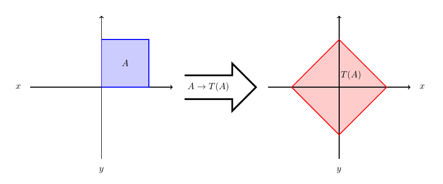
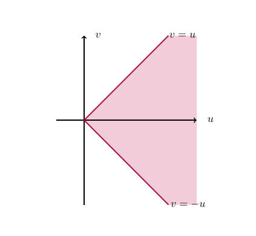

# Transformations of random variables {#Transform}

## Introduction {#Transform:intro}

In this section we will consider transformations of random variables. Transformations are useful for:  

- Simulating random variables.  
For example, computers can generate *pseudo random numbers* which represent draws from $U(0,1)$ distribution and transformations enable us to generate random samples from a wide range of more general (and exciting) probability distributions.  
- Understanding functions of random variables.    
Suppose that £$P$ is invested in an account with continuously compounding interest rate $r$.  Then the amount £$A$ in the account after $t$ years is  
<center>  
\[
A=P \text{e}^{r t}.
\]  
</center>  
Suppose that $P=1,000$ and $r$ is a realisation of a continuous random variable $R$ with pdf $f(r)$.  What is the p.d.f. of the amount $A$ after one year? *i.e.* What is the p.d.f. of  
<center>  
\[
A=1000 \text{e}^{R}?
\]  
</center>  

We will consider both univariate and bivariate transformations with the methodology for bivariate transformations extending to more general multivariate transformations.  

## Univariate case {#Transform:univariate}

Suppose that $X$ is a continuous random variable with p.d.f. $f(x)$. Let $g$ be a continuous function, then $Y=g(X)$ is a continuous random variable.  Our aim is to find the p.d.f. of $Y$.  

We present the distribution function method which has two steps:  

1. Compute the c.d.f. of $Y$, that is  
<center>  
$$F_Y(y)=P(Y \leq y).$$   
</center>  
2. Derive the p.d.f. of $Y$, $f_Y(y)$, using the fact that  
<center>  
$$f_Y(y)=\dfrac{dF_Y(y)}{dy}.$$  
</center>  

:::{.ex #Transform:ex:normal_square} 
```{asis, include=knitr::is_latex_output()} 
\textcolor{red}{Example 14.2.1.}
```
<span style="color: rgba(207, 0, 15, 1);">**Square of a Standard Normal**</span>  
\
Let $Z\sim N(0,1)$. Find the p.d.f. of $Y=Z^2$.  
:::

For $y>0$, the c.d.f. of $Y=Z^2$ can be expressed in terms of the c.d.f. of $Z$,
<center>
\begin{align*}
F_Y(y) &= P(Y \leq y) \\
&= P(Z^2 \leq y) \\
&= P(-\sqrt{y} \leq Z \leq \sqrt{y}) \\
&= P(Z \leq \sqrt{y}) - P(Z \leq -\sqrt{y}) \\
&= F_Z(\sqrt{y}) - F_Z(-\sqrt{y}).
\end{align*}
</center>  
Note that if we want a specific formula for $F_Y$, then we can evaluate the resulting c.d.f.'s. In this case:  
<center>
$$ F_Z(\sqrt{y}) = \int_{-\infty}^{\sqrt{y}} \frac{1}{\sqrt{2\pi}} e^{-\frac{z^2}{2}}dz.$$
</center>  
Therefore, using the chain rule for differentiation,  
<center>
\begin{align*}
f_Y(y) &= \frac{dF_Y(y)}{dy} \\
&= \frac{d}{dy}F_Z(\sqrt{y}) - \frac{d}{dy} F_Z(-\sqrt{y}) \\
&= \frac{d}{dz} F_Z(z) \frac{d}{dy}(z) - \frac{d}{dz} F_Z(-z) \frac{d}{dy}(-z)
\end{align*}  
</center>
where $z=y^{1/2}$.  
Now $\frac{d}{dz} F_Z(z) = \frac{1}{\sqrt{2\pi}} e^{-\frac{z^2}{2}}$, so
<center>
\begin{align*}
f_Y(y) &= \frac{1}{\sqrt{2\pi}} e^{-\frac{(\sqrt{y})^2}{2}} \frac{1}{2\sqrt{y}} - \frac{1}{\sqrt{2\pi}} e^{-\frac{(-\sqrt{y})^2}{2}} \frac{-1}{2\sqrt{y}} \\
&= \frac{1}{2\sqrt{2 \pi y}} e^{-\frac{y}{2}} + \frac{1}{2\sqrt{2 \pi y}} e^{-\frac{y}{2}} \\
&= \frac{1}{\sqrt{2 \pi y}} e^{-\frac{y}{2}}.
\end{align*}
</center>  
Therefore $Y$ has probability density function:  
<center>  
$$ f_Y (y) = \left\{ \begin{array}{ll} \frac{y^{-1/2}}{\sqrt{2 \pi}} \exp \left( - \frac{y}{2} \right) \qquad & y>0, \\
0 & \mbox{otherwise.} \end{array} \right.$$  
</center>
Thus $Y \sim {\rm Gamma} \left( \frac{1}{2},\frac{1}{2} \right)$, otherwise known as a [Chi-squared distribution](#rv:exponential:chi) with $1$ degree of freedom.
:::


## Bivariate case {#Transform:bivariate}

Suppose that $X_1$ and $X_2$ are continuous random variables with joint p.d.f. given by $f_{X_1,X_2}(x_1,x_2)$. Let $(Y_1,Y_2)=T(X_1,X_2)$. We want to find the joint p.d.f. of $Y_1$ and $Y_2$.

:::{.def #Transform:def:Jacobian}
```{asis, include=knitr::is_latex_output()} 
\textcolor{red}{Definition 14.3.1.}
```
<span style="color: rgba(207, 0, 15, 1);">**Jacobian**</span>  

Suppose $T:(x_1,x_2) \rightarrow (y_1,y_2)$ is a one-to-one transformation in some region of $\mathbb{R}^2$, such that $x_1 = H_1(y_1,y_2)$ and $x_2 = H_2(y_1,y_2)$.  The *Jacobian* of $T^{-1}=(H_1,H_2)$ is defined by  
<center>
$$ J(y_1,y_2) = \begin{vmatrix} \frac{\partial H_1}{\partial y_1} & \frac{\partial H_1}{\partial y_2} \\[4pt]
\frac{\partial H_2}{\partial y_1} & \frac{\partial H_2}{\partial y_2} \end{vmatrix} .$$  
</center>  
:::

:::{.thm #Transform:thm:transform}
```{asis, include=knitr::is_latex_output()} 
\textcolor{red}{Theorem 14.3.2.}
```
<span style="color: rgba(207, 0, 15, 1);">**Transformation of random variables.**</span>

Let $(Y_1,Y_2)=T(X_1,X_2)$ be some transformation of random variables.  If $T$ is a one-to-one function and the Jacobian of $T^{-1}$ is non-zero in $T(A)$ where  
<center>  
$$A=\{(x_1,x_2): f_{X_1,X_2}(X_1, X_2)>0\},$$  
</center>  
then the joint p.d.f. of $Y_1$ and $Y_2$, $f_{Y_1,Y_2}(y_1,y_2)$, is given by  
<center>  
$$f_{X_1,X_2}(H_1(y_1,y_2),H_2(y_1,y_2)) |J(y_1,y_2)|$$  
</center>
if $(y_1, y_2) \in T(A)$, and $0$ otherwise.  
:::

:::{.ex #Transform:ex:uniform} 
```{asis, include=knitr::is_latex_output()} 
\textcolor{red}{Example 14.3.3.}
```
<span style="color: rgba(207, 0, 15, 1);">**Transformation of uniforms.**</span>  

Let $X_1 \sim U(0,1)$, $X_2 \sim U(0,1)$ and suppose that $X_1$ and $X_2$ are independent. Let
<center>
$$ Y_1=X_1+X_2, \quad Y_2=X_1-X_2.$$
</center>  
Find the joint p.d.f. of $Y_1$ and $Y_2$.  
:::

:::{.ans}
The joint p.d.f. of $X_1$ and $X_2$ is  
<center>
\begin{align*}
f_{X_1,X_2}(x_1,x_2) &= f_{X_1}(x_1)f_{X_2}(x_2) \\
&= \begin{cases} 1, \quad & \text{if } 0 \leq x_1 \leq 1 \text{ and } 0 \leq x_2 \leq 1,\\[3pt]
0, \quad & \text{otherwise.}\end{cases}
\end{align*}
</center>  
Now $T:(x_1,x_2) \mapsto (y_1,y_2)$ is defined by  
<center>
$$ y_1=x_1+x_2,\quad y_2=x_1-x_2.$$
</center>  
Hence,  
<center>  
\begin{align*}
x_1 &= H_1(y_1,y_2) = \frac{y_1+y_2}{2}, \\
x_2 &= H_2(y_1,y_2) = \frac{y_1-y_2}{2}.
\end{align*}  
</center>  
The Jacobian of $T^{-1}$ is
<center>
$$ J(y_1,y_2) =
\begin{vmatrix} \frac{\partial H_1}{\partial y_1} &
\frac{\partial H_1}{\partial y_2} \\
\frac{\partial H_2}{\partial y_1} &
\frac{\partial H_2}{\partial y_2} \end{vmatrix}
=\begin{vmatrix} \frac{1}{2} & \frac{1}{2} \\ \frac{1}{2} & -\frac{1}{2} \end{vmatrix} = -\frac{1}{2}.$$
</center>   
Since $A=\{(x_1,x_2): 0 \leq x_1 \leq 1, 0 \leq x_2 \leq 1\}$ and since the lines $x_1=0$, $x_1=1$, $x_2=0$ and $x_2=1$ map to the lines $y_1+y_2=0$, $y_1+y_2=2$, $y_1-y_2=0$ and $y_1-y_2=2$ respectively, it can be checked that  
<center>
$$ T(A)= \left\{ (y_1,y_2): 0\leq y_1+y_2 \leq 2, 0 \leq y_1-y_2 \leq 2 \right\}.$$
</center>  
<center>
```{r transform1, echo = FALSE, message=FALSE, fig.keep='all', out.width= "100%", fig.cap ="Transformation"}

```  
</center>  
Thus,
<center>
\begin{align*}
f_{Y_1,Y_2}(y_1,y_2) &= \begin{cases} \frac{1}{2} f_{X_1,X_2}(H_1(y_1,y_2),H_2(y_1,y_2)), & \text{if } (y_1,y_2) \in T(A),\\ 0, & \text{otherwise.}\end{cases} \\[3pt]
&= \begin{cases} \frac{1}{2}, & \text{if } 0 \leq y_1+y_2 \leq 2 \text{ and } 0 \leq y_1-y_2 \leq 2,\\ 0, & \text{otherwise.}\end{cases}
\end{align*}
</center>
:::
\

:::{.ex #Transform:exer:expo} 
```{asis, include=knitr::is_latex_output()} 
\textcolor{red}{Example 14.3.4.}
```
<span style="color: rgba(207, 0, 15, 1);">**Transformation of Exponentials.**</span>  

Suppose that $X_1$ and $X_2$ are i.i.d. exponential random variables with parameter $\lambda$. Let $Y_1 = \frac{X_1}{X_2}$ and $Y_2=X_1+X_2$.  

(a) Find the joint p.d.f. of $Y_1$ and $Y_2$.  
(b) Find the p.d.f. of $Y_1$.  
:::

Attempt [Example 14.3.4: Transformation of Exponentials](#Transform:exer:expo) and then watch [Video 22](#video22) for the solutions.

```{asis, include=knitr::is_html_output()}
:::{.des #video22}
<span style="color: rgba(207, 0, 15, 1);">**Video 22: Transformation of Exponentials**</span>  

<iframe id="kaltura_player" src="https://cdnapisec.kaltura.com/p/1355621/sp/135562100/embedIframeJs/uiconf_id/13188771/partner_id/1355621?iframeembed=true&playerId=kaltura_player&entry_id=1_33aakq3q&flashvars[streamerType]=auto&amp;flashvars[localizationCode]=en&amp;flashvars[sideBarContainer.plugin]=true&amp;flashvars[sideBarContainer.position]=left&amp;flashvars[sideBarContainer.clickToClose]=true&amp;flashvars[chapters.plugin]=true&amp;flashvars[chapters.layout]=vertical&amp;flashvars[chapters.thumbnailRotator]=false&amp;flashvars[streamSelector.plugin]=true&amp;flashvars[EmbedPlayer.SpinnerTarget]=videoHolder&amp;flashvars[dualScreen.plugin]=true&amp;flashvars[hotspots.plugin]=1&amp;flashvars[Kaltura.addCrossoriginToIframe]=true&amp;&wid=1_7ac1b3az" width="640" height="420" allowfullscreen webkitallowfullscreen mozAllowFullScreen allow="autoplay *; fullscreen *; encrypted-media *" sandbox="allow-downloads allow-forms allow-same-origin allow-scripts allow-top-navigation allow-pointer-lock allow-popups allow-modals allow-orientation-lock allow-popups-to-escape-sandbox allow-presentation allow-top-navigation-by-user-activation" frameborder="0" title="Transformation FINAL VERSION"></iframe>
:::
```

```{asis, include=knitr::is_latex_output()}
Watch [\textcolor{blue}{Video 22: Transformation of Exponentials}](https://mediaspace.nottingham.ac.uk/media/Transformation+FINAL+VERSION/1_33aakq3q)
```   

<details><summary>Solution to Example 14.3.4</summary>
:::{.ans}
Remember from previous results that $Y_2 = X_1 + X_2 \sim {\rm Gamma} (2,\lambda)$.

(a) Since $X_1$ and $X_2$ are i.i.d. exponential random variables with parameter $\lambda$, the joint p.d.f. of $X_1$ and $X_2$ is given by  
<center>
\begin{align*}
f_{X_1,X_2}(x_1,x_2) &= f_{X_1}(x_1)f_{X_2}(x_2) \\[3pt]
&= \begin{cases} \lambda e^{-\lambda x_1} \lambda e^{-\lambda x_2}, & \text{if } x_1,x_2 > 0, \\ 0, & \text{otherwise.} \end{cases} \\[3pt]
&= \begin{cases} \lambda^2 e^{-\lambda(x_1+x_2)}, & \text{if } x_1,x_2 > 0, \\ 0, & \text{otherwise.} \end{cases}
\end{align*}  
</center>  
Solving simultaneously for $X_1$ and $X_2$ in terms of $Y_1$ and $Y_2$, gives $X_1=Y_1X_2$ and  
<center>
$$Y_2 = X_1+X_2 = Y_1X_2 + X_2 = X_2(Y_1+1).$$
</center>  
Rearranging gives $X_2 = \frac{Y_2}{Y_1+1} (=H_2 (Y_1,Y_2))$, and then $X_1 = Y_1X_2 = \frac{Y_1Y_2}{Y_1+1} (=H_1 (Y_1,Y_2))$.  
Computing the Jacobian of $T^{-1}$, we get  
<center>
\begin{align*}
J(y_1,y_2) &= \begin{vmatrix} \frac{\partial H_1}{\partial y_1} & \frac{\partial H_1}{\partial y_2} \\ \frac{\partial H_2}{\partial y_1} & \frac{\partial H_2}{\partial y_2} \end{vmatrix} \\[3pt]
&= \begin{vmatrix} \frac{y_2}{(y_1+1)^2} & \frac{y_1}{y_1+1} \\ -\frac{y_2}{(y_1+1)^2} & \frac{1}{y_1+1} \end{vmatrix} \\[3pt]
&= \frac{y_2}{(y_1+1)^3} + \frac{y_1y_2}{(y_1+1)^3} \\[3pt]
&= \frac{y_2}{(y_1+1)^2}.
\end{align*}
</center>  

Now,

<center>
\begin{align*}
A &= \left\{ (x_1,x_2):f_{X_1,X_2}(x_1,x_2)>0 \right\} \\
&= \left\{ (x_1,x_2):x_1>0,x_2>0 \right\}.
\end{align*}
</center>

Therefore, $T(A) \subseteq \left\{(y_1, y_2):y_1>0, y_2>0\right\}$.  Since $x_1>0$ and $x_2>0$, $y_1=\frac{x_1}{x_2}>0.$ Furthermore, since $x_1=\frac{y_1y_2}{y_1+1}>0$, then $y_1y_2>0$ implies $y_2>0$. Therefore, 

<center>
$$T(A)=\left\{ (y_1,y_2):y_1>0,y_2>0 \right\}.$$
</center>

Consequently, the joint p.d.f. of $Y_1$ and $Y_2$, $f=f_{Y_1,Y_2}(y_1,y_2)$ is given by

<center>
\begin{align*}
f &= f_{X_1,X_2} \left( H_1(y_1,y_2),H_2(y_1,y_2) \right) \left| J(y_1,y_2) \right| \\[3pt]
&= f_{X_1,X_2} \left( \frac{y_1y_2}{1+y_1},\frac{y_2}{1+y_1} \right) \left|\frac{y_2}{(1+y_1)^2} \right| \\[3pt]
&= \lambda^2 e^{-\lambda \left( \frac{y_1y_2}{(1+y_1)} + \frac{y_2}{(1+y_1)} \right)} \frac{y_2}{(1+y_1)^2} \\[3pt]
&= \lambda^2 e^{-\lambda y_2} \frac{y_2}{(1+y_1)^2}, \quad \text{if } y_1,y_2>0.
\end{align*}
</center>
If either $y_1<0$ or $y_2<0$, then $f_{Y_1,Y_2}(y_1,y_2)=0$.
\

(b) The p.d.f. of $Y_1$ is the marginal p.d.f. of $Y_1$ coming from the joint p.d.f $f_{Y_1,Y_2}(y_1,y_2)$. Therefore, for $y_1 >0$,  
<center>
\begin{align*}
f_{Y_1}(y_1) &= \int_0^{\infty} \lambda^2 e^{-\lambda y_2} \frac{y_2}{(1+y_1)^2} dy_2 \\
&= \frac{1}{(1+y_1)^2} \int_0^{\infty} \lambda^2 y_2 e^{-\lambda y_2} dy_2 \\
&= \frac{1}{(1+y_1)^2}.
\end{align*}  
</center>  
(In the above integration remember that $\lambda^2 y_2 e^{-\lambda y_2}$ is the p.d.f. of ${\rm Gamma} (2,\lambda)$.)  
So,  
<center>  
$$ f_{Y_1}(y_1) = \begin{cases} \frac{1}{(1+y_1)^2} & \text{if } y_1>0, \\[3pt] 0 & \text{otherwise.} \end{cases} $$  
</center>  
The distribution $Y_1$ is an example of a probability distribution for which the expectation is not defined.  
<center> 
```{r transform2, echo = FALSE, message=FALSE, out.width= "80%", fig.cap ="Plot of the p.d.f. of $Y_1$."}
x=seq(0,10,0.01)
y=1/(1+x)^2
plot(x,y,xlab=expression(y[1]),ylab="Density",type="l")
```  
</center>
:::
</details>
\

Note that one can extend the method of transformations to the case of $n$ random variables.
\

## <span style="color: rgba(15, 0, 207, 1);">**Student Exercise**</span>  {- #Transform:exer}

Attempt the exercise below. 

:::{.exer #exer14:1}
```{asis, include=knitr::is_latex_output()} 
\textcolor{red}{Exercise 14.1.}
```
\
Let $X$ and $Y$ be independent random variables, each having probability density function
$$ f(x) = \begin{cases} \lambda e^{-\lambda x} & \text{if } x>0, \\ 0 & \text{otherwise} \end{cases} $$
and let $U=X+Y$ and $V=X-Y$.  

(a)  Find the joint probability density function of $U$ and $V$.  
(b) Hence derive the marginal probability density functions of $U$ and $V$.    
(c) Are $U$ and $V$ independent? Justify your answer.  
:::


```{asis, include=knitr::is_html_output()}
<details><summary>Solution to Exercise 14.1.</summary>
:::{.ans #Question_S14_1} 
(a) Let the transformation $T$ be defined by $T(x,y)=(u,v)$, where $u=x+y$ and $v=x-y$. Then, $x=\frac{1}{2} (u+v)$ and $y={1\over2}(u-v)$, so that  
<center>
$$ J(u,v)=\left| \begin{matrix} \frac{1}{2} & \frac{1}{2} \\ \frac{1}{2} & -\frac{1}{2} \end{matrix} \right| = -\frac{1}{2}.$$  
</center>  
Since $X$ and $Y$ are independent,  
<center>
$$ f_{X,Y}(x,y)=f_X(x)f_Y(y)= \begin{cases} \lambda^2e^{-\lambda(x+y)} & \text{if }x,y>0, \\ 0&\text{otherwise.} \end{cases} $$  
</center>
Thus, since $T$ is one-to-one,  
<center>
\begin{eqnarray*}
f_{U,V}(u,v) &=& f_{X,Y}(x(u,v),y(u,v))|J(u,v)| \\
&=& \begin{cases} \frac{1}{2} \lambda^2e^{-\lambda u} & \text{if } u+v > 0, u-v > 0, \\ 0 & \text{otherwise} \end{cases} \\
&=& \begin{cases} \frac{1}{2} \lambda^2e^{-\lambda u} & \text{if } u > 0,-u < v < u, \\ 0 & \text{otherwise.} \end{cases}
\end{eqnarray*}  
</center>  
The region over which $f_{U,V}(u,v)>0$ is shown below.  
<center>
```{r trans_ex, echo = FALSE, message=FALSE, fig.keep='all', out.width= "70%", fig.cap = ""}

```
</center>
```{asis, include=knitr::is_html_output()}
(b) The marginal pdf's of $U$ and $V$ are respectively   
<center>  
\begin{eqnarray*}
f_U(u) &=& \int_{-\infty}^\infty f_{U,V}(u,v) dv = \begin{cases} \int_{-u}^u{1\over2} \lambda^2e^{-\lambda u} dv = \lambda^2u e^{-\lambda u} & \text{if }u>0,\\ 0 & \text{otherwise;} \end{cases} \\
f_V(v) &=& \int_{-\infty}^\infty f_{U,V}(u,v) du = \int_{|v|}^\infty \frac{1}{2} \lambda^2e^{-\lambda u}du =  \frac{1}{2} \lambda e^{-\lambda|v|}, \qquad v\in{\mathbb R}.
\end{eqnarray*}
</center>  
Note that again we have $U =X+Y$ is the sum of two independent ${\rm Exp}(\lambda)$ random variables, so $U \sim {\rm Gamma} (2, \lambda)$.  
(c)  Clearly, $f_{U,V}(u,v)=f_U(u) f_V(v)$ does not hold for all $u,v \in {\mathbb R}$, so $U$ and $V$ are not independent.  
:::
</details>
```
