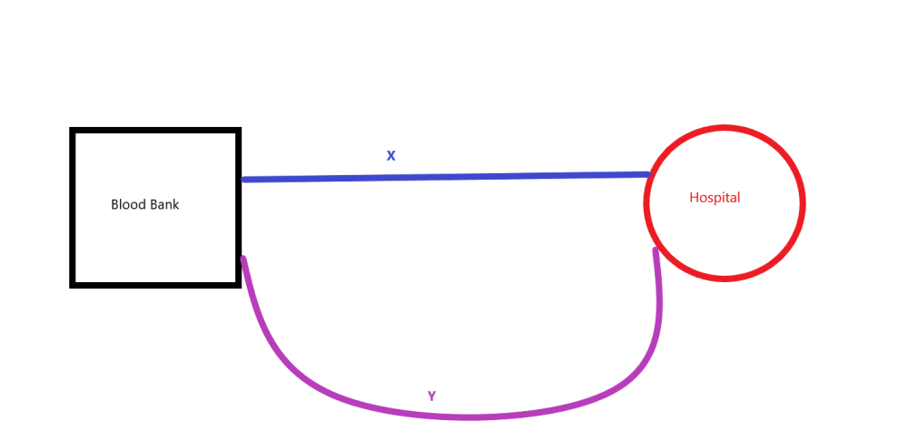

# Hypothesis Testing {#Sec_Hypo_Test}

## Introduction to hypothesis testing {#Sec_Hypo_Test:intro}

In estimation, we are interested in asking ourselves the question what is the value of some particular parameter of interest in the population. For example, what is the average annual income of residents in the UK?

Often there are times in statistics when we are not interested in the specific value of the parameter, but rather are interested in asserting some statement regarding the parameter of interest.  Some examples:

- We want to claim that the average annual income of UK residents is more than or equal to $£35,000$.  
- We want to assess whether the average annual income of men in academia in the UK is the same as that of women in similar ranks.  
- We want to determine whether the number of cars crossing a certain intersection follows a Poisson distribution or whether it is more likely to come from a geometric distribution.  

To perform a statistical hypothesis test, one needs to specify two disjoint hypotheses in terms of the parameters of the distribution that are of interest.  They are

- $H_0:$ Null Hypothesis,  
- $H_1:$ Alternative Hypothesis.  

Traditionally, we choose $H_0$ to be the claim that we would like to assert. 

Returning to our examples:

- We want to claim that the average annual income of UK residents is more than or equal to $£35,000$.  We test  
<center>
$$ H_0: \mu \geq 35,000 \quad \text{vs.} \quad H_1: \mu < 35,000. $$  
</center>  
- We want to assess whether the average annual income of men in academia in the UK is the same as that of women at similar ranks.  We test  
<center>  
$$ H_0: \mu_{\text{men}} = \mu_{\text{women}} \quad \text{vs.} \quad H_1: \mu_{\text{men}} \neq \mu_{\text{women}}.$$  
</center>   
- We want to determine whether the number of cars crossing a certain intersection follows a Poisson distribution or whether it is more likely to come from a geometric distribution.  We test  
<center>  
$$ H_0: X \sim {\rm Po} (2) \quad \text{vs.} \quad H_1: X \sim {\rm Geom} (0.5).$$  
</center>  

Hypotheses where the distribution is completely specified are called simple hypotheses.  For example, $H_0$ and $H_1$ in the car example and $H_0$ in the gender wage example are all simple hypotheses.

Hypotheses where the distribution is not completely specified are called composite hypotheses.  For example, $H_0$ and $H_1$ in the average annual income example and $H_1$ in the gender wage example are all composite hypotheses.

Note that in the average annual income and gender wage examples, the null and alternative hypotheses cover all possibilities, whereas for the car example there are many other choices of distributions which could be hypothesized. 

:::{.def #Sec_Hypo_Test:def:conc} 
```{asis, include=knitr::is_latex_output()} 
\textcolor{red}{Definition 19.1.1.}
```
<span style="color: rgba(207, 0, 15, 1);">**The conclusion of a hypothesis test**</span> 
\
We will **reject** $H_0$ if there is sufficient information from our sample that indicates that the null hypothesis cannot be true thereby concluding the alternative hypothesis is true.

We will **not reject** $H_0$ if there is not sufficient information in the sample to refute our claim. 
:::

The remainder of this section is structured as follows. We define [Type I and Type II errors](#Sec_Hypo_Test:errors), which are the probability of making the wrong decision in a hypothesis test. In [Section 19.3]({#Sec_Hypo_Test:normal_known}) we show how to construct hypothesis tests starting with hypothesis tests for the mean of a normal distribution with known variance. This is extended to the case where the variance is unknown and where we have two samples we want to compare. We introduce [$p$-values](#Sec_Hypo_Test:p_values) which give a measure of how likely (unlikely) the observed data are if the null hypothesis is true.We then consider hypothesis testing in a wide range of scenarios:-  

- [Normal means with unknown variance](#Sec_Hypo_Test:normal_unknown)
- [Confidence intervals and two-sided tests](#Sec_Hypo_Test:twosided)
- [Distribution of Variance](#Sec_Hypo_Test:variance)  
- [Other types of hypothesis tests](#Sec_Hypo_Test:other)  
- [Sample size calculations](#Sec_Hypo_Test:samplesize)  


## Type I and Type II errors {#Sec_Hypo_Test:errors}

:::{.def #Sec_Hypo_Test:def:Type_I_error}
```{asis, include=knitr::is_latex_output()} 
\textcolor{red}{Definition 19.2.1.}
```
<span style="color: rgba(207, 0, 15, 1);">**Type I error**</span> 
\
A *Type I error* occurs when one chooses to incorrectly reject a true null hypothesis.
:::

A Type I error is also commonly referred to as a *false positive*.

:::{.def #Sec_Hypo_Test:def:Type_II_error} 
```{asis, include=knitr::is_latex_output()} 
\textcolor{red}{Definition 19.2.2.}
```
<span style="color: rgba(207, 0, 15, 1);">**Type II error**</span> 
\
A *Type II error* occurs when one fails to  reject a false null hypothesis.
:::

A Type II error is also commonly referred to as a *false negative*.

[Type I error](#Sec_Hypo_Test:def:Type_I_error) and [Type II error](#Sec_Hypo_Test:def:Type_II_error) are summarised in the following decision table. 

|                               | One accepts the Null| One rejects the Null |
|             :----:            |     :----:          |     :----:           |
| **Null hypothesis is true**   | Correct Conclusion  | Type I Error         |
| **Null hypothesis is false**  | Type II Error       | Correct Conclusion   |

:::{.def #Sec_Hypo_Test:def:sig}
```{asis, include=knitr::is_latex_output()} 
\textcolor{red}{Definition 19.2.3.}
```
<span style="color: rgba(207, 0, 15, 1);">**Significance level**</span> 
\
The *significance level* or *size* of the test is

<center>
\begin{align*}
\alpha &= P(\text{Type I error}) \\
&= P(\text{Reject } H_0 | H_0 \text{ true}).
\end{align*}
</center>
:::

Typical choices for $\alpha$ are 0.01, 0.05 and 0.10.

:::{.def #Sec_Hypo_Test:def:probII}
```{asis, include=knitr::is_latex_output()} 
\textcolor{red}{Definition 19.2.4.}
```
<span style="color: rgba(207, 0, 15, 1);">**Probability of Type II error**</span> 
\
The probability of a Type II error is

<center>
\begin{align*}
\beta &= P(\text{Type II error}) \\
&= P(\text{Do Not Reject } H_0 | H_1 \text{ true}).
\end{align*}
</center>
:::

Consider the following properties of $\alpha$ and $\beta$:

- It can be shown that there is an inverse relationship between $\alpha$ and $\beta$, that is as $\alpha$ increases, $\beta$ decreases and vice versa. Therefore for a fixed sample size one can only choose to control one of the types of error. In hypothesis testing we choose to control Type I error and select our hypotheses initially so the "worse" error is the Type II error.  
- The value of both $\alpha$ and $\beta$ depend on the value of the underlying parameters. Consequently, we can control $\alpha$ by first choosing $H_0$ to include an equality of the parameter, and then showing that the largest the Type I error can be is at this point of equality. Therefore we may as well choose the parameter to be the size.  To illustrate in the average annual income example above
\begin{align*}
\alpha &= P (\text{rejecting } H_0 | \mu = 35,000) \\
&\geq P(\text{rejecting } H_0 | \mu \geq 35,000).
\end{align*}
Therefore $H_0: \mu \geq 35,000$ is often just written as $H_0: \mu = 35,000$.  
- Because $H_0$ describes an equality, $H_1$ is therefore a composite hypothesis. Therefore $\beta = P(\text{Type II error})$ is a function of the parameter within the alternative parameter space.  

:::{.def #Sec_Hypo_Test:def:power}
```{asis, include=knitr::is_latex_output()} 
\textcolor{red}{Definition 19.2.5.}
```
<span style="color: rgba(207, 0, 15, 1);">**Power of a Test**</span> 
\
The *power* of the test is

<center>
\begin{align*}
1-\beta &= 1-P(\text{Type II error}) \\
&= P(\text{Reject }H_0 | H_1 \text{ true}).
\end{align*}
</center>
:::

The power of a test can be thought of as the probability of making a correct decision.

## Tests for normal means, $\sigma$ known {#Sec_Hypo_Test:normal_known}

In this section we study a number of standard hypothesis tests that one might perform on a random sample. 

We assume throughout this section that $x_1, x_2, \ldots, x_n$ are i.i.d. samples from $X$ with $E[X]=\mu$, where $\mu$ is unknown and $var(X) = \sigma^2$ is known.

:::{.des #Sec_Hypo_Test:test1}
<span style="color: rgba(207, 0, 15, 1);">**Test 1:**</span>  $H_0: \mu = \mu_0$ vs. $H_1: \mu < \mu_0$; $\sigma^2$ known.
:::

Watch [Video 28](#video28) for the construction Hypothesis [Test 1](#Sec_Hypo_Test:test1).  

```{asis, include=knitr::is_html_output()}
:::{.des #video28}
<span style="color: rgba(207, 0, 15, 1);">**Video 28: Hypothesis Test 1**</span>  

<iframe id="kaltura_player" src="https://cdnapisec.kaltura.com/p/1355621/sp/135562100/embedIframeJs/uiconf_id/13188771/partner_id/1355621?iframeembed=true&playerId=kaltura_player&entry_id=1_9oauwn25&flashvars[streamerType]=auto&amp;flashvars[localizationCode]=en&amp;flashvars[sideBarContainer.plugin]=true&amp;flashvars[sideBarContainer.position]=left&amp;flashvars[sideBarContainer.clickToClose]=true&amp;flashvars[chapters.plugin]=true&amp;flashvars[chapters.layout]=vertical&amp;flashvars[chapters.thumbnailRotator]=false&amp;flashvars[streamSelector.plugin]=true&amp;flashvars[EmbedPlayer.SpinnerTarget]=videoHolder&amp;flashvars[dualScreen.plugin]=true&amp;flashvars[hotspots.plugin]=1&amp;flashvars[Kaltura.addCrossoriginToIframe]=true&amp;&wid=1_59qv7cgd" width="640" height="420" allowfullscreen webkitallowfullscreen mozAllowFullScreen allow="autoplay *; fullscreen *; encrypted-media *" sandbox="allow-downloads allow-forms allow-same-origin allow-scripts allow-top-navigation allow-pointer-lock allow-popups allow-modals allow-orientation-lock allow-popups-to-escape-sandbox allow-presentation allow-top-navigation-by-user-activation" frameborder="0" title="Hypothesis Testing FINAL VERSION"></iframe>

:::
```

```{asis, include=knitr::is_latex_output()}
Watch [\textcolor{blue}{Video 28: Hypothesis Test 1}](https://mediaspace.nottingham.ac.uk/media/Hypothesis+Testing+FINAL+VERSION/1_9oauwn25)
```


A summary of the construction of Hypothesis [Test 1](#Sec_Hypo_Test:test1) is given below.

**Data assumptions.** We assume either

- $X_1,X_2,\dots,X_n$ are a random sample from a normal distribution with known variance $\sigma^2$;  
- The sample size $n$ is sufficiently large so that we can assume $\bar{X}$ is approximately normally distributed by the Central Limit Theorem, and that either the variance is known or that the sample variance $s^2 \approx \sigma^2$.  

**Step 1:** Choose a <span style="color: rgba(15, 0, 207, 1);">**test statistic**</span> based upon the random sample for the parameter we want to base our claim on.  For example, we are interested in $\mu$ so we want to choose a good estimator of $\mu$ as our test statistic. That is, $\hat{\mu} = \bar{X}$.  

**Step 2:** Specify a <span style="color: rgba(15, 0, 207, 1);">**decision rule**</span>. The smaller $\bar{X}$ is, the more the evidence points towards the alternative hypothesis $\mu < \mu_0$. Therefore our decision rule is to reject $H_0$ if $\bar{X} < c$, where $c$ is called the <span style="color: rgba(15, 0, 207, 1);">**cut-off**</span> value for the test.   

**Step 3:** Based upon the sampling distribution of the test statistic and the specified significance level of the test, solve for the specific value of the <span style="color: rgba(15, 0, 207, 1);">**cut-off**</span> value $c$.  To find $c$,  
<center>
\begin{align*}
\alpha &= P(\text{Type I error}) \\
&= P(\text{Reject } H_0 | H_0 \text{ true}) \\
&= P(\bar{X} < c | \mu = \mu_0) \\
&= P\left(\bar{X} < c | \bar{X} \sim N\left(\mu_0, \frac{\sigma^2}{n}\right)\right) \\
&= P\left( \frac{\bar{X} - \mu_0}{\sigma/\sqrt{n}} < \frac{c-\mu_0}{\sigma/\sqrt{n}} \right) \\
&= P\left( Z < \frac{c-\mu_0} {\sigma/\sqrt{n}} \right).
\end{align*}
</center>
Since $P(Z < -z_\alpha )=\alpha$, where $z_\alpha$ can be found using `qnorm(1-alpha)` ($P(Z < z_\alpha) =1 - \alpha$) or statistical tables, then
$$ -z_\alpha = \frac{c-\mu_0}{\sigma/\sqrt{n}} $$
and $c = \mu_0 -z_\alpha \cdot \frac{\sigma}{\sqrt{n}}$.

So, the **decision rule** is to reject $H_0$ if $\bar{X} < \mu_0 -z_\alpha \cdot \frac{\sigma}{\sqrt{n}}$ or, equivalently,
$$Z = \frac{\bar{X} - \mu_0}{\sigma\sqrt{n}} < -z_\alpha.$$


:::{.des #Sec_Hypo_Test:test2}
<span style="color: rgba(207, 0, 15, 1);">**Test 2:**</span>  $H_0: \mu = \mu_0$ vs. $H_1: \mu < \mu_0$; $\sigma^2$ known.
:::


This is similar to the previous test, except the <span style="color: rgba(15, 0, 207, 1);">**decision rule**</span> is to reject $H_0$ if $\bar{X} > \mu_0 + z_\alpha \frac{\sigma}{\sqrt{n}}$ or, equivalently,
$$Z = \frac{\bar{X} - \mu_0}{\sigma/\sqrt{n}} > z_\alpha.$$

Note that both these tests are called <span style="color: rgba(15, 0, 207, 1);">**one-sided tests**</span>, since the rejection region falls on only one side of the outcome space.

:::{.des #Sec_Hypo_Test:test3}
<span style="color: rgba(207, 0, 15, 1);">**Test 3:**</span>  $H_0: \mu = \mu_0$ vs. $H_1: \mu \neq \mu_0$; $\sigma^2$ known.
:::


The test statistic $\bar{X}$ does not change but the decision rule will. 
The <span style="color: rgba(15, 0, 207, 1);">**decision rule**</span> is to reject $H_0$ if $\bar{X}$ is sufficiently far (above or below) from $\mu_0$. Specifically, reject $H_0$ if $\bar{X} < \mu_0 -z_{\alpha/2} \cdot \frac{\sigma}{\sqrt{n}}$ or $\bar{X} > \mu_0 + z_{\alpha/2} \cdot \frac{\sigma}{\sqrt{n}}$. Equivalent to both of these is
$$|Z| = \left| \frac{\bar{X}-\mu_0}{\sigma/\sqrt{n}} \right| > z_{\alpha/2}.$$

This is called a <span style="color: rgba(15, 0, 207, 1);">**two-sided test**</span> because the decision rule partitions the outcome space into two disjoint intervals.


:::{.ex #Sec_Hypo_Test:ex:coffee_machine} 
```{asis, include=knitr::is_latex_output()} 
\textcolor{red}{Example 19.3.1.}
```
<span style="color: rgba(207, 0, 15, 1);">**Coffee machine.**</span>
\
Suppose that a coffee machine is designed to dispense 6 ounces of coffee per cup with a standard deviation $\sigma=0.2$, where we assume the amount of coffee dispensed is normally distributed. A random sample of $n=20$ cups gives $\bar{x}=5.94$.Test whether the machine is correctly filling the cups.
:::

:::{.ans}
We test $H_0: \mu = 6.0$ vs. $H_1: \mu \neq 6.0$ at significance level $\alpha = 0.05$.

Using a two-sided test with known variance, the decision rule is to reject $H_0$ if $|Z| = \left| \frac{\bar{x}-6.0}{0.2/\sqrt{20}} \right| > z_{0.05/2}= z_{0.025} = 1.96$. Now  
<center>
$$ |Z| = \left| \frac{5.94 - 6.0}{0.2/\sqrt{20}} \right| = |-1.34| < 1.96.$$
</center>  
Therefore, we conclude that there is not enough statistical evidence to reject $H_0$ at $\alpha=0.05$.  
:::
\

## $p$ values {#Sec_Hypo_Test:p_values}

When our sample information determines a particular conclusion to our hypothesis test, we only report that we either reject or do not reject $H_0$ at a particular significance level $\alpha$. Hence when we report our conclusion the reader doesn't know how sensitive our decision is to the choice of $\alpha$.

To illustrate, in [Example 19.3.1 (Coffee Machine)](#Sec_Hypo_Test:ex:coffee_machine) we would have reached the same conclusion that there is not enough statistical evidence to reject $H_0$ at $\alpha=0.05$ if $|Z| = 1.95$ rather than $|Z| = 1.34$. Whereas, if the significance level was $\alpha = 0.10$, we would have rejected $H_0$ if $|Z| = 1.95 > z_{0.10/2} = 1.6449$, but we would not reject $H_0$ if $|Z| = 1.34 < z_{0.10/2} = 1.6449$.

Note that the choice of $\alpha$ should be made before the test is performed; otherwise, we run the risk of inducing experimenter bias!

:::{.def #Sec_Hypo_Test:def:probII}
```{asis, include=knitr::is_latex_output()} 
\textcolor{red}{Definition 19.4.1.}
```
<span style="color: rgba(207, 0, 15, 1);">**$p$-value**</span> 
\
The <span style="color: rgba(15, 0, 207, 1);">$p$*-value*</span> of a test is the probability of obtaining a test statistic at least as extreme as the observed data, given $H_0$ is true.
:::

So the p-value is the probability of rejecting $H_0$ with the value of the test statistic obtained from the data given $H_0$ is true. That is, it is the critical value of $\alpha$ with regards to the hypothesis test decision.

If we report the conclusion of the test, as well as the $p$ value then the reader can decide how sensitive our result was to our choice of $\alpha$.

:::{.ex #Sec_Hypo_Test:ex:coffee_machineII}
```{asis, include=knitr::is_latex_output()} 
\textcolor{red}{Definition 19.4.2.}
```
<span style="color: rgba(207, 0, 15, 1);">**Coffee machine (continued).**</span>
\
Compute the $p$ value for the test in [Example 19.3.1](#Sec_Hypo_Test:ex:coffee_machine).
:::

In [Example 19.3.1 (Coffee machine)](#Sec_Hypo_Test:ex:coffee_machine), we were given $\bar{x}=5.94$, $n=20$ and $\sigma=0.2$.  Our decision rule was to reject $H_0$ if $|Z| = \left| \frac{\bar{x}-6.0}{0.2/\sqrt{20}} \right| > z_{0.025}$.

To compute the $p$-value for the test assume $H_0$ is true, that is, $\mu=6.0$. We want to find,  
<center>
\begin{align*}
P \big( \left| \bar{x} - \mu \right| > \left| 5.94 - \mu \right| \big)  &= P \left( |Z| = \left| \frac{\bar{x}-6.0}{0.2/\sqrt{20}} \right| > \left| \frac{5.94 - 6.0}{0.2/\sqrt{20}} \right| \right) \\
&= P(\left| Z \right| > 1.34 ) \\
&= 2 P (Z > 1.34) \\
&= 2 \times `r round(1-pnorm(1.34),4)` \\
&= `r 2*round(1-pnorm(1.34),4)`.
\end{align*}
</center>

Consider the following remarks on [Example 19.4.2](#Sec_Hypo_Test:ex:coffee_machineII).

- The multiplication factor of 2 has arisen since we are computing the $p$ value for a two-sided test, so there is an equal-sized rejection region at both tails of the distribution. For a one-tailed test we only need to compute the probability of rejecting in one direction.  
- The $p$ value implies that if we had chosen an $\alpha$ of at least $0.1802$ then we would have been able to reject $H_0$.  
- In applied statistics, the $p$ value is interpreted as the sample providing:  
<center>
$$ \begin{cases} \text{strong evidence against $H_0$}, & \text{if } p \leq 0.01, \\
\text{evidence against $H_0$}, & \text{if } p \leq 0.05, \\
\text{slight evidence against $H_0$}, & \text{if } p \leq 0.10, \\
\text{no evidence against $H_0$}, & \text{if } p > 0.10. \end{cases}$$  
</center>  

## Tests for normal means, $\sigma$ unknown {#Sec_Hypo_Test:normal_unknown}

Assume $X_1,X_2,\dots,X_n$ is a random sample from a normal distribution with unknown variance $\sigma^2$.

:::{.des #Sec_Hypo_Test:test4}
<span style="color: rgba(207, 0, 15, 1);">**Test 4:**</span>  $H_0: \mu = \mu_0$ vs. $H_1: \mu < \mu_0$; $\sigma^2$ unknown.
:::

As before the decision rule is to reject $H_0$ if $\bar{X} < c$ for some cut off value $c$ that we need to find. We have
<center>  
\begin{align*}
\alpha &= P(\text{Type I error}) \\[3pt]
&= P(\text{Reject } H_0 | H_0 \text{ true}) \\[3pt]
&= P(\bar{X} < c | \mu = \mu_0) \\[3pt]
&= P\left(\bar{X} <c | \bar{X} \sim N\left(\mu_0, \frac{\sigma^2}{n}\right)\right).
\end{align*}
</center>  
However, now $\sigma^2$ is unknown. We have seen before that  
<center>  
$$ \frac{\bar{X} - \mu_0}{s/\sqrt{n}} \sim t_{n-1},$$
</center>  
where $s^2$ is the sample variance.  

Hence,  
<center>  
\begin{align*}
\alpha &= P\left(\bar{X} <c | \bar{X} \sim N\left(\mu_0, \frac{\sigma^2}{n}\right)\right) \\ 
&= P \left( \frac{\bar{X} - \mu_0}{s/\sqrt{n}} < \frac{c-\mu_0}{s/\sqrt{n}} \right) \\
&= P \left( T < \frac{c-\mu_0}{s/\sqrt{n}} \right).
\end{align*}  
</center>  
Now, $P(T < -t_{n-1,\alpha})=\alpha$, where $t_{n-1,\alpha}$ can be found by using the `qt` function in **R** with $t_{n-1,\alpha} =$ `qt(alpha,n-1)` or using statistical tables similar to those of the normal tables in [Section 5.7](#rv:normal). Therefore
<center>  
$$ -t_{n-1,\alpha} = \frac{c-\mu_0}{s/\sqrt{n}} $$  
</center>  
and $c = \mu_0 -t_{n-1,\alpha} \cdot \frac{s}{\sqrt{n}}$. Therefore, the <span style="color: rgba(15, 0, 207, 1);">**decision rule**</span> is to reject $H_0$ if $\bar{X} < \mu_0 -t_{n-1,\alpha} \cdot \frac{s}{\sqrt{n}}$ or, equivalently if 
<center>
$$T = \frac{\bar{X}-\mu_0}{s/\sqrt{n}} < -t_{n-1,\alpha}.$$  
</center>

:::{.des #Sec_Hypo_Test:test5}
<span style="color: rgba(207, 0, 15, 1);">**Test 5:**</span>  $H_0: \mu = \mu_0$ vs. $H_1: \mu > \mu_0$; $\sigma^2$ unknown.
:::

This is similar to [Test 4](#Sec_Hypo_Test:test4), except the <span style="color: rgba(15, 0, 207, 1);">**decision rule**</span> is to reject $H_0$ if $\bar{X} > \mu_0 + t_{n-1,\alpha} \cdot \frac{s}{\sqrt{n}}$ or, equivalently if  
<center>  
$$T = \frac{\bar{X} - \mu_0}{s/\sqrt{n}} > t_{n-1,\alpha}.$$
</center>  

:::{.des #Sec_Hypo_Test:test6}
<span style="color: rgba(207, 0, 15, 1);">**Test 6:**</span>  $H_0: \mu = \mu_0$ vs. $H_1: \mu \neq \mu_0$; $\sigma^2$ unknown.
:::

Similarly deduced to [Test 3](#Sec_Hypo_Test:test3), the <span style="color: rgba(15, 0, 207, 1);">**decision rule**</span> here is to reject $H_0$ if  
<center>  
$$|T| = \left| \frac{\bar{X}-\mu_0}{s/\sqrt{n}} \right| > t_{n-1,\alpha/2}.$$  
</center>  

:::{.ex #Sec_Hypo_Test:ex:coffee_machineIII} 
```{asis, include=knitr::is_latex_output()} 
\textcolor{red}{Example 19.5.1.}
```
<span style="color: rgba(207, 0, 15, 1);">**Coffee machine (continued).**</span>
\
Suppose that $\sigma$ is unknown in [Example 19.3.1](#coffee_machine_ex), though we still assume the amount of coffee dispensed is normally distributed. A random sample of $n=20$ cups gives mean $\bar{x} = 5.94$ and sample standard deviation $s = 0.1501$.  
Test whether the machine is correctly filling the cups.
:::

:::{.ans}
We test $H_0: \mu = 6.0$ vs. $H_1: \mu \neq 6.0$ at significance level $\alpha = 0.05$.

The decision rule is to reject $H_0$ if $|T| = \left| \frac{\bar{x}-6.0}{0.1501/\sqrt{20}} \right| > t_{20-1,0.05/2}= t_{19,0.025} = 2.093$.

Now
<center>
$$ |T| = \left| \frac{5.94 - 6.0}{0.1501/\sqrt{20}} \right| = |-1.7876| < 2.093.$$
</center>  

Therefore, we do not reject $H_0$ at $\alpha=0.05$. The $p$ value is
<center>
\begin{align*}
p &= P \big( \lvert \bar{x} - 6.0 \rvert > |5.94 - 6.0| \big) \\ 
&= 2 P(t_{19} > |-1.7876|) \\ 
&= 2 \times `r round(pt(-1.7876,19),4)` \\
&= `r 2*round(pt(-1.7876,19),4)`.
\end{align*}
</center>
:::
\

## Confidence intervals and two-sided tests {#Sec_Hypo_Test:twosided}

Consider the two-sided $t$-test of size $\alpha$.  We reject $H_0$ if $|T| = \left| \frac{\bar{X} - \mu_0}{s/\sqrt{n}} \right| > t_{n-1,\alpha/2}$.  This implies we do not reject $H_0$ if
<center> 
\[
|T| = \left| \frac{\bar{X} - \mu_0}{s/\sqrt{n}} \right| \leq t_{n-1,\alpha/2} 
\]
</center>
or equivalently,
<center>
\begin{eqnarray*}
&-t_{n-1,\alpha/2} \cdot \frac{s}{\sqrt{n}} \leq \bar{X} - \mu_0 \leq t_{n-1,\alpha/2} \cdot \frac{s}{\sqrt{n}}& \\
& \bar{X}-t_{n-1,\alpha/2} \cdot \frac{s}{\sqrt{n}} \leq \mu_0 \leq \bar{X} + t_{n-1,\alpha/2} \cdot \frac{s}{\sqrt{n}}. &
\end{eqnarray*}
</center>  

But  
<center>  
$$\left( \bar{X}-t_{n-1,\alpha/2} \frac{s}{\sqrt{n}} , \bar{X}+t_{n-1,\alpha/2} \frac{s}{\sqrt{n}} \right)$$  
</center>  
is a $100(1-\alpha)\%$ confidence interval for $\mu$. Consequently, if $\mu_0$, the value of $\mu$ under $H_0$, falls within the $100(1-\alpha)\%$ confidence interval for $\mu$, then we will **not** reject $H_0$ at significance level $\alpha$.

In general, therefore, there is a correspondence between the "acceptance region" of a statistical test of size $\alpha$ and the related $100(1-\alpha)\%$ confidence interval. Therefore, we will **not** reject $H_0 : \theta = \theta_0$ vs. $H_1: \theta \neq \theta_0$ at level $\alpha$ if and only if $\theta_0$ lies within the $100(1-\alpha)\%$ confidence interval for $\theta$.

:::{.ex #Sec_Hypo_Test:ex:coffee_machineIV} 
```{asis, include=knitr::is_latex_output()} 
\textcolor{red}{Definition 19.6.1.}
```
<span style="color: rgba(207, 0, 15, 1);">**Coffee machine (continued).**</span>
\
For the coffee machine in [Example 19.5.1 (Coffee machine - continued)](#Sec_Hypo_Test:ex:coffee_machineIII) we wanted to test $H_0 : \mu = 6.0$ vs. $H_1: \mu \neq 6.0$ at significance level $\alpha = 0.05$. We were given a random sample of $n=20$ cups with $\bar{x} = 5.94$ and $s^2 = 0.1501^2$.  
Construct a $95\%$ confidence interval for $\mu$.  
:::

:::{.ans}
The limits of a 95\% confidence interval for $\mu$ are

<center>
\begin{eqnarray*}
\bar{x} \pm t_{n-1,\alpha/2} \frac{s}{\sqrt{n}} &=& 5.94 \pm t_{20-1,0.05/2}\frac{0.1501}{\sqrt{20}} \\
&=& 5.94 \pm 2.093 \frac{0.1501}{\sqrt{20}}
\end{eqnarray*}
</center>
so the 95\% confidence interval for $\mu$ is

<center>
$$(5.8698, 6.0102).$$
</center>

If we use the confidence interval to perform our test, we see that

<center>
$$\mu_0 = 6.0 \in (5.8698, 6.0102),$$
</center>
so we will not reject $H_0$ at $\alpha =0.05$.
:::
\

## Distribution of the variance {#Sec_Hypo_Test:variance}

Thus far we have considered hypothesis testing for the mean but we can also perform hypothesis tests for the variance of a normal distribution. However, first we need to consider the distribution of the sample variance.

Suppose that $Z_1, Z_2, \ldots, Z_n \sim N(0,1)$. Then we have shown that 
<center>
$$ Z_1^2 \sim \chi^2_1 = {\rm Gamma} \left( \frac{1}{2}, \frac{1}{2} \right),$$
</center>
in [Section 14.2](#Transform:univariate).

This can be extended to show that  
<center>
$$ \sum_{i=1}^n Z_i^2 \sim \chi^2_n = {\rm Gamma} \left( \frac{n}{2}, \frac{1}{2} \right).$$
</center>

More generally, if $X_1, X_2, \ldots, X_n \sim N(\mu, \sigma^2) = \mu + \sigma Z$, then 
<center>
$$ \frac{1}{\sigma^2} \sum_{i=1}^n \left( X_i - \bar{X}\right)^2 \sim \chi_{n-1}^2. $$  
</center>
Note that the *degrees of freedom* of $\chi^2$ is $n-1$, the number of observations $n$ minus 1 for the estimation of $\mu$ by $\bar{X}$. 

It follows that  
<center>
$$ (n-1) \frac{s^2}{\sigma^2}  \sim \chi^2_{n-1}.$$ 
</center>


## Other types of tests {#Sec_Hypo_Test:other}

:::{.des #Sec_Hypo_Test:test7}
<span style="color: rgba(207, 0, 15, 1);">**Test 7:**</span>  $H_0: \sigma_1^2 = \sigma_2^2$ vs. $H_1: \sigma_1^2 \neq \sigma_2^2$.
:::

Let $X_1,X_2,\dots,X_m \sim N(\mu_1, \sigma^2_1)$ and $Y_1,Y_2,\dots,Y_n \sim N(\mu_2, \sigma^2_2)$
be two independent random samples from normal populations.

The test statistic is $F=\frac{s_1^2}{s_2^2}$, where 
<center>
$$ s_1^2 = \frac{1}{m-1} \sum\limits_{i=1}^m (X_i - \bar{X})^2, \qquad \text{and } \qquad s_2^2 = \frac{1}{n-1} \sum\limits_{i-1}^n (Y_i - \bar{Y})^2.$$
</center>

Recall that  
<center>
$$ (m-1) \frac{s_1^2}{\sigma_1^2} \sim \chi_{m-1}^2, \qquad \text{and } \qquad (n-1) \frac{s_2^2}{\sigma_2^2} \sim \chi_{n-1}^2.$$  
</center>

Since the samples are independent, $s_1^2$ and $s_2^2$ are independent. Therefore,  
<center>
$$\frac{s_1^2/\sigma_1^2}{s_2^2/\sigma_2^2} \sim \frac{\chi_{m-1}^2/(m-1) }{ \chi_{n-1}^2/(n-1)} \sim F_{m-1,n-1}. $$ 
</center>

Under $H_0 : \sigma_1^2 = \sigma_2^2$, it follows  
<center>
$$F= \frac{s_1^2}{s_2^2} \sim F_{m-1,n-1}.$$
</center>

The <span style="color: rgba(15, 0, 207, 1);">**decision rule**</span> is to reject $H_0$ if 
<center>
$$F = \frac{s_1^2}{s_2^2} < F_{m-1,n-1,\alpha/2}, \qquad \text{or } \qquad F = \frac{s_1^2}{s_2^2} > F_{m-1,n-1,1-\alpha/2}.$$  
</center>  
The critical values $F_{m-1,n-1,\alpha/2}$ and $F_{m-1,n-1,1-\alpha/2}$ are given using `qf(alpha/2,m-1,n-1)` and `qf(1-alpha/2,m-1,n-1)`. Alternatively,  Statistical Tables can be used. For the latter you may need to use the identity 
<center>
$$ F_{\nu_1,\nu_2,q} = \frac{1}{F_{\nu_2,\nu_1,1-q}},$$
</center>
to obtain the required values from the table.

:::{.des #Sec_Hypo_Test:test8}
<span style="color: rgba(207, 0, 15, 1);">**Test 8:**</span>  $H_0: \mu_1 = \mu_2$ vs. $H_1: \mu_1 \neq \mu_2$; $\sigma^2$ unknown.
:::

Assume $X_1,X_2,\dots,X_m \sim N(\mu_1, \sigma^2)$ and $Y_1,Y_2,\dots,Y_n \sim N(\mu_2, \sigma^2)$ are two independent random samples with unknown but equal variance $\sigma^2$.

Note that

- $(\bar{X} - \bar{Y}) \sim N \Big( (\mu_1 -\mu_2), \sigma^2 \left( \frac{1}{m} + \frac{1}{n} \right) \Big)$ which implies 
<center>
$$\frac{(\bar{X} - \bar{Y}) - (\mu_1 - \mu_2) }{ \sqrt{ \sigma^2 \left( \frac{1}{m} + \frac{1}{n} \right) }} \sim N(0,1);$$   
</center>  
- $(m+n-2) \frac{s_p^2}{\sigma^2} \sim \chi_{m+n-2}^2$;  
- $s_p^2$ is independent of $\bar{X} - \bar{Y}$.  

Therefore, 
<center>  
$$\frac{ (\bar{X}-\bar{Y}) - (\mu_1-\mu_2) }{ \sqrt{s_p^2 \left( \frac{1}{m} + \frac{1}{n} \right)} }= \frac{ \frac{(\bar{X}-\bar{Y}) - (\mu_1-\mu_2)}{\sqrt{\sigma^2 \left( \frac{1}{m} + \frac{1}{n} \right) }} }{ \sqrt{\frac{(m+n-2)s_p^2}{(m+n-2)\sigma^2}} } \sim t_{m+n-2}.$$  
</center>  

Under $H_0$, $\mu_1-\mu_2=0$, this becomes  
<center> 
$$T = \frac{\bar{X} - \bar{Y} }{ \sqrt{s_p^2 \left( \frac{1}{m} + \frac{1}{n} \right) }} \sim t_{m+n-2}.$$  
</center>  

Therefore the <span style="color: rgba(15, 0, 207, 1);">**decision rule**</span> is to reject $H_0$ if
<center>   
$$|T| = \left| \frac{\bar{X} - \bar{Y}}{\sqrt{ s_p^2 \left( \frac{1}{m} + \frac{1}{n} \right) }} \right| > t_{m+n-2,\alpha/2},$$  
</center>  
where $s_p^2 = \frac{(m-1)s_X^2 + (n-1)s_Y^2}{m+n-2}$ is the pooled sample variance.

:::{.ex #Sec_Hypo_Test:exer:bloodbank} 
```{asis, include=knitr::is_latex_output()} 
\textcolor{red}{Example 19.8.1.}
```
<span style="color: rgba(207, 0, 15, 1);">**Blood bank.**</span>
\
Suppose that one wants to test whether the time it takes to get from a blood bank to a hospital via two different routes is the same on average. Independent random samples are selected from each of the different routes and we obtain the following information:

<center>
|             |        |              |                  |
|    :---:    |  :---: |    :---:     |      :---:       |
| **Route X** | $m=10$ | $\bar{x}=34$ | $s_X^2 = 17.111$ |
| **Route Y** | $n=12$ | $\bar{y}=30$ | $s_Y^2 =  9.454$ |
</center>

<center>  
```{r blood, echo = FALSE, message=FALSE, fig.keep='all', out.width= "80%", fig.cap = "Routes from blood bank to hospital."}

``` 
</center>  

Test $H_0: \mu_X = \mu_Y$ vs. $H_1: \mu_X \neq \mu_Y$ at significance level $\alpha=0.05$, where $\mu_1$ and $\mu_2$ denote the mean travel times on routes X and Y, respectively.
:::

Attempt [Example 19.8.1: Blood bank](#Sec_Hypo_Test:exer:bloodbank) and then watch [Video 29](#video29) for the solutions. 

```{asis, include=knitr::is_html_output()}
:::{.des #video29}
<span style="color: rgba(207, 0, 15, 1);">**Video 29: Blood bank**</span>  

<iframe id="kaltura_player" src="https://cdnapisec.kaltura.com/p/1355621/sp/135562100/embedIframeJs/uiconf_id/13188771/partner_id/1355621?iframeembed=true&playerId=kaltura_player&entry_id=1_04t6341p&flashvars[streamerType]=auto&amp;flashvars[localizationCode]=en&amp;flashvars[sideBarContainer.plugin]=true&amp;flashvars[sideBarContainer.position]=left&amp;flashvars[sideBarContainer.clickToClose]=true&amp;flashvars[chapters.plugin]=true&amp;flashvars[chapters.layout]=vertical&amp;flashvars[chapters.thumbnailRotator]=false&amp;flashvars[streamSelector.plugin]=true&amp;flashvars[EmbedPlayer.SpinnerTarget]=videoHolder&amp;flashvars[dualScreen.plugin]=true&amp;flashvars[hotspots.plugin]=1&amp;flashvars[Kaltura.addCrossoriginToIframe]=true&amp;&wid=1_0gkhjgjm" width="640" height="420" allowfullscreen webkitallowfullscreen mozAllowFullScreen allow="autoplay *; fullscreen *; encrypted-media *" sandbox="allow-downloads allow-forms allow-same-origin allow-scripts allow-top-navigation allow-pointer-lock allow-popups allow-modals allow-orientation-lock allow-popups-to-escape-sandbox allow-presentation allow-top-navigation-by-user-activation" frameborder="0" title="Blood Bank Example FINAL VERSION"></iframe>

:::
```

```{asis, include=knitr::is_latex_output()}
Watch [\textcolor{blue}{Video 29: Blood bank}](https://mediaspace.nottingham.ac.uk/media/Blood+Bank+Example+FINAL+VERSION/1_04t6341p)
```

<details><summary>Solution to Example 19.8.1: Blood bank</summary>
:::{.ans}
To perform the $t$-test we need the variances to be equal, so we test $H_0: \sigma_X^2 = \sigma_Y^2$ vs. $H_1: \sigma_X^2 \neq \sigma_Y^2$ at significance level $\alpha=0.05$. The decision rule is to reject $H_0$ if  
<center>
$$F = \frac{s_X^2}{s_Y^2} < F_{m-1,n-1,\alpha/2} \qquad \text{or} \qquad F = \frac{s_X^2}{s_Y^2} > F_{m-1,n-1,1-\alpha/2}.$$  
</center>  

Compute 

- $F = \frac{s_X^2}{s_Y^2} = \frac{17.111}{9.454} = 1.81$;  
- $F_{9,11,0.975} = \frac{1}{F_{11,9,0.025}} = \frac{1}{3.915} = 0.256$;  
- $F_{9,11,0.025} = 3.588$.  

Hence $F_{9,11,0.975} < F < F_{9,11,0.025}$, so we do not reject $H_0$ at $\alpha = 0.05$.  Therefore we can assume the variances from the two samples are the same.

Now we test $H_0: \mu_X = \mu_Y$ vs. $H_1: \mu_X \neq \mu_Y$ at significance level $\alpha = 0.05$

The decision rule is to reject $H_0$ if

<center>
$$|T| = \left| \frac{\bar{X} - \bar{Y} }{ \sqrt{s_p^2 \left(\frac{1}{m} + \frac{1}{n} \right) }} \right| > t_{m+n-2,\alpha/2}.$$
</center>

Computing, the pooled variance, 
<center>
$$s_p^2 = \frac{9 \times 17.111 + 11 \times 9.454}{10+12-2} = 12.9$$ 
</center>
giving   
<center>
$$T = \left| \frac{34-30}{ \sqrt{ 12.9 \left( \frac{1}{10} + \frac{1}{12} \right) }} \right| = 2.601 > t_{20,0.025} = 2.086.$$
</center>

Therefore we reject $H_0$ that the journey times are the same on average at $\alpha = 0.05$.  The $p$ value is  
<center>  
$$P(|T| > 2.601) = 2 P(T> 2.601) = 2 \times 0.00854 = 0.01708.$$  
</center>
:::
</details>
\

:::{.des #Sec_Hypo_Test:test9}
<span style="color: rgba(207, 0, 15, 1);">**Test 9:**</span>  $H_0: \mu_1 = \mu_2$ vs. $H_1: \mu_1 \neq \mu_2$; non-independent samples.
:::

Suppose that we have two groups of observations $X_1,X_2,\dots,X_n$ and $Y_1,Y_2,\dots,Y_n$ where there is an obvious pairing between the observations. For example consider before and after studies or comparing different measuring devices. This means the samples are no longer independent.

An equivalent hypothesis test to the one stated is $H_0: \mu_d = \mu_1 - \mu_2 = 0$ vs. $H_1: \mu_d = \mu_1 - \mu_2 \neq 0$. With this in mind define $D_i = X_i - Y_i$ for $i=1,\dots,n$, and assume $D_1,D_2,\dots,D_n \sim N(\mu_d, \sigma_d^2)$ and are i.i.d.

The <span style="color: rgba(15, 0, 207, 1);">**decision rule**</span> is to reject $H_0$ if  
<center>
$$\left| \frac{\bar{D}}{s_d/\sqrt{n}} \right| > t_{n-1,\alpha/2}.$$  
</center>  

:::{.ex #Sec_Hypo_Test:ex:drugtrial} 
```{asis, include=knitr::is_latex_output()} 
\textcolor{red}{Example 19.8.2.}
```
<span style="color: rgba(207, 0, 15, 1);">**Drug Trial.**</span>
\
In a medical study of patients given a drug and a placebo, sixteen patients were paired up with members of each pair having a similar age and being the same sex.  One of each pair received the drug and the other recieved the placebo. The response score for each patient was found.

<center>
|                   |        |        |        |        |        |        |        |        |
|    :---:          |  :---: | :---:  | :---:  | :---:  | :---:  | :---:  | :---:  | :---:  |
| **Pair Number**   | $1$    | $2$    | $3$    | $4$    | $5$    | $6$    | $7$    | $8$    |
| **Given Drug**    | $0.16$ | $0.97$ | $1.57$ | $0.55$ | $0.62$ | $1.12$ | $0.68$ | $1.69$ |
| **Given Placebo** | $0.11$ | $0.13$ | $0.77$ | $1.19$ | $0.46$ | $0.41$ | $0.40$ | $1.28$ |
</center>  

Are the responses for the drug and placebo significantly different?
:::


:::{.ans}
This is a "matched-pair" problem, since we expect a relation between the values of each pair.  The difference within each pair is

<center>
|                        |        |        |        |         |        |        |        |        |
|    :---:               |  :---: | :---:  | :---:  | :---:   | :---:  | :---:  | :---:  | :---:  |
| **Pair Number**        | $1$    | $2$    | $3$    | $4$     | $5$    | $6$    | $7$    | $8$    |
| $\mathbf{D_i=y_i-x_i}$ | $0.05$ | $0.84$ | $0.80$ | $-0.64$ | $0.16$ | $0.71$ | $0.28$ | $0.41$ |
</center>

```{r,echo=FALSE}
Dif=c(0.05,0.84,0.8,-0.64,0.16,0.71,0.28,0.41)
mu_D=round(mean(Dif),3)
var_D=round(var(Dif),3)
sd_D=round(sd(Dif),3)
```

We consider the $D_i$'s to be a random sample from $N(\mu_D, \sigma_D^2)$.  We can calculate that $\bar{D} = `r mu_D`$, $s_D^2 = `r var_D`$ so $s_D = `r sd_D`$.

To test $H_0: \mu_D = 0$ vs $H_1: \mu_D \neq 0$, the decision rule is to reject $H_0$ if

<center>
$$\left| \frac{\bar{D}}{s_D/\sqrt{n}} \right| = `r round(mu_D/(sd_D/sqrt(length(Dif))),3)` > t_{n-1, \alpha/2}.$$
</center>
Now $t_{7,0.05} = `r round(qt(0.95,7),3)`$, so we would not reject $H_0$ at the $10\%$ level (just).
:::

## Sample size calculation {#Sec_Hypo_Test:samplesize}

We have noted that for a given sample $x_1, x_2,\ldots, x_n$, if we decrease the Type $I$ error $\alpha$ then we increase the Type $II$ error $\beta$, and visa-versa.

To control for both Type $I$ and Type $II$ error, ensure that $\alpha$ and $\beta$ are both sufficiently small, we need to choose an appropriate sample size $n$.

Sample size calculations are appropriate when we have two simple hypotheses to compare. For example, we have a random variable $X$ with unknown mean $\mu = E[X]$ and known variance $\sigma^2 = \text{Var} (X)$. We compare the hypotheses:  

- $H_0: \mu = \mu_0$,  
- $H_1: \mu = \mu_1$.  

Without loss of generality we will assume that $\mu_0 < \mu_1$.

Suppose that $x_1, x_2, \ldots, x_n$ represent i.i.d. samples from $X$. Then by the central limit theorem  
<center>  
$$ \bar{X}= \frac{1}{n} \sum_{i=1}^n X_i \approx N \left( \mu, \frac{\sigma^2}{n} \right). $$  
</center>  

We reject $H_0$ at an $\alpha$ significance level if 
<center>
$$ \frac{\bar{x} - \mu_0}{\sigma/\sqrt{n}} > z_{\alpha}. $$
</center>

That is, we reject the null hypothesis $\mu =\mu_0$ in favour of the alternative hypothesis $\mu = \mu_1$ if 
<center>
$$\bar{x} > \mu_0 + z_{\alpha} \frac{\sigma}{\sqrt{n}}. $$  
</center>
Note that as $n$ increases, the cut-off for rejecting $H_0$ decreases towards $\mu_0$. 

We now consider the choice of $n$ to ensure that the Type $II$ error is at most $\beta$, or equivalently, that the power of the test is at least $1-\beta$.

The Power of the test is:  
<center>
$$\mbox{Power} = {\rm P} (\mbox{Reject $H_0$}|\mbox{$H_0$ is false}). $$  
</center>

Rewriting in terms of the test statistic and $H_0$ is false ($H_1$ is true):  
<center>  
\begin{eqnarray*}
\mbox{Power}&=& {\rm P} \left( \left. \frac{\bar{X} -\mu_0}{\sigma/\sqrt{n}} > z_{\alpha} \right| \mu=\mu_1\right)
\\ &=& 1-\beta. \end{eqnarray*}  
</center>

[Lemma 19.9.1 (Sample size calculation)](#Sec_Hypo_Test:lem:sample_size) gives the smallest sample size $n$ to bound Type $I$ and $II$ errors by $\alpha$ and $\beta$ in the case where the variance, $\sigma^2$ is known. 

:::{.lem #Sec_Hypo_Test:lem:sample_size}  
```{asis, include=knitr::is_latex_output()} 
\textcolor{red}{Lemma 19.9.1.}
```
<span style="color: rgba(207, 0, 15, 1);">**Sample size calculation.**</span>
\
Suppose that $X$ is a random variable with unknown mean $\mu$ and known variance $\sigma^2$.
The required sample size, $n$, to ensure significance level $\alpha$ and power $1-\beta$ for comparing hypotheses:  

- $H_0: \mu = \mu_0$  
- $H_1: \mu = \mu_1$  

is: 
$$ n = \left( \frac{\sigma}{\mu_1 - \mu_0} (z_\alpha - z_{1-\beta}) \right)^2. $$
:::

The details of the proof of [Lemma 19.9.1 (Sample size calculation)](#Sec_Hypo_Test:lem:sample_size) are  provided but can be omitted.

<details><summary>Proof of Sample Size calculations.</summary>
:::{.prf}
Thus the Power of the test is: 
<center> 
\begin{eqnarray*}
\mbox{Power}= 1-\beta&=& {\rm P} \left( \left. \frac{\bar{X} \color{blue}{-\mu_1 +\mu_1} -\mu_0}{\sigma/\sqrt{n}} > z_{1-\alpha} \right| \mu=\mu_1\right) \\
&=& {\rm P} \left( \left. \frac{\bar{X} -\mu_1}{\sigma/\sqrt{n}} + \frac{\mu_1 - \mu_0}{\sigma/\sqrt{n}}  > z_{1-\alpha} \right| \mu=\mu_1\right) \\
&=& {\rm P} \left( \left. \frac{\bar{X} -\mu_1}{\sigma/\sqrt{n}}   > z_{1-\alpha} - \frac{\mu_1 - \mu_0}{\sigma/\sqrt{n}} \right| \mu=\mu_1\right). \end{eqnarray*} 
</center> 

Given $\mu = \mu_1$, we have that:  
<center>  
$$\frac{\bar{X} -\mu_1}{\sigma/\sqrt{n}} \sim Z = N(0,1). $$  
</center> 
Therefore the power satisfies:  
<center>  
\begin{eqnarray*}
{\rm P} \left( \left. Z  > z_{\alpha} - \frac{\mu_1 - \mu_0}{\sigma/\sqrt{n}} \right| \mu=\mu_1\right) &=& 1-\beta \\ &=& P(Z > z_{1-\beta}). \end{eqnarray*}  
</center> 
Hence,  
<center>  
$$ z_{\alpha} - \frac{\mu_1 - \mu_0}{\sigma/\sqrt{n}} = z_{1-\beta}, $$  
</center>
which rearranges to give  
<center>
$$ n = \left( \frac{\sigma}{\mu_1 - \mu_0} (z_\alpha - z_{1-\beta}) \right)^2. $$
</center>
:::
</details>
\

**Note:**  

1. We need larger $n$ as $\sigma$ increases. (More variability in the observations.)   
2. We need larger $n$ as $\mu_1 - \mu_0$ gets closer to 0. (Harder to detect a small difference in mean.)   
3. We have that $\alpha, \beta <0.5$, so $z_{\alpha} >0$ and $z_{1-\beta} <0$. Hence, $z_{\alpha} - z_{1-\beta}$ becomes larger as $\alpha$ and $\beta$ decrease. (Smaller errors requires larger $n$.) 

The following R Shiny App lets you explore the effect of $\mu_1 - \mu_0$, $\sigma$ and $\alpha$ on the sample size $n$ or power $1-\beta$.   

R Shiny app: [Sample size calculation app](https://shiny-new.maths.nottingham.ac.uk/pmzpn/SampleSize/)


## <span style="color: rgba(15, 0, 207, 1);">**Task: Session 10**</span>  {- #Sec_Hypo_Test:lab}

Attempt the **R Markdown** file for Session 10:  
[Session 10: Confidence intervals and hypothesis testing](https://moodle.nottingham.ac.uk/course/view.php?id=134982#section-2)


## <span style="color: rgba(15, 0, 207, 1);">**Student Exercises**</span>  {- #Sec_Hypo_Test:exer}

Attempt the exercises below. 

Note that throughout the exercises, for a random variable $X$ and $0 <\beta <1$, $c_\beta$ satisfies $\mathrm{P} (X > c_\beta) = \beta$.

:::{.exer #exer19.1}
```{asis, include=knitr::is_latex_output()} 
\textcolor{red}{Exercise 19.1.}
```
\
Eleven bags of sugar, each nominally containing 1 kg, were randomly selected from a large batch.  The weights of sugar were: 
<center>
\[ 1.02, \; \; 1.05, \; \; 1.08, \; \; 1.03, \; \; 1.00, \; \; 1.06, \; \; 1.08, \; \; 1.01, \; \; 1.04, \; \; 1.07, \; \; 1.00. \]  
</center>
You may assume these values are from a normal distribution.  

(a) Calculate a $95\%$ confidence interval for the mean weight for the batch.  
(b) Test the hypothesis $H_0: \mu=1$ vs $H_1: \mu \neq 1$.  Give your answer in terms of a p-value.  


Note that

<center>
\[ \begin{array}{c|c|c|c|c|c|c|c|c} \beta & 0.1 & 0.05 & 0.025 & 0.01 & 0.005 & 0.001 & 0.0005  & 0.0001 \\
\hline t_{10}: c_\beta & `r round(qt(0.9,10),4)` & `r round(qt(0.95,10),4)` & `r round(qt(0.975,10),4)` & `r round(qt(0.99,10),4)` & `r round(qt(0.995,10),4)` & `r round(qt(0.999,10),4)` & `r round(qt(0.9995,10),4)` & `r round(qt(0.9999,10),4)` \\  Z: c_\beta & `r round(qnorm(0.9),4)` & `r round(qnorm(0.95),4)` & `r round(qnorm(0.975),4)` & `r round(qnorm(0.99),4)` & `r round(qnorm(0.995),4)` & `r round(qnorm(0.999),4)` & `r round(qnorm(0.9995),4)` & `r round(qnorm(0.9999),4)` \end{array}  \]
</center>
:::

```{r,echo=FALSE}
x=c(1.02,1.05,1.08,1.03,1.00,1.06,1.08,1.01,1.04,1.07,1.00)
n=length(x)
S2=round(sum(x^2),4)
A=round(n*mean(x)^2,4)
varx=(S2-A)/(n-1)
sx=round(sqrt(varx),5)
ta=round(qt(0.975,10),4)
inta=round(ta*sx/sqrt(n),4)
tb=round((mean(x)-1)/(sx/sqrt(n)),4)
```

```{asis, include=knitr::is_html_output()}
<details><summary>Solution to Exercise 19.1.</summary>
:::{.ans #Question_S19_1} 
The sample mean is $\bar{x} = \frac{11.44}{11} = 1.04$.  The sample variance is,  
<center>  
$$s^2  = \frac{1}{n-1}\left[\sum_i x_i^2 - n \bar{x}^2\right] = \frac{1}{10} [11.9068 - 11.8976] =  0.00092.$$  
</center>  
Hence, the sample standard deviation is $s = \sqrt{0.00092}  = 0.03033$.  

(a) The $95\%$ confidence interval for the mean is given by $\bar{x} \pm t_{n-1,0.025}s/\sqrt{n}$.  Now $t_{10,0.025} = 2.2281$.  Hence the confidence interval is
<center>  
\begin{eqnarray*}
1.04 \pm 2.2281 \left(\frac{0.03033}{\sqrt{11}}\right) = 1.04 \pm 0.0204 = (1.0196, 1.0604)
\end{eqnarray*}  
</center>  
(b) The population variance is unknown so we apply a $t$ test with test statistic  
<center>  
$$ t= \frac{ \bar{x} - \mu_0 }{ s/\sqrt{n}} = \frac{1.04 - 1}{0.03033/\sqrt{11}} = 4.3741$$  
</center>  
and $n-1$ degrees of freedom.  The $p$ value is $P(|t|> 4.3741)$.  From the critical values given, $P(t_{10}> 4.1437)=0.001$ and $P(t_{10}>4.5869)=0.0005$, so $0.0005 < P(t_{10}> 4.3741) < 0.001$.  Hence $0.001 < p < 0.002$.  Therefore, there is strong evidence that $\mu \neq 1$.  
:::
</details>
```
\

:::{.exer #exer19.2}
```{asis, include=knitr::is_latex_output()} 
\textcolor{red}{Exercise 19.2.}
```
\
Random samples of 13 and 11 chicks, respectively, were given from birth a protein supplement, either oil meal or meat meal.  The weights of the chicks when six weeks old are recorded and the following sample statistics obtained:
<center> 
\[
\begin{array}{llll}
\mbox{Oil Meal Data:}  & \bar{x}_1= 247.9 & s_1^2 = 2925.8 & n_1 = 13\\
\mbox{Meat Meal Data:} & \bar{x}_2= 275.5 & s_2^2 = 4087.3 & n_2 = 11
\end{array}
\]  
</center> 

```{r,echo=FALSE}
x1=247.9
v1=2925.8
n1=13
s1=round(sqrt(v1),2)
x2=275.5
v2=4087.3
n2=11
s2=round(sqrt(v2),2)
vp=round(((n1-1)*v1+(n2-1)*v2)/(n1+n2-2),2)
sp=round(sqrt(vp),2)
```

(a) Carry out an $F$-test to examine whether or not the groups have significantly different variances or not.  
(b) Calculate  a $95\%$ confidence interval for the difference between weights of 6-week-old chicks on the two diet supplements.  
(c) Do  you consider that the supplements have a significantly different effect?  Justify your answer.  

Note that

$F_{10,12}$:
<center>
\[ \begin{array}{c|c|c|c|c} \beta & 0.05 & 0.025 & 0.01 & 0.005  \\
\hline c_\beta & `r round(qf(0.95,10,12),4)` & `r round(qf(0.975,10,12),4)` & `r round(qf(0.99,10,12),4)` & `r round(qf(0.995,10,12),4)` \end{array}  \]
</center>

$F_{12,10}$:
<center>
\[ \begin{array}{c|c|c|c|c} \beta & 0.05 & 0.025 & 0.01 & 0.005  \\
\hline c_\beta & `r round(qf(0.95,12,10),4)` & `r round(qf(0.975,12,10),4)` & `r round(qf(0.99,12,10),4)` & `r round(qf(0.995,12,10),4)` \end{array}.  \]
</center>

```{r,echo=FALSE}
nu=22
AA=round(round(qt(0.975,nu),4)*round(sqrt((1/n1)+(1/n2)),4)*sp,4)
```

<center>
\[ \begin{array}{c|c|c|c|c|c|c|c|c} \beta & 0.1 & 0.05 & 0.025 & 0.01 & 0.005 & 0.001 & 0.0005  & 0.0001 \\
\hline t_{`r nu`}: c_\beta & `r round(qt(0.9,nu),4)` & `r round(qt(0.95,nu),4)` & `r round(qt(0.975,nu),4)` & `r round(qt(0.99,nu),4)` & `r round(qt(0.995,nu),4)` & `r round(qt(0.999,nu),4)` & `r round(qt(0.9995,nu),4)` & `r round(qt(0.9999,nu),4)`  \end{array}  \]
</center>
:::


```{asis, include=knitr::is_html_output()}
<details><summary>Solution to Exercise 19.2.</summary>
:::{.ans #Question_S19_2} 
We regard the data as being from two independent normal distributions with unknown variances.  

(a) F-test: $H_0: \sigma_1^2 = \sigma_2^2$ vs. $H_1: \sigma_1^2 \ne \sigma_2^2$.  
We reject $H_0$ if  
<center>
\[F = \frac{s_1^2}{s_2^2} > F_{n_1-1,n_2-1,1-\alpha/2} = \frac{1}{F_{n_2-1,n_1-1,\alpha/2}} \text{ or } F = \frac{s_1^2}{s_2^2} < F_{n_1-1,n_2-1,\alpha/2}. \]  
</center>  
Now, $F_{12,10,0.025} = 3.6209$ and $F_{12,10,0.975} = \frac{1}{3.3736} = 0.2964$.  From the data $F = s_1^2/s_2^2 = 0.7158$ so we do not reject $H_0$. There is no evidence against equal population variances.  
(b) Assume $\sigma_1^2 = \sigma_2^2  = \sigma^2$ (unknown).  The pooled estimate of the common variance $\sigma^2$ is  
<center>
$$s_p^2 = \frac{(n_1 -1)s_1^2 + (n_2-1)s_2^2}{n_1+n_2-2} = 3453.75,$$  
</center>
so $s_p = 58.77$.  The 95\% confidence limits for $\mu_1-\mu_2$ are  
<center>
\begin{eqnarray*}
\bar{x}_1 - \bar{x}_2 \pm t_{22, 0.025} s_p \sqrt{ \frac{1}{n_1}+\frac{1}{n_2} } &=& (247.9`- 275.5) \pm (2.0739 \times 0.4097 \times 58.77) \\
&=& -27.6 \pm 49.9355.
\end{eqnarray*}  
</center>  
So the interval is $(-77.5355,22.3355)$.  
(c) Since the confidence interval in (b) includes zero (where $\mu_1 -\mu_2 = 0$, $\mu_1 =\mu_2$) we conclude that the diet supplements do not have a significantly different effect (at $5\%$ level).  
:::
</details>
```
\

:::{.exer #exer19.3}
```{asis, include=knitr::is_latex_output()} 
\textcolor{red}{Exercise 19.3.}
```
\
A random sample of 12 car drivers took part in an experiment to find out if alcohol increases the average reaction time.  Each driver's reaction time was measured in a laboratory before and after drinking a specified amount of alcoholic beverage. The reaction times were as follows:

```{r,echo=FALSE}
before=c(0.68,0.64,0.82,0.80,0.72,0.55,0.84,0.78,0.57,0.73,0.86,0.74)
after=c(0.73,0.62,0.92,0.87,0.77,0.70,0.88,0.78,0.66,0.79,0.86,0.72)
diff=after-before
```

<center>
\[
\begin{array}{l|rrrrrrrrrrrr}
      &    1 &    2 &    3 &    4 &    5 &    6 &    7 &    8 &    9 &   10 &   11 &   12\\ \hline
\mbox{Before}& `r before[1]` & `r before[2]` & `r before[3]` & `r before[4]` & `r before[5]` & `r before[6]` & `r before[7]` &`r before[8]` & `r before[9]` & `r before[10]` & `r before[11]` & `r before[12]`\\
\mbox{After} & `r after[1]` & `r after[2]` & `r after[3]` & `r after[4]` & `r after[5]` & `r after[6]` & `r after[7]` &`r after[8]` & `r after[9]` & `r after[10]` & `r after[11]` & `r after[12]` \end{array}
\]  
</center>

Let $\mu_B$ and $\mu_A$ be the population mean reaction time, before and after drinking alcohol.  

(a) Test $H_0: \mu_B = \mu_A$ vs. $H_1: \mu_B \neq \mu_A$ assuming the two samples are independent.  
(b) Test $H_0: \mu_B = \mu_A$ vs. $H_1: \mu_B \neq \mu_A$ assuming the two samples contain `matched pairs'.  
(c) Which of the tests in (a) and (b) is more appropriate for these data, and why?  

Note that

```{r,echo=FALSE}
nu=11
```

<center>
\[ \begin{array}{c|c|c|c|c|c|c|c|c} \beta & 0.1 & 0.05 & 0.025 & 0.01 & 0.005 & 0.001 & 0.0005  & 0.0001 \\
\hline t_{`r nu`}: c_\beta & `r round(qt(0.9,nu),4)` & `r round(qt(0.95,nu),4)` & `r round(qt(0.975,nu),4)` & `r round(qt(0.99,nu),4)` & `r round(qt(0.995,nu),4)` & `r round(qt(0.999,nu),4)` & `r round(qt(0.9995,nu),4)` & `r round(qt(0.9999,nu),4)`  \end{array}  \]
</center>

and the critical values for $t_{22}$ are given above in Exercise 19.2.
:::

```{r echo=FALSE}
mb=round(mean(before),4)
vb=round(var(before),4)
sb=round(sd(before),4)
ma=round(mean(after),4)
va=round(var(after),4)
sa=round(sd(after),4)
n=length(before)
vp=round((va+vb)/2,4)
sp=round(sqrt(vp),4)
T1=round(abs((mb-ma)/(sp*sqrt(2/n))),4)
md=round(mean(diff),4)
vd=round(var(diff),4)
sd=round(sd(diff),4)
```

```{asis, include=knitr::is_html_output()}
<details><summary>Solution to Exercise 19.3.</summary>
:::{.ans #Question_S19_3} 
(a) The summary statistics of the reaction times before alcohol are $\bar{x} = 0.7275$ and $s_x^2 = 0.0103$.  Similarly the summary statistics after alcohol are $\bar{y} = 0.775$ and $s_y^2 = 0.0088$.  Assuming both samples are from normal distributions with the same variance, the pooled variance estimator is
<center>
$$ s_p^2 = \frac{(n-1)s_x^2 + (n-1)s_y^2}{2(n-1)} = 0.0096. $$  
</center>
The null hypothesis is rejected at $\alpha=0.05$ if  
<center>  
$$ t = \left| \frac{\bar{x}-\bar{y}}{s_p\sqrt{\frac{1}{n}+\frac{1}{n}}} \right| > t_{22,0.025} = 2.0739.$$  
</center>
From the data,  
<center>
$$ t = \left| \frac{0.7275 - 0.775}{ 0.098 \sqrt{ \frac{2}{12}} } \right| = 1.1873 $$  
</center>
Hence, the null hypothesis is not rejected.  There is no significant difference between the reaction times.  
(b) The difference in reaction time for each driver is  
<center>
\[
\mbox{after}-\mbox{before}=(0.05,-0.02,0.10,0.07,0.05,0.15,0.04,0.00,0.09,0.06,0.00,-0.02)
\]  
</center>
The sample mean and variance of the differences are $\bar{d} = 0.0475$ and $s_d = 0.0517$.  Assuming the differences are samples from a normal distribution, the null hypothesis is rejected at $\alpha = 0.05$ if  
<center>
$$ t = \left| \frac{\bar{d}}{s_d/\sqrt{11}} \right| > t_{11,0.025} = 2.201.$$  
</center>  
From the data,  
<center>
$$ t = \left| \frac{0.0475}{ 0.0517/\sqrt{11}}  \right| = 3.1827. $$  
</center>  
Hence, the null hypothesis is rejected.  There is a significant difference between the reaction times.  
(c) The matched pair test in (b) is more appropriate.  By recording each driver's reaction time before and after, and looking at the difference for each driver we are removing the driver effect.  The driver effect says that some people are naturally slow both before and after alcohol, others are naturally quick.  By working with the difference we have removed this factor.
:::
</details>
```
\