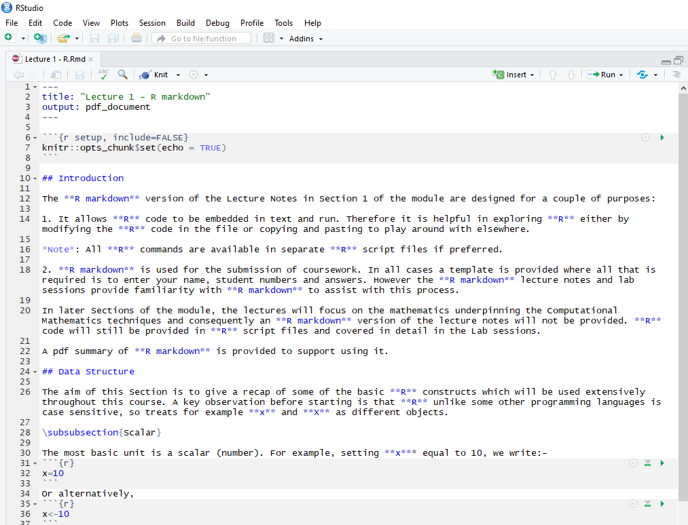
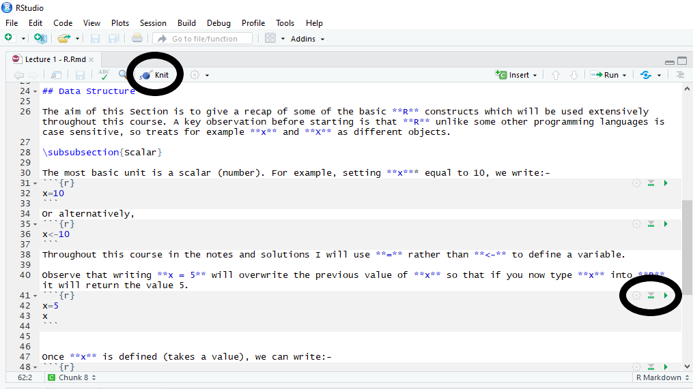
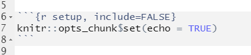
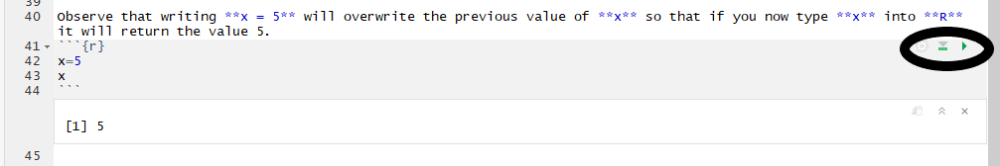
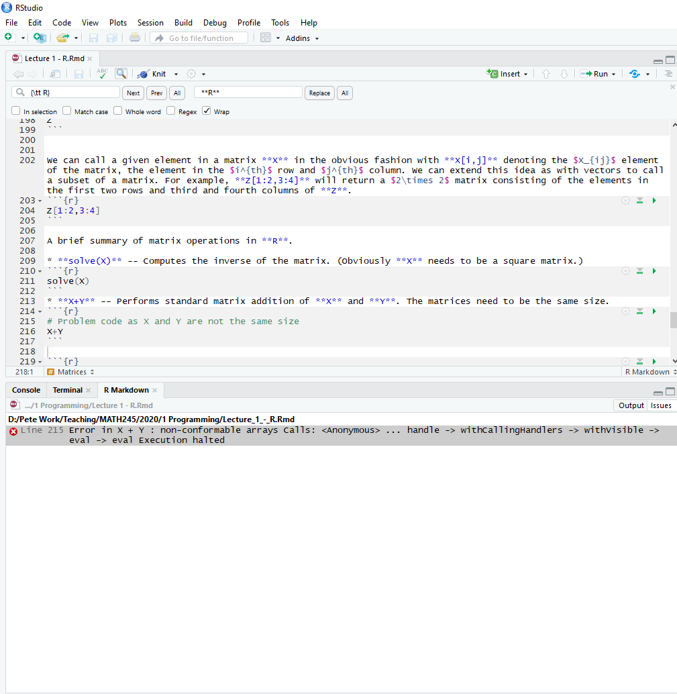

# What is R Markdown? {#Rmark}

In this Section, we give a brief introduction to **R Markdown**. We present a brief summary of the key features, [R](#Rmark_R) code, [text](#Rmark_text) and [maths](#Rmark_maths), which make up an **R Markdown** file. Finally, there is a [video](#videoR2) which works through the construction of a simple R Markdown file.

## Getting started {#Rmark_start}

Embarking upon writing an **R Markdown** file is rather daunting at first. **R** provides a *simple* **R Markdown** template which launches when you create a new **R Markdown** file. Whilst this is helpful, it is not easy going for somebody who is new to **R**. Therefore we will start with pre-prepared **R Markdown** templates for you to work from and as the Programme progresses you will develop your skills and begin to be able to construct your **R Markdown** files from scratch.

This document is designed to help navigate you around **R Markdown** documents and to *knit* (compile) a html file with your output. We will focus on inputting **R** code (including) and text into an **R Markdown** template. The end of this document touches upon the inclusion of mathematics.

Figure \@ref(fig:Rmark1) show the start of an R markdown file.

<center>
```{r Rmark1, echo = FALSE, message=FALSE, fig.keep='all', out.width= "80%",  fig.cap = "Start of an R markdown file."}

```
</center>

The file header is:

````
---
title: "My R Markdown"
output: html_document
---

````


All R Markdown will have a header of this form, specifying the title and output type. The title is self-explanatory and you can change to whatever you choose. The output states what sort of document is produced when markdown is run. The two main options are **html_document** and **pdf_document** which produce a html file and a pdf file as output, respectively.

In order to construct the html or pdf file output you need to compile the file using the **Knit** icon in the menu bar at the top of the script window which is circled in Figure \@ref(fig:Rmark2) show the start of an R markdown file.

<center>
```{r Rmark2, echo = FALSE, message=FALSE, fig.keep='all', out.width= "80%",  fig.cap = "R markdown image highlighting Knit button and R segment run options."}

```
</center>

## R in R Markdown {#Rmark_R}

Immediately below the title we have:

<center>
```{r Rmark5, echo = FALSE, message=FALSE, fig.keep='all', out.width= "80%",  fig.cap = "**R** Setup code."}

```
</center>

This sets up the **R** code. The **include=FALSE** means that information from the setup is not included in the output file. The **echo=TRUE** means that the default option when running **R** code is to produce both the **R** code and the resulting output in the html/pdf file. For the purposes of assessment, you will often set **echo=TRUE** so that the code can be seen. However, if you are producing a document for other purposes you will often not want the **R** code to be shown. For any section of **R** code you can locally override the global decision (include or exclude **R** code).

Once you're working with an **R Markdown** document you can insert chunks of **R** code by clicking on Insert and **R**. (You will notice other options such as Python are available.)  The syntax is as follows.  Note that the apostrophes are backwards, the key on the keyboard is normally found top left (next to 1).  It's often called backquote, or backtick, or grave accent.

````

```{r}
# Insert your lines of R code
# in between these triple backquotes.
# Each such construction is called an R code chunk.
```

````

Remember that hashtag, #, signifies to **R** that all the rest of the text on that line is a comment and not **R** code. Therefore the above *code* will do nothing.

If you want to run **R** code to test it without using the Knit button to construct the output file, you can use the buttons on the right hand side of the **R** code segments. These buttons are circled in Figure \@ref(fig:Rmark2). The green triangle pointing right runs that segment of code, whilst the grey triangle pointing down with a green bar underneath runs all the **R** code in the document up to this point. Figure \@ref(fig:Rmark3) illustrates using the green button on a short **R** code segment:

<center>
```{r Rmark3, echo = FALSE, message=FALSE, fig.keep='all', out.width= "80%", fig.cap = "Running a segment of **R** code within R markdown, see lines 40-45."}

```
</center>

Running segments of **R** code is very useful as the **R markdown** file will not **knit** if there are any errors in the code. An example is given in Figure \@ref(fig:Rmark4) where the line 216 asks **R** to sum two matrices which are different sizes. **R markdown** gives an error message which notifies us that the error is linked to **R** code segment starting at line 215.

<center>
```{r Rmark4, echo=FALSE, message=FALSE, fig.keep='all', out.width= "80%", fig.cap = "Error message when **knitting** R markdown. Error linked to **R** code segment starting at line 215."}

```
</center>


If you find an error in your code the first thing to do is to try and fix it. *i.e.* Code debugging. However, sometimes you just won't be able to see what the problem is. In such cases you can include your attempt at the **R** code and tell **R markdown** not to run the **R**  code (to create an error message). This can be done by setting `eval=FALSE`.

Using this option allows you to present code and comment that it's not quite working.

````

```{r, eval = FALSE}
s <- (-3)^^^0.5 # I'm not sure why, but this doesn't work.
```

````

Another option available is `results = 'hide'`. Hiding results causes the output HTML not to include the results that **R** calculates and displays on the screen (but it does still run the code, in contrast to eval above).

````

```{r, results = 'hide'}
# This boring part creates a vector in a tedious way.
A <- rep(1,2)
A
A <- cbind(A,5)
A
A <- rbind(A,A)
A
cat (A)
```

````

## Text in R markdown {#Rmark_text}

Text output can just be written as usual, outside of these **R** chunks.  **R** variables can be used outside of chunks if you wish, using a `` r yourmaths ``  command (use a single backquote at each end, follow the first backquote by an r and a space to the **R** code you want to implement).  Those of you with knowledge of LaTeX could use $\$$ and $\$\$$ commands if you like, to get nicely formatted mathematical equations but this isn't essential. **R Markdown** allows for many shortcuts for formatting headings, bullet points and the like.
For example, to produce **bold** and *italic* text we use `` **bold** `` and ``*italic* ``. Headings of various levels are given by #, for example, `` # Heading 1 ``, `` ## Heading 2 ``, $\ldots$. The fewer # the higher the level of Heading (the larger) the text.

Read the **R Markdown** cheat sheet in **RStudio** for help, see:

https://www.rstudio.com/wp-content/uploads/2015/02/rmarkdown-cheatsheet.pdf

## Mathematics in R Markdown {#Rmark_maths}

For completeness, we include a short summary of including mathematics in **R Markdown**. This can be skipped for now.

Mathematical expressions are placed between a pair of $\$$ signs (maths mode), or the case of an equation is place within  `` \[  \] ``. Note that $\backslash$ is used to initiate many commands in LaTeX.

The key operations are:  

1. **Superscript** To insert a superscript we use `` ^ ``. For example, to write $x^2$, we write `` $x^2$ ``. If we want to include a superscript involving more than one expression, we place the expression to form the superscript in $\{ \}$. For example, $e^{x+2}$ is given by `` $e^{x+2}$ ``.  
2. **Subscript** To insert a subscript we use `` _ ``. For example, to write $y_i$, we write  `` $y_i$ ``. The same rule concerning placing longer expressions in $\{ \}$ applies for subscripts. If we want to combine sub- and superscripts we can put either the sub- or superscript first. For example, both   `` $x_j^3$ `` and  `` $x^3_j$ `` produce $x_j^3$.  
3. **Greek Letters** These can also be written in maths mode and we insert \ to produce the desired letter. For example, `` $\beta$ `` gives $\beta$.  
4. **Fractions** To produce a fraction we can use  `` $\frac{A}{B}$ ``, which will give $\frac{A}{B}$. We can replace $A$ and $B$ by whatever mathematical expression we want with $A$ and $B$ denoting the numerator and denominator, respectively.  
5. **Mathematical symbols** For an almost complete catalogue of mathematical symbols, see for example, 

https://oeis.org/wiki/List_of_LaTeX_mathematical_symbols

For example,  `` $\sin (x)$ ``,   `` $\leq$ ``,   `` $\triangle$ `` and `` $\leftarrow$ `` produce $\sin (x)$, $\leq$, $\triangle$ and $\leftarrow$, respectively.

We can place more than one expression within the mathematics mode. For example, $x^2 + \alpha = 7$ is generated by  `` $x^2 + \alpha = 7$ ``. If we want to put our mathematics expression as an equation on its own line, we use  `` \[x^2 + \alpha = 7\] `` which gives
\[x^2 + \alpha = 7.\]

## Worked Example {#Rmark_work}

We conclude with a [video](#videoR2) which works through an example of creating a simple R Markdown file.

```{asis, include=knitr::is_html_output()}
:::{.des #videoR2}
<span style="color: rgba(207, 0, 15, 1);">**Video R2: Introduction to R Markdown**</span>  

<iframe id="kaltura_player" src="https://cdnapisec.kaltura.com/p/1355621/sp/135562100/embedIframeJs/uiconf_id/13188771/partner_id/1355621?iframeembed=true&playerId=kaltura_player&entry_id=1_mah0t8sg&flashvars[streamerType]=auto&amp;flashvars[localizationCode]=en&amp;flashvars[sideBarContainer.plugin]=true&amp;flashvars[sideBarContainer.position]=left&amp;flashvars[sideBarContainer.clickToClose]=true&amp;flashvars[chapters.plugin]=true&amp;flashvars[chapters.layout]=vertical&amp;flashvars[chapters.thumbnailRotator]=false&amp;flashvars[streamSelector.plugin]=true&amp;flashvars[EmbedPlayer.SpinnerTarget]=videoHolder&amp;flashvars[dualScreen.plugin]=true&amp;flashvars[hotspots.plugin]=1&amp;flashvars[Kaltura.addCrossoriginToIframe]=true&amp;&wid=1_d218bp3w" width="640" height="420" allowfullscreen webkitallowfullscreen mozAllowFullScreen allow="autoplay *; fullscreen *; encrypted-media *" sandbox="allow-downloads allow-forms allow-same-origin allow-scripts allow-top-navigation allow-pointer-lock allow-popups allow-modals allow-orientation-lock allow-popups-to-escape-sandbox allow-presentation allow-top-navigation-by-user-activation" frameborder="0" title="Introduction to R Markdown FINAL VERSION"></iframe>
:::
```

```{asis, include=knitr::is_latex_output()}
Watch [\textcolor{blue}{Video R2: Introduction to R Markdown}](https://mediaspace.nottingham.ac.uk/media/Introduction+to+R+Markdown+FINAL+VERSION/1_mah0t8sg)
``` 
